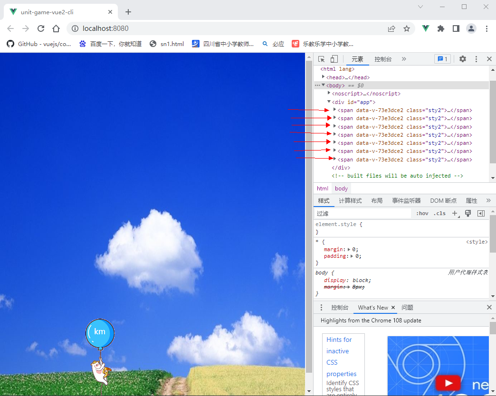
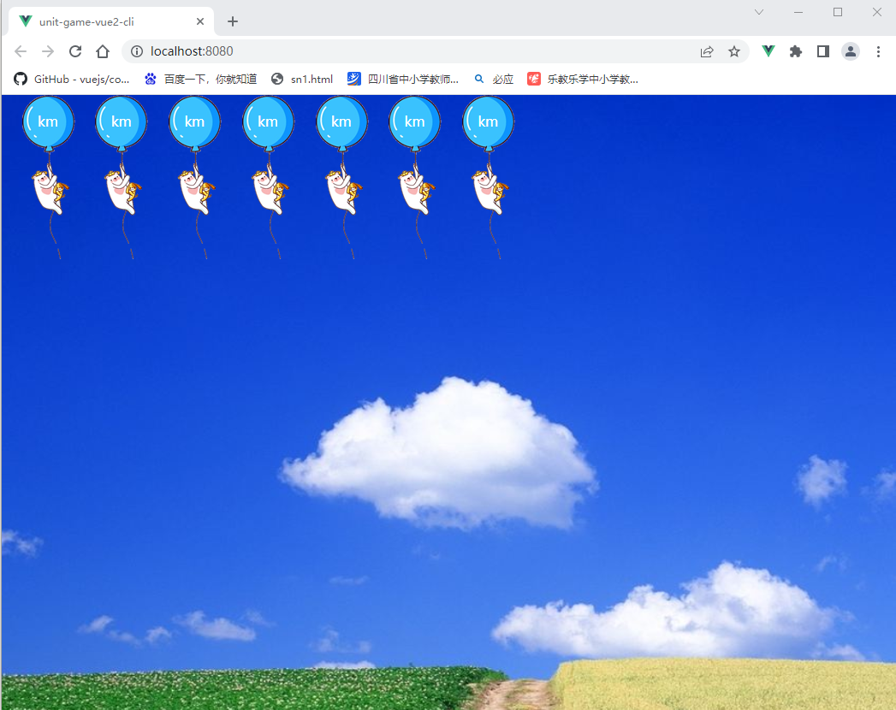
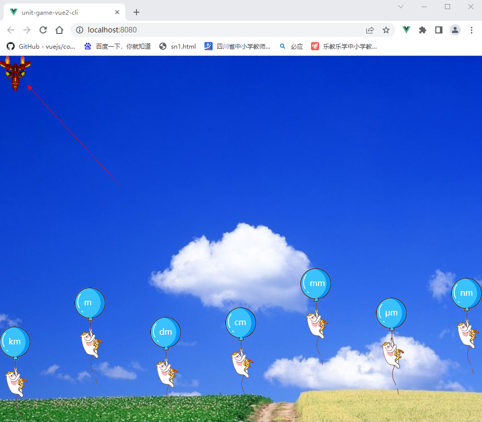
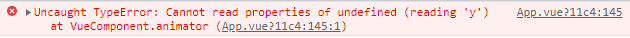
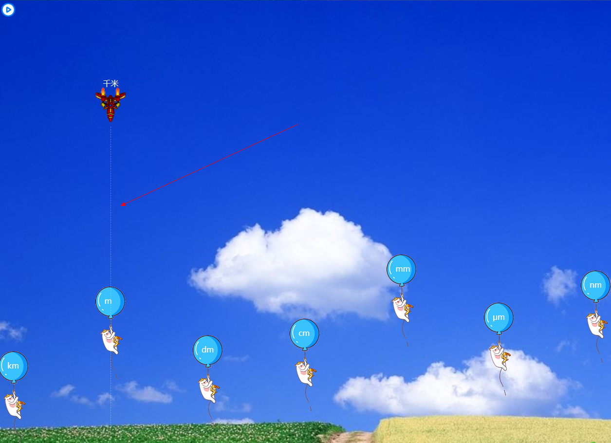

# 一、设计简述

长度单位是中学生开始学习物理课程的第一章节里的内容，也是学生们开启物理学科时首次接触的物理单位，一下子就有7个单位，许多学生往往记不着这7个单位的英文符号所表示的中文单位名称，此小游戏可让学生在玩乐中不知不觉地记做这些英文单位符号所代表的物理意义，从而扫除记忆障碍，从一开始就对物理学科产生浓厚的学习兴趣。

<center class="half">
    
    
</center>


如上图所示，标有不同单位的气球载着小猪不断地上升，玩家按键盘上的上、下、左、右或W、A、S、D键可移动歼击机去对准想要击打的气球，按键盘上的空格键即可发射飞镖子弹，子弹击中气球后，气球破裂，小猪快速下降，程序再根据记分规则判定记分。

玩家是不能乱打的，否则得分率将会很低。得分是按掉落的**有效**气球个数来计分的，如图1，现在歼击机是中文“米”字歼击机，下面是不同英文单位的气球，玩家如将歼击机移动到“m”字气球的正上空并发射子弹击中“m”字气球，此时所有的气球均会破裂掉落，掉落的有效气球数为7个，此时玩家可得7分。如果玩家事先打掉一个非“m”字的气球，此气球虽掉落了，但此时歼击机发射的是“米”字子弹，而击中的英文单位不是对应的“m”，故不得分，此时界面上剩下的有效气球只有6个了，如玩家再次调整歼击机的位置击中“m”字气球后，剩余的气球因“首领”死亡也会跟着破裂（团灭），6个气球同时掉落，此时玩家可得6分。也就是说：得分是按击中**首领**时界面上有多少个气球就计多少分，按此规则，每一关中玩家最高可得分7分，最低得分1分。如果在未击落所有气球之前，任一 一气球上升到顶部或碰到歼击机，则判玩家输，游戏结束。

游戏按轮次进行，每轮有7关，第一轮时气球上的单位是英文，歼击机上的单位是7个中文单位中的一个，每关一个单位，构成7关。

第二轮则交换两套单位，气球上的单位是中文，歼击机上的单位是英文。

前两轮的单位是顺次出现的，无难度，开场练手而也。

第三轮，气球上的单位是英文，仍按单位大小顺次出现，歼击机上的单位是中文，不过每关不再按大小顺次出现，而是随机的。

第四轮，气球上的单位是中文，歼击机上的单位是英文，两者身上的单位均随机出现。

第五轮，气球上的单位是英文，歼击机上的单位是中文，两者身上的单位均随机出现。

前面轮次中，气球是均匀分布，以各自的速度匀速直线上升的，后面的各关中则让气球有左右飘升的功能出现。

此游戏无终结的结束关卡，通过逐关提升气球上升速度致使玩家无法继续玩下去的方式而结束游戏，虽然不友好，但展示的结束语为：“你已经是最高级别的王者了，就不玩了吧，可要累死我啦！”。


# 二、准备工作

## (一)开发工具的准备

1、安装npm

2、安装vue

3、安装vscode

## (二)构建项目

在命令模式下进入到你要在那里创建项目的那个目录中，而在windows系统下有一个巧妙的方法，那就是先打开你准备创建项目的那个文件夹，在地址栏里单击一下会选中整个路径名，如下图所示：


然后直接输入：cmd按回车也会打开命令模式并自动处于当前目录：


先想好你的项目名，比如我取名为：unit-game-vue2-cli，意为用vue2脚手架开发的初中物理长度单位游戏，然后输入命令：vue create unit-game-vue2-cli，按回车，会出现下面界面：


此游戏运用Vue2开发，故按键盘上的下行键选择Vue 2按回车，下图是项目创建过程中的截图：


最终创建成功后的界面如下：


它提示你先通过cd命令进入到项目所在目录unit-game-vue2-cli，然后通过npm命令：npm run serve运行该项目。

你如果按它的提示运行越来的话，其界面如下图：


上面提示信息中的 http://localhost:8081/是在你本机上运行的地址，下面的http://192.168.0.104:8081/是局域里的其他机子访问的地址。此时vue脚手架不但给你架设了项目，还给你布设了一个微型服务器。你把 http://localhost:8081/复制下来打开浏览器粘贴在地址栏里即可看见：


vue脚手架不但为你构建了项目，还为你写好了一个HelloWorld示例。

看看即可，接下来我们在命令窗口中按Ctrl+C，出现“终止批处理操作吗(Y/N)?”时按Y键停掉这个服务器：


接下来，打开项目所在的文件夹：


在项目文件夹上单击鼠标右键，选择“通过Code打开”，这样你的项目就呈现在vscode中了：


整个项目由4部分组成（红色框显示的4个部分）：

1、node_modules文件夹：脚手架在构建该项目时自动为你配置的各种包、各种库文件，里面有几百个。

2、public文件夹：项目运行越来后就是一个微型服务器，这个public文件夹就是网站的根目录，也就是访问的根路径，现在里面只有两个文件：index.html是首页文件，favicon.ico是网页标签图标（显示在浏览器上标题左边的图标），网页打开时，浏览器会自动到此目录下去请求该资源，你可以换成自己的图标，但名字与位置最好按默认设置来，不改变即可。

3、src文件夹：你自己开发的所有源文件就是存放在这里的。它分成三个部分（黄色框住的三部分）：
		assets文件夹存放你用到的静态资源；
		components文件夹存放你开发的组件；
		第三部分是直接放在外部的App.vue与main.js两个文件：
		App.vue是根组件，是一人之下(vm)、万人之上(其他组件)的统领组件，正因它很重要，则没把它放入components文件夹中，以示区别。
		main.js是脚手架启动程序时的入口，当你以npm run serve命令开始这个程序时，首先它就会来到这个main.js文件里，这个文件实际上是很短的，第一步import Vue from 'vue'引入vue，第二步import App from './App.vue'引入当前路径下的App组件，第三步Vue.config.productionTip = false设置Vue的config对象里的productionTip属性值为假， 以阻止 vue 在启动时生成生产提示，干扰我们开发。第四步是实例化出Vue的实例即vm，并挂载到容器#app上。

4、该部分为一些配置文件：
		(1).gitgnore是git忽略配置文件，配置好后可以避免在提交代码时把我们不想上传的文件提交到git中。
		(2)babel.config.js是babel配置文件，因我们开发中不可避免地要使用ES6的一些语法，babel的任务就是帮我们把这些ES6的语法转换成ES5的语法；
		(3)jsconfig.json，如果我们使用TypeScript话，该文件便为tsconfig.json，在里可指定编译项目所需的根文件和编译器选项，而现在我们使用的是JavaScript，所以为jsconfig.json，它的作用与tsconfig.json几乎相同，但默认启用了一些与 JavaScript 相关的编译器标志。
		(4)package-lock.json是在`npm install`执行的时候生成的一份文件，用来记录package.json的来源和版本号。其实用一句话来概括很简单，就是锁定安装时的包的版本号，以保证其他人在npm install时大家的依赖能保证一致。
		(5)package.json：在Node.js中，模块是一个库或框架，也是一个Node.js项目。Node.js项目遵循模块化的架构，当我们创建了一个Node.js项目，意味着创建了一个模块，这个模块的描述文件，被称为package.json。它是我们在创建项目时自动生成的文件，它定义了这个项目所需要的各种模块，以及项目的配置信息（比如名称、版本、许可证等元数据）
		(6)README.md，就是一个md格式的文件，你可以在其中书写一些说明，使其成为该项目的一本说明书。
		(7)vue.config.js，它是一个可选的配置文件，与package.json是同级的，存放在根目录中，要是有这个文件，在@vue/cli-service 启动的时候会自动加载，所以我们在修改里面的内容之后，要进行项目重新加载。在此项目中可不多理会，采用它的默认配置不动即可。

上面分析了项目的目录层次结构，下面给你说说项目的启动流程到底是怎样的。

脚手架主要是开发单文件组件的框架，它有它自己的一套运行流程，与在页面中引入完整版的vue开发传统的多页面来说则不相同，它自己的那一套流程是：
当你以npm run serve命令开始这个程序时，首先就会到项目的src文件夹中找到那个main.js入口文件运行起来，main.js运行起来后，会引入vue，引入App组件（因App是根组件，引入它时会自动引入它涉及到的其他子组件），然后实例化出Vue的实例即vm，并挂载到容器#app上展现出来。那么这个容器在哪里呢？答案是在public文件夹中的index.html里，也许你会问，我又没有做什么配置，它是怎么知道的呢？告诉你吧：这是脚手架配置的，它内部事先就做了这样的设置，不用你管，你只须知道是怎么一回事就可以了。

index.html也很简单：

```html
<!DOCTYPE html>
<html lang="">

<head>
	<meta charset="utf-8">
	<!--针对IE浏览器的一个特殊配置，含义是让IE浏览器以最高的渲染级别渲染页面-->
	<meta http-equiv="X-UA-Compatible" content="IE=edge">
	<!--开启移动端的理想视口-->
	<meta name="viewport" content="width=device-width,initial-scale=1.0">
	<!--配置页签图标。<%= BASE_URL %>代表public所在的路径-->
	<link rel="icon" href="<%= BASE_URL %>favicon.ico">
	<!--配置网页标题。<%= htmlWebpackPlugin.options.title %>表示到package.json文件里去找 "name": "unit-game-vue2-cli" 配置项，并把其值unit-game-vue2-cli作为网页标题。这是webpack的一个插件完成的功能-->
	<title><%= htmlWebpackPlugin.options.title %></title>
</head>

<body>
	<!-- 当浏览器不支持js时下面的noscript标签中的元素就会被渲染 -->
	<noscript>
		<strong>We're sorry but <%= htmlWebpackPlugin.options.title %> doesn't work properly without JavaScript enabled.
			Please enable it to continue.</strong>
	</noscript>
	<!-- 容器 -->
	<div id="app"></div>
	<!-- built files will be auto injected -->
</body>

</html>
```

网页头里的一些元标签已加注了说明，这些虽是一个完备的页面文件所应具备的，但是你把它删了也能运行起来，我们重点关注的是作为vue容器的那个id为app的div。

既然是vue的容器，是不是我们就在这里书写vue的代码呢？

那你就错啦，恰恰相反，这里是什么都不用写，整个index.html文件就像这样就对了，因脚手架运行起来后，它通过babel以及webpack的编译与动作，脚手架会自动把那些经过编译转化后的代码放入容器中，你只需集中精力去开发你的vue代码就行了，剩下的一切由脚手架去调集babel、webpack等去自动替你完成。这就是脚手架，它辅助你爬高登远实现你的高楼大厦的建造梦想。

# 三、程序开发

## (一) 理解render函数(h方法)

```javascript
//main.js
import Vue from 'vue'				//引入vue
import App from './App.vue'			//引入App组件

Vue.config.productionTip = false	//关闭生产提示

new Vue({							//实例化Vue构建vm对象
  render: h => h(App),				//渲染App组件
}).$mount('#app')					//挂载到容器app身上
```

上面是入口文件main.js中为数不多的几行代码，虽然已经加注了解释，如你是初次接触脚手架的话，不免还是有不理解的地方，特别是第8行：render: h => h(App)。

我们先回顾一下，不使用脚手架，采取在页面里直接引入vue的嵌入式开发模式：

```html
<!DOCTYPE html>
<html lang="">
<head>
	...
    <script src="./js/vue.js"></script>
</head>

<body>
	<div id="app">
    	<App></App>
    </div>
    <script>
        //定义App组件
        const App=Vue.extend({
            template:`<div>{{msg}}</div>`,
            data(){
                return{
                    msg:'试验'
                }
            }
        })
    	new Vue({
            el:'#app',
            components:{'App'} //注册组件
        })
    
    </script>
</body>

</html>
```

第5行是直接引入Vue（当然你要事先把Vue下载下来放在当前项目的js文件夹中），就像以前我们引入JQuery一样，当我们引入了JQuery后，整个页面里就有了JQuery对象了，可直接使用里面的方法了，同理，我们这里直接引入了Vue，整个页面里就有了Vue这个函数对象了，就可使用Vue函数实例化对象以及使用这个函数里的方法（在javascript里函数也是对象，具有双重身份的），在这个程序里，第14-21行就是利用Vue函数对象里的extend方法先定义出组件App出来，再在22-25行实例化Vue时把组件App注册到里面，因Vue实例（vm）接管的容器是9-11定义的那个div，于是在这个容器里我们就可直接使用vm身上的组件App了，如第10行所示。

这是非单文件组件方面的基础知识，如果未弄明白也不用担心，它对你使用单文件组件来进行开发的影响不是多大。

下面，把上面的程序再改进一下：

```html
<!DOCTYPE html>
<html lang="">
<head>
	...
    <script src="./js/vue.js"></script>
</head>

<body>
	<div id="app">
    	
    </div>
    <script>
        //定义App组件
        const App=Vue.extend({
            template:`<div>{{msg}}</div>`,
            data(){
                return{
                    msg:'试验'
                }
            }
        })
    	new Vue({
            el:'#app',
            template: `<App></App>`,
            components:{'App'} //注册组件
        })
    
    </script>
</body>

</html>
```

第10的容器里我们什么都不写，在第24行处，使用template配置项直接把组件配置到当前vm的模板里，这样vm就自带模板，当vm挂载到容器上时自然就有了与前面一样的页面了。

下面我们根据以前所学的这个知识点，把main.js文件：

```javascript
//main.js
import Vue from 'vue'				//引入vue
import App from './App.vue'			//引入App组件

Vue.config.productionTip = false	//关闭生产提示

new Vue({							//实例化Vue构建vm对象    
  render: h => h(App),				//渲染App组件
}).$mount('#app')					//挂载到容器app身上
```

先做如下改写：

```javascript
//main.js
import Vue from 'vue'				//引入vue
import App from './App.vue'			//引入App组件

Vue.config.productionTip = false	//关闭生产提示

new Vue({							//实例化Vue构建vm对象
  	el:'#app',						//指定vm服务容器为app
    render: h => h(App),			//渲染App组件
})
```

上面的原文件是在第9行处，当new出vm后继续通过vm身上的一个钩子函数$mount将vm挂载到容器app上，这样写只是简单利落少写一行代码而也，其实质与下面改写后的功能是一样的，改写后的代码是在第8行处通过el配置项来指定vm将要服务或者说挂载的容器是app，这样vue运行起来后它根据这个配置项去自动找到并挂载到那个容器上。
这两段代码的功能是一样的，只是写法不同而也。说到这里，你会不会问那个容器app在哪里呢，在这个文件里没有哪一行代码指示出容器到底在哪个文件里啊！说到这一点，你可不能边学边忘记啊，这个问题在前面就已经说了的哦：在public文件夹中的index.html里，也许你会问，我又没有做什么配置，它是怎么知道的呢？告诉你吧：这是脚手架配置的，它内部事先就做了这样的设置，不用你管，你只须知道是怎么一回事就可以了。

下面我们来说render函数了，假设你不了解这个函数，那就用我们前面学到的组件知识来改写一下看行不行。

```javascript
//main.js
import Vue from 'vue'				//引入vue
import App from './App.vue'			//引入App组件

Vue.config.productionTip = false	//关闭生产提示

new Vue({							//实例化Vue构建vm对象
  	el:'#app',						//指定vm服务容器为app    
    components: {App}				//注册组件
    template: '<App></App>',		//使用组件
})
```

前面程序里用到的render函数，其注释里说是渲染App组件的，渲染组件就是把组件显示出来嘛，那现在我们先注册一下组件（第9行），然后使用template把这个组件用起来了不就对了吗。

是的，这个认为好像没毛病，然而当你npm run serve运行起来打开页面时，页面上是什么都没有，继续打开控制台发现有错误提示：

[Vue warn]: $\textcolor{red}{You are using the runtime-only build of Vue where the template compiler is not available.} $ 
$\textcolor{green}{Either pre-compile the templates into render functions, or use the compiler-included build.}$

前边那段直译出来是：您正在使用Vue的仅运行时构建，而模板编译器不可用。
便于理解的说法是：你使用了一个运行时版本的Vue，这个运行时版本的Vue是不带模板解析器的。

后边那段直译出来是：要么将模板预编译为render函数，要么使用编译器包含的构建。
通顺的翻译是：要么把需要编译的模板交给render函数，要么使用包含模板编译器在内的完整版的Vue。

总的说来，现在我们引用的Vue是一个不完整的Vue，里面不带模板编译器，解析不了由template: '<App></App>'配置的模板了，所以报错。

		

打开项目文件中的模块文件夹node_modules，找到vue模块中的dist文件夹打开，将发现里面有多个版本的Vue，但大致上分成两大部分，如上图所示。

中间的vue.js才是最完整版的Vue，那两大部分的vue都是在此基础上精简而成的。上面带common的是遵循commonJS模块化规范的vue，下面带runtime的是运行时的vue，是不带模板解析器的vue。在脚手架的main.js文件里我们通过：import Vue from 'vue'引用的vue，默认引用的是：vue.runtime.esm.js，其中的esm是：ES module的缩写，意思是使用ES6模块化语法时应引用的vue，当然，我们现在的这个脚手架采用的就是ES6模块化规范，所以脚手架默认引用的就是这个精简版的Vue。

这个精简版的Vue是不带模板解析器的，所以，我们在vue实例里写出template的模板配置项时，运行就会报错。

虽然此时的Vue里没有模板解析器，但作者给我们提供了一个render函数，可利用此函数来解析模板。这就是此时要使用render函数的原因。

凭什么说我们引用的vue是vue.runtime.esm.js呢？

```javascript
//main.js文件
import Vue from 'vue'
import App from './App.vue'

Vue.config.productionTip = false

new Vue({
 render: h => h(App),
}).$mount('#app')
```

第1行就是引用的vue，按住Ctrl键的同时鼠标指向这个vue单词，如下图：


此时vue下边则会出现下划线，单击鼠标则会来到你引用的vue的包里：


当然此时左边界面里默认打开的是index.dts文件，我们不看这个文件，在左边单击package.json，其右边窗口里就会展现此文件，第7行："module": "dist/vue.runtime.esm.js",就是我们引用的vue。为什么是呢，看下面讲解：

我们引用vue时，是这种写法：import Vue from 'vue' ，这种写法是没有写成从哪个文件夹下引用哪个文件的那种具体的路径形式，而是只写到vue这个文件夹就算了的这种简写方式，那么在这种简写形式下，引用vue时程序就要去package.json文件中查找相关的配置了，这个配置就是这个文件里的第7行："module": "dist/vue.runtime.esm.js",前面的module是键名，意思是说：如果你通过ES6模块化语法去引入vue的时候，就根据其后的键值规定的路径去引用vue，读这个键值我们不难知道我们默认引用的vue是不带模板解析器的那个残缺的vue了：vue.runtime.esm.js。

这样一来，因你引入了残缺版的vue，就须借助render函数来处理模板了，这个函数不但是vue帮你调用，而且还会自动传入一个参数：createElement，这个参数是一个函数，它能够创建元素：

```javascript
render(createElement){
  return createElement('h1','你好啊！')
}
```

createElement可接受3个参数，该示例中使用了前两个参数，第一个参数“h1”代表标签名，第二个参数“你好啊!”是h1标签中的内容，有此两个基本要素就可创建出一个h1标签元素了，当把 这个元素返回给vue时，vue就可把它呈现在页面上了。

当然，这是很麻烦的，要传两个参数，第一个参数是标签名，第二个参数是标签体，但如果我们把组件作为一个元素整体传给creatElement时，则只需传一个组件参数了，因组件里就有具体的内容了，不须再传其他参数的，这样它就能根据组件元素的内容给我们渲染出页面出来：

```javascript
import Vue from 'vue'
import App from './App.vue'
Vue.config.productionTip = false
new Vue({
   render:render(createElement){
   	  return createElement(App)
  }
})
```

下面我们来看看如何简写这个render渲染函数。

根据ES6采用的箭头函数这种新语法，加之这里也没有用到this，我们就可以把这个普通的函数改写成箭头函数：
render:(createElement)=>{ return createElement(App) }

而箭头函数的左边只有一个参数，那么在书上形式上则可以省略括号：
render:createElement=>{ return createElement(App) }

再加之函数体里只有一条return语句，所以还可继续简写成：
render:createElement => createElement(App)

我们把参数createElement不写那么长，随便用一个字母比如h代替，就成了代码里的那个render渲染函数了：
render: h => h(App) 

这看越来很复杂似的，实际上你不用担心，因在实际项目开发中，都是采用单文件组开发件模式，虽然引用的是一个残缺版的vue，但只需在这个mian.js入口文件的vue实例中使用一次render渲染函数把App根组件渲染出来即可，写法是固定的，我们只需了解其中的原理即可。 

最后，我们来说另一个疑问：

既然vue.runtime.esm.js是残缺版的vue，不包含模板解析器，如果我们把import Vue from 'vue' ，改写成import Vue from 'vue/dist/vue.js' ，即写出具体的路径，引用完整版的vue，不就是解决问题了吗？是的，这样确实可以解决问题，但vue的作者为什么要给我们设计出这么多的残缺版的vue出来呢？

vue实际上是由核心代码与模板解析器两大部分组成的，而模板解析器几乎占了vue的三分之一的体积。如果只使用完整版的vue，当你开发完了，交给webpack打包时，vue的模板解析器也会一并被打包。我们在开发的时候，模板解析器可以帮助我们翻译解析模板，供我们调试程序使用，但经webpack打包后，其代码是浏览器已经能够识别的纯粹原生的js、css、html代码了，这个时候模板解析器就没有什么作用了，如果还包含模板解析器的话，无形之中就增加了文件的大小，显然不合理，所以vue团队打造出了不包含模板解析器的精简版的vue，以达节省空间的目的。

## (二)素材及界面布局

### 1、图片：5张


在public中新建一个image文件夹，将这五张图片放入到该文件夹下。

### 2、声音

仍在public中新建一个sound文件夹，将背景音乐、发射子弹、气球被击中后等声音文件放入其中。

### 3、界面布局

#### (1)根组件App.vue

根组件App.vue是统领所有组件的主组件，也是这个游戏的主界面了。

在我们的这个项目里已经有一根组件App.vue：

```javascript
<template>
  <div id="app">
    
    <HelloWorld msg="Welcome to Your Vue.js App"/>
  </div>
</template>

<script>
import HelloWorld from './components/HelloWorld.vue'

export default {
  name: 'App',
  components: {
    HelloWorld
  }
}
</script>

<style>
#app {
  font-family: Avenir, Helvetica, Arial, sans-serif;
  -webkit-font-smoothing: antialiased;
  -moz-osx-font-smoothing: grayscale;
  text-align: center;
  color: #2c3e50;
  margin-top: 60px;
}
</style>
```

这是那个示例程序的根组件，第3行放了一张图片，第4行是使用了Helloworld组件。第9行是引入Helloworld这个组件，第14行是注册Helloworld这个组件。20-26行是样式。
现在在此基础来上编写我们的内容，首先删除不用的内容，精简后如下：

```javascript
<template>
  <div id="app"></div>
</template>

<script>
	export default {
		name: 'App' 
	}
</script>

<style></style>
```

这是一个空白的组件，里面什么也没有，在vscode中按快捷键Ctrl+` 可直接在vscode的下方打开命令终端，输入npm run serve命令即可运行该项目，待编译完成后界面如下：


按住Ctrl键的同时鼠标移到http://locallhost:8080/单击鼠标即可打开浏览器浏览页面：


当然与预期一样，页面一片空白，什么都没呈现，打开调试窗口可见只有一个基本结构，由于<div id="app"></div>里什么都没有，当然会是空白的。
下面我们来把游戏背景图贴上去，显示出来后就有了游戏场景的感觉了。

App.vue:

```javascript
<template>
  <div id="app"></div>
</template>

<script>
	export default {
		name: 'App' 
	}
</script>

<style>
	* {
		margin: 0;
		padding: 0;
	}
	html {
		height: 100%;
		width: 100%;
		background-image: url(../public/image/timg.jpg);
		background-size: 100% 100%;
	}	    
</style>
```

只需在样式标签style中加上12-21行的代码，就可看到效果了：


根组件是统领所有组件的主组件，style中设定的样式往往适用于整个界面，所以一般不要像这样<style scoped>在其中加上scoped属性，这样可使其样式不只是应用于本组件，而是应用于所有组件身上。正因如此，我们在这里布设游戏场景是最适合的了。（第19行就是设置背景图的样式行）

接下来，缩写第一个子组件，让气球小猪出场。

#### (2)子组件BallPig

components文件夹下已有一个HelloWorld.vue组件文件，那是安装脚手架时为我们附带生成的示例程序的子组件，直接将其删除，重新建立下列组件文件
BallPig.vue气球小猪组件：

```javascript
//BallPig.vue组件
<template>
	<span>
		
	</span>
</template>

<script>
	export default {
		name:'BallPig',
		data() {
			return {
				image: "image/ballute.png",
			}
		}		
	}
</script>

<style scoped>	
</style>
```

2-6行为模板语句块，通过第4行代码向模板中放入了一张图片，并给图片的src属性绑定了一个值，即图片的来源由script语句块的13行代码里的image变量的值来确定，即当前路径下的image文件夹中的ballute.png图片。style语句块中暂时未设置样式。

当然，这里的src是可以直接设置的 src="image/ballute.png"，但这样是一个写死了的静态值，由于游戏中子弹击中气球后，气球的图像要变成破裂状，即src的值在某个时刻要改变，此时静态的src值就非常不方便了，现在在这里我们的做法是用v-bind:src=“image”简写成:src=“image”给src绑定一个变量image，即src的值由image提供，游戏过程中，只要改变变量image的值，vue会自动更新页面呈现出另一个图片出来，这就是vue的精髓所在之处，我们只须设置好数据，操作DOM的事情就由vue去帮我们完成，即数据驱动页面，我们只管维护好数据就对了，麻烦的DOM操作就不须我们自己去做了，这是vue开发过程中要时刻把握好的一个关键点，前几年流行的JQuery主要就是操作DOM，该库中80%的功能都是去操作DOM，所以当reack、Angular 、Vue崛起后，你就可明白JQuery逐渐被淡化的真正原因了吧。

建立好了子组件后，紧接着就可以在根组件App里使用了：

```javascript
//App.vue文件
template>
  	<div id="app">
		<BallPig/>
	</div>
</template>

<script>
	import BallPig from "./components/BallPig.vue";
	export default {
		name: 'App',
		components:{BallPig}
	}
</script>

<style>
	* {
		margin: 0;
		padding: 0;
	}
	html {
		height: 100%;
		width: 100%;
		background-image: url(../public/image/timg.jpg);
		background-size: 100% 100%;
	}	
</style>
```

第9行引入子组件BallPig，第12行注册该组件，在第4行处使用该子组件，其他代码保持不变，运行后的最终呈现效果如下图所示：


哇，气球小猪真的出场了耶！
但这样的气球小猪要有7个，而且每个还要带上不同的单位名称。下面先解决单位名称这件事。
单位名称是跟随气球小猪的，应该写在气球小猪这个组件里：

```javascript
//BallPig.vue文件
<template>
	<span>
		
        <span>{{unit}}</span>
	</span>
</template>

<script>
	export default {
		name:'BallPig',
		data() {
			return {
				image: "image/ballute.png",
                unit:"km"
			}
		}		
	}
</script>

<style scoped>	
</style>
```

增加的第5行、15行代码就是显示单位名称的代码，运行后的效果如下图所示：


如上图，虽然显示出“km”这个单位字样了，但位置不对。
显示位置这样的事情，通过CSS样式就可解决的，此时就看你的基本功了：

```javascript
//BallPig.vue文件
<template>
	<span>
		
        <span class='sty'>{{unit}}</span>
	</span>
</template>

<script>
	export default {
		name:'BallPig',
		data() {
			return {
				image: "image/ballute.png",
                unit:"km"
			}
		}		
	}
</script>

<style scoped>
    .sty{
		position: relative;
		top:-155px;
		left:42px;
		color:white
	}
</style>
```

第23行将其定位属性设置为相对定位；24-25行设置它的偏移值（通过多次更改试出来，或打浏览器的调试窗口去边改值边观察而得知）；26行是设置字体颜色。运行的效果如下图所示：


是的，已解决了“km”的位置显示问题了。
也许你要说，还有一个问题，整个气球小猪的位置不对呀，它应该出现在底部，后面才可以往上飘升呀。
是的，位置确实不对，你可以在该组件的最外层的span上设置定位属性来临时解决，如下所示：

```javascript
//BallPig.vue文件
<template>
	<span class="sty2">
		
        <span class='sty'>{{unit}}</span>
	</span>
</template>

<script>
	export default {
		name:'BallPig',
		data() {
			return {
				image: "image/ballute.png",
                unit:"km"
			}
		}		
	}
</script>

<style scoped>
    .sty{
		position: relative;
		top:-155px;
		left:42px;
		color:white
	}
	.sty2{
		position: absolute;
		top:560px;
		left:180px;
	}
</style>
```

第3行最外层的span上应用新增加的sty2样式类后就有了定位的效果了：

上图的右边是打开了浏览器的调试控制台了的，红色框围住的部分是气球小猪这个组件解析后的页面结构，你把它与你的BallPig组件里的template模板里结构对照一下，不难发现其结构层次上是一样的(经vue解析后vue还会加上它自己使用的一些特定属性如data-v-73e3dce2之类，那是因组件里的 <style> 模块里有 scoped 属性时，vue为了让其只作用于当前组件中的元素，故编译时额外生成了data-v-xxx属性，以区别不同组件的样式类)

通过调试控制台来分析页面结构非常实用，后面我们会用到它来辅助我们开发。

以上虽可解决气球小猪的定位问题，但这不是最佳解决办法，一个主要原因是其位置值是写死了的，一个简单的操作如当玩家有调整窗口宽、高的动作时它就不适应了，更不说还要让它往上不断飘升呢，再一个，这个组件整体出现在界面中，而且是多个（7个），其位置应该由容纳它的父组件App来安排了，现在你只需知道这个道理即可，后面在App组件里去调节。

接下来我们要弄出7个这样的气球小猪出来，又该怎么去做呢？

#### (3)界面布局

组件是实现局部(特定)功能效果的代码集合，是一个是可复用的 Vue 实例。

是的，BallPig组件已经注册到了App里，我们再复用6次不就是7个了嘛？

```javascript
//App.vue文件
template>
  	<div id="app">
		<BallPig/>
        <BallPig/>
        <BallPig/>
        <BallPig/>
        <BallPig/>
        <BallPig/>
        <BallPig/>
	</div>
</template>

<script>
	import BallPig from "./components/BallPig.vue";
	export default {
		name: 'App',
		components:{BallPig}
	}
</script>

<style>
	* {
		margin: 0;
		padding: 0;
	}
	html {
		height: 100%;
		width: 100%;
		background-image: url(../public/image/timg.jpg);
		background-size: 100% 100%;
	}	
</style>
```

5-10行就是反复使用BallPig组件6次，运行后的效果如下：



唉，还是只有一个啊！但你打开调试控制台后你会发现是有7个的（上图右边7个箭头所指示的），页面上它们是重叠在一起了。原因在前面已有所提到，那是因我们在组件上写死了定位值造成的，现将组件里的sty2样式去掉后的效果如下：


这下对了。
但，7个气球的单位名应该各不相同，现在都是“km”，原因是由于在组件里给unit变量写了一个固定值“km”造成的。

也就是说，现在要求第一个气球的单位是km，第二个是m，第三个dm，以此类推，也就是它们要拥有自己的单位名。由于这些气球小猪是由同一个组件复用而得到的，你如果在组件里写了一个固定值，它们当然就是同一个单位名了，也就是说这个单位名不能写死，我们要在用组件的时候给它传一个值进去，这样它们就能拥有各自的单位名了。

能完成这项任务的，那就是组件身上的props了，即组件里的变量unit不由data提供，改成由props提供，其值由将来使用这个组件的时候传进入：

```javascript
//BallPig.vue文件
<template>
	<span class="sty2">
		
        <span class='sty'>{{unit}}</span>
	</span>
</template>

<script>
	export default {
		name:'BallPig',
        props:['unit'],
		data() {
			return {
				image: "image/ballute.png",
                //unit:"km"
			}
		}		
	}
</script>

<style scoped>
    .sty{
		position: relative;
		top:-155px;
		left:42px;
		color:white
	}
	.sty2{
		position: absolute;
		top:560px;
		left:180px;
	}
</style>
```

去掉第16行，增加第12行。

然后在App组件里，在使用BallPig组件的地方把对应的单位值传过去即可：

```javascript
//App.vue文件
template>
  	<div id="app">
		<BallPig unit="km"/>
		<BallPig unit="m"/>
		<BallPig unit="dm"/>
		<BallPig unit="cm"/>
		<BallPig unit="mm"/>
		<BallPig unit="μm"/>
		<BallPig unit="nm"/>
	</div>
</template>

```


这下是不是对了呢。props是父子组件间通信的重要手段，可要掌握好哟！

下面来改进代码。

在使用BallPig组件时，我们硬写了7遍<BallPig unit="km"/>相似的代码，而在我们的编程世界里，for语句可是最擅长干重复事情的啦，vue当然也行，它把for包装了一下，结合for功能于v-for指令之中，只不过`v-for` 指令需要使用 `item in items` 形式的特殊语法，其中 `items` 是源数据序列，而 `item` 则是被迭代的序列元素的**别名**，下面我们就用此指令来改进我们的代码吧。

使用v-for，必须要有一个供它迭代的源数据序列，这个源数据序列在哪里去找呢？

‘km’,’m’,’dm’,’cm’,’mm’,’μm’,’nm’这些是我们在App组件里要传给其子组件BallPig的单位名，把它们组成一个数组，不就正好是一个数据序列了吗：

```javascript
//App.vue文件
template>
  	<div id="app">
		<BallPig v-for="item in units" :unit="item" :key="item"></BallPig>
	</div>
</template>

<script>
	import BallPig from "./components/BallPig.vue";
	export default {
		name: 'App',
		components:{BallPig},
        data(){
			return {
				units:['km','m','dm','cm','mm','μm','nm']
			}
		}
	}
</script>

<style>
	* {
		margin: 0;
		padding: 0;
	}
	html {
		height: 100%;
		width: 100%;
		background-image: url(../public/image/timg.jpg);
		background-size: 100% 100%;
	}	
</style>
```

第13-17行是新增加的data数据配置项，其中15行就是供f-for迭代的数组序列。
第4行就是运用v-for指令迭代数组而产生7个气球小猪出来的功能代码。其中的key属性是vue特有的属性(相当于vue的关键字)，它在虚拟DOM的比对算法中起到关键性的作用，如果这方面的知识理解得不透彻的话，我这里有很好的课程。

再次运行起来，其效果应该是一样的。

接下来我们让气球均匀分散排列，也就是给它们指定一个位置，这个位置不但是水平方向上要处于均匀排列的位置上，在高度方向上还要定位在底部。

这显然与打开页面时浏览器的窗口大小尺寸有关了。要先拿到窗口的宽度，才可以计算出7个气球之间的间距，也要先拿到窗口的高度，才可定位到哪里才算是底部。

还好，文档对象document里有对应的属性记录着它们呢，我们拿到这些属性值就可知道窗口的宽高了，所以我们先在data配置项里把这两个值获取到保存下来供后续使用：

```javascript
scr_w: document.documentElement.clientWidth, //屏幕宽度
scr_h: document.documentElement.clientHeight, //屏幕高度
```

好了，有了宽度值就能计算出它们的间距了：scr_w/6，如果使用这个计算式的话，是不精确的，请看下图：


最外层的大框假设代表窗口的宽度scr_w，那6个间距应该是整个窗口的宽度scr_w减去最后一个物体的宽度后的平均值，即：(scr_w-w)/6，物体在屏幕上的位置坐标是以其**左上角**所处的位置为标准来定位的，这样计算的结果可确保其能精准定位。

最后一物体的宽度，就是那张气球小猪图片的宽度，这是在我们准备素材时就确定好了的，是62像素宽，高为192像素。

下面我们就通过样式属性来定位各个组件的位置吧：

```javascript
<template>
  <div id="app">
		<BallPig v-for="(item,index) in units" 
		:unit="item" 
		:key="item"
		:style="{
					position: 'absolute',
					display: 'block',
					left:(scr_w-62)/6*index+'px',
					top:(scr_h-150)+'px'
				}"
		></BallPig>
	</div>
</template>

<script>
	import BallPig from "./components/BallPig.vue";
	export default {
		name: 'App',
		components:{BallPig},
		data(){
			return {
				scr_w: document.documentElement.clientWidth, //屏幕宽度
				scr_h: document.documentElement.clientHeight, //屏幕高度
				units:['km','m','dm','cm','mm','μm','nm']
			}
		}
	}
</script>

<style>
	* {
		margin: 0;
		padding: 0;
	}
	html {
		height: 100%;
		width: 100%;
		background-image: url(../public/image/timg.jpg);
		background-size: 100% 100%;
	}	
</style>
```

第23-24行，是窗口屏幕的宽度、高度。
第3行的v-for里新增了一个index项，供样式里计算x坐标使用。
第6-11行是新增的当前这个组件的style属性。这里整个BallPig属性的书写是变了一个形式的，是为了便于阅读而也。这里还要注意一点，通过style设置元素的left、top值时，是要带px单位的，(scr_w-62)/6*index计算的结果为数值型，故要加上单位“px”。
这样以来就满足了我们前面所说的：气球小猪组件应由容纳它的父组件App来安排它们的位置。好吧，打开看看效果吧：


哇，有问题，如图中箭头所示处。

首先我们看右下角的两个箭头处：窗口的右边与下边出现了滚动条！
右边出现滚动条，说明显示的内容超出了窗口的下边界；下边出现滚动条，是超出了右边界。我们先不管那么多，在样式的html类里加上：overflow: hidden这句，即隐藏超出的内容，即可解决：


那是治标不治本的办法，出现滚动条就是因定位有误造成的，overflow: hidden只是让滚动条不显示而也，但位置错乱的问题仍存在。


上图是我们前面开发过程中的截图，“km”在气球小猪的“下方”，实际它不是在下方，准确地说是在气球小猪的左边。
我们的模板是：

```javascript
<template>
	<span>
		<span class='sty'>{{unit}}</span>
		
	</span>
</template>
```

```<span class='sty'>{{unit}}</span> ```这是单位km的容器，它是一个span，行内元素，接下的``````也是一个行内元素，既然都是行内元素，那就并排显示呗，显示了km后接着就显示气球小猪图片，所以是左右并排排列的，你看成了在下方那是因你忽略了小猪的下方还有一段细绳，气球小猪的实际高度是192像素（如下图所示），“km”与图片左右并排排列时是以底端对齐的，你忽视了细绳，以小猪为参照物，就会觉得“km”在下方了。


嘿嘿，眼见不一定为实吧！设计过程中遇到的细节是很多的，但只要你认真分析、追根求源总能弄明白的，关键是看你有没有那个耐心，急功近利、心浮气躁是“程序猿”最大的杀手。

我们当时为了把“km”定位到气球上去，采用的是相对定位position: relative，相对定位的特点是，虽然它走开了在另外的位置上显示出来，但它原来所占的位置仍保留在那里不消失的，这样一来，这个组件所占的实际宽度是它们并排起来的宽度，并不是气球小猪图片的宽度62px了，这点可从第一个气球小猪没有紧靠最左边边缘这个现象中发现端倪的。现在因组件的实际宽度大于了给它设定的宽度62px，自然在水平方向排不下，甚至把最后一单位名nm都挤错位了，整体超出右边界，所以会显示出底端滚动条出来。右边显示滚动条说明超出底边界了的原因是气球小猪图片的高度是192，而我们在设置它的top值时是(scr_h-150)+'px'，只减去了一个150，还有42px的高度部分超出下边界呢。

好了，原因找到了，下边着手来解决问题吧。

相对定位会保留原位置，而绝对定位则不会，那我们改成绝对定位position: absolute试试：


果然气球小猪在水平方向上的定位正确了，现在是左右靠边地均匀分布了，因此时单位名的容器的定位属性已改变为绝对定位，不再占用自己原来的宽度了，整个组件的宽度就与设定的宽度一致了，所以就正确了。
然而，那些单位名的位置还不正确，这个不正确也是合理的，因我们只改了定位属性，还未改偏移值，使用的仍然是原来那个相对定位的偏移值呢，所以不正确。怎么办？调呗，怎么调？打开浏览器的调试控制台，在里面一边调一边看效果，达到理想值后记下数值写到程序代码里就可完美解决了：


完成后BallPig.vue组件的完整代码为：

```javascript
//BallPig.vue
<template>
	<span>
		<span class='sty'>{{unit}}</span>
		
	</span>
</template>

<script>
	export default {
		name:'BallPig',
		props:['unit'],
		data() {
			return {
				image: "image/ballute.png"
			}
		}		
	}
</script>

<style scoped>
	.sty{
		position: absolute;
		top:19px;
		left:18px;
		color:white
	}
	
</style>
```

至此，如果你认为已完美地解决了气球小猪的布局问题的话，那你可错了。

任何时候你打开此程序运行起来都是没问题的，但问题出在运行起来后如果再去改变浏览器窗口大小的时候就会出问题了，不信你试试。

问题的原因在于气球小猪的坐标值是根据程序启动的那一刻获取到的文档界面宽、高的值来计算定位的。

前面曾说过，vue的精髓是数据驱动，用户不用操心页面，只管维护数据，数据变了，vue会自动去更新页面。

那么根据这个原理，我们只要在界面改变时，把改变后的值传给scr_w、scr_h这两个变量，vue就会自动去更新因直接或间接用到这两个变量的界面元素。现在的关键问题是有什么办法在窗口大小改变的时候去改变scr_w、scr_h的值呢？

在windowc对象中，有一个调整窗口大小的事件函数onresize，只要窗口大小发生像素变化，就会触发这个事件，那么我们能不能利用这个事件来完成响应式布局呢？答案是肯定的。

那么我们应该把这个事件放在哪里呢？
这种情况下，vue设计的生命同期钩子函数则发挥作用了。

生命周期钩子mounted，是在vue实例被挂载后调用的，我们可以把onresize这个事件放在这里，从此以后，只要窗口大小改变，就会触发这个事件，然后我们在对应的事件处理函数里去重新获取窗口的宽高值并传给scr_w与scr_h这两个变量，当vue监测到这两个量发生变化后，就会自动去更新因直接或间接用到这两个变量的界面元素，即根据新的scr_w、scr_h值计算出它们的定位值，并变动对应元素的位置，从而达到我们想要的动态效果了：

```javascript
<template>
  <div id="app">
		<BallPig v-for="(item,index) in units" 
		:unit="item" 
		:key="item"
		:style="{
					position: 'absolute',
					display: 'block',
					left:(scr_w-62)/6*index+'px',
					top:(scr_h-150)+'px'
				}"
		></BallPig>
	</div>
</template>

<script>
	import BallPig from "./components/BallPig.vue";
	export default {
		name: 'App',
		components:{BallPig},
		data(){
			return {
				scr_w: document.documentElement.clientWidth, //屏幕宽度
				scr_h: document.documentElement.clientHeight, //屏幕高度
				units:['km','m','dm','cm','mm','μm','nm']
			}
		},
        mounted() {
			//当调整界面时重新获取屏幕的宽高，从而从新布局
			window.onresize = () => {
				this.scr_w = document.documentElement.clientWidth;//获取新的宽度
				this.scr_h = document.documentElement.clientHeight;
			};
		}
	}
</script>

<style>
	* {
		margin: 0;
		padding: 0;
	}
	html {
		height: 100%;
		width: 100%;
		background-image: url(../public/image/timg.jpg);
		background-size: 100% 100%;
	}	
</style>
```

28-34行就是生命同期钩子mounted的代码块，调整窗口大小的那个事件onresize放在这个钩子里的30-33行。这里我们一定要注意一点那就是this的问题，在vue里，只要是vue维护的函数，里面的this都是指向当前实例对象的，在这里我们把调整窗口大小的事件处理函数改写成箭头函数就是为了利用这个特性，因箭头函数没有它自己的this，向外一找便是vue维护的this了，如果你保持普通函数不变：

```javascript
window.onresize = function(){
    this.scr_w = document.documentElement.clientWidth;//获取新的宽度
    this.scr_h = document.documentElement.clientHeight;
    //console.log(this);
}
```

原生JS里的事件处理函数不是vue自己维护的函数，里面的this就不是这个组件的实例对象了，也就不能通过this.scr_w这个形式拿到scr_w变量了，你若不信，在你可使用普通函数时增加一行打印代码console.log(this)，当你调整窗口大小时，在调试控制台中你将发现输出的那个this代表的是window对象，而window对象里哪有this_w、scr_h变量呢，故程序不会起作用的。

好，这下才算完美解决布局问题了，剩下的工作就是通过一系列的逻辑演算，让游戏动起来。

## (三)气球上升动画

说到动画，一般会想到定时器，而我在这里要给你介绍一个功能强大的api：window.requestAnimationFrame，它既可以实现如丝般顺滑的动画，又能充当性能优化的利器，还能代替setTimeout，setInterval等定时器。自从学会了requestAnimationFrame，我已经不会拼写setInterval啦…

在讲具体功能和这个api使用方法之前，我们先来大体聊一下动画的背景和原理。

在各类影视节目横行的今天，大家应该都对电影或是动画的实现有一定了解，最开始的动画是工作人员，一张图一张图画出来的，然后通过快速的切换图片，使静态的画面“运动起来”，人们认为，人类的肉眼所能分辨的频率的极值约为50ms/次，也就是说，只要画面在50ms内快速切换，人类就几乎发现不了画面切换带来的顿挫感，观测到的画面是一种顺滑的流畅的图像。这也就是原始动画片的制作原理。

浏览器的画面，和动画片类似，也是浏览器按照一定频率一帧一帧绘制出来的，一般情况下浏览器的刷新率为16ms绘制一帧。也就是说，这个频率的绘制，会让人完全感受不到画面的闪烁，让图像真正的动起来。

浏览器绘制每一帧，都会按照以下过程进行：（省略一些不太相关的过程）
1、开始新的一帧率
2、处理输入事件
3、执行requestAnimationFrame
4、解析html
5、计算样式
6、更新图层树
7、发送帧

通过这个过程不难发现，每当浏览器开始绘制新的一帧画面的时候，都会去执行一下requestAnimationFrame，那如果我们将动画相关的代码，通过requestAnimationFrame来执行，是不是就可以做到和浏览器本身画面一样顺滑了呢？

举个例子，如果你希望得到一个向右侧移动的div方块，那么你可以这样

```javascript
function animationTest(){
    const div = document.createElement("div");
    div.style.width = '100px'
    div.style.height = '100px
    div.style.position = 'absolute'
    div.style.top = '0px';
    div.style.left = 'Opx';
    div.style.backgroundColor='#f00'
    div.style.zIndex = '999999
    document.body.appendChild(div);

    let distance = 0:
    function move(){
        distance++
        console.log(distance) // 打印印当前，方块移动的距离
        div.style.left = distance + 'px'
        requestAnimationFrame(move); // 通知浏览器开始绘制下一的时候，继续执行move函数
    }
    move();
}
animationTest()
```

这段代码你可以打开浏览器，F12打开控制台，复制进去测试。 你应该可以看到一个红色的方块，在浏览器里缓慢的向右侧移动。

这里就不在举更多的例子了，简单总结一下，requestAnimationFrame(callback)， 其中callback就是你想要执行的函数，将callback作为参数传递给requestAnimationFrame的时候，就表示你希望在浏览器绘制下一帧的时候，去调用这个函数。当你需要多次触发被requestAnimationFrame包裹callback的时候，在浏览器绘制一帧的的过程中，不论你触发多少次，它都仅会执行一次。正因为如此，所以可以当作一个16ms一次的截流函数来使用。也是因为如此，我们才可以在一个看似死循环的递归中使用它。

当然，requestAnimationFrame也是它存在的问题，比如他只会在当前页面激活时被触发，也就是说，不论你切了浏览器tab标签，还是切换到了其他的程序，只要当前的浏览器页面没有被激活，requestAnimationFrame是不会触发的。这是它的缺点，但也是它的优点，因不触发，则可减少cpu资源的占有，提高性能呢，然而在一些有严格要求的动画中，则会导致丢帧的情况，解决这种丢帧问题的方法，一般会采用监听visibilitychange事件，当用户离开当前页面时，我们记录离开的时间戳，当用户再次回到页面时，我们利用记录的时间戳计算用户离开页面的时间，并计算出在这段时间内丢失的动画状态，同时将动画状态进行补偿，这样就可以解决丢帧的问题了。

在vue里，我们只需在requestAnimationFrame调用的函数里改变气球小猪的位置值，vue会自动更新气球小猪元素的位置，从而实现动画了。也就是说，我们要把气球小猪的定位值用一个变量表示出来，我们只需改变这个变量的值，vue就会更新页面，从而出现动画效果。

```javascript
:style="{
        position: 'absolute',
        display: 'block',
        left:(scr_w-62)/6*index+'px',
        top:(scr_h-150)+'px'
		}"
```

前面的设计中，气球小猪组件的left、top的值是写死了的（严格说并不是完全写死了的，因其scr_w或scr_h的值发生改变时，它也会跟着动的，不过只限于你调整窗口大小的时候）。

现在我们来改进它，不能写死，要用一个变量来代替。

当下，我们只考虑气球向上运动这种情况，暂时不涉及左右摆动这种情况。那么我们只需改写top。

我们在data里新增一个变量，就用y来命名吧，表示气球小猪的y坐标，游戏开始时，气球小猪在底部，所以y的初始值为document.documentElement.clientHeight-150，即 y:document.documentElement.clientHeight-150，然后把top:(scr_h-150)+'px'改写成top:y+'px'，改写后的完整代码如下：

```javascript
<template>
  <div id="app">
		<BallPig v-for="(item,index) in units" 
		:unit="item" 
		:key="item"
		:style="{
					position: 'absolute',
					display: 'block',
					left:(scr_w-62)/6*index+'px',
					top:y+'px'
				}"
		></BallPig>
	</div>
</template>

<script>
	import BallPig from "./components/BallPig.vue";
	export default {
		name: 'App',
		components:{BallPig},
		data(){
			return {
				scr_w: document.documentElement.clientWidth, //屏幕宽度
				scr_h: document.documentElement.clientHeight, //屏幕高度
				units:['km','m','dm','cm','mm','μm','nm'],	 //单位数组
                y:document.documentElement.clientHeight-150	 //气球y坐标
			}
		},
        mounted() {
			//当调整界面时重新获取屏幕的宽高，从而从新布局
			window.onresize = () => {
				this.scr_w = document.documentElement.clientWidth;//获取新的宽度
				this.scr_h = document.documentElement.clientHeight;
			};
		}
	}
</script>

<style>
	* {
		margin: 0;
		padding: 0;
	}
	html {
		height: 100%;
		width: 100%;
		background-image: url(../public/image/timg.jpg);
		background-size: 100% 100%;
	}	
</style>
```

运行后效果不变，也没报什么错误，说明可行。

下面就是利用requestAnimationFrame去改变y的值，让气球小猪飞起来。

要给requestAnimationFrame传入一个函数，在这个函数里去改y的值让气球动起来，那我们就把这个函数方法命名为animator吧：

```javascript
animator(){
    //气球向上升
    y-- 
};
window.requestAnimationFrame(animator)
```

该函数执行一次就会让y的值减1，y值减小，气球就往上升1个像素。该方法不是我们去调用它，是把它传给requestAnimationFrame，在下一次刷新屏幕时调用： window.requestAnimationFrame(animator);

在下一次刷新屏幕时调用，这个下一次是以现在这个时刻为起点，当到了刷新屏幕的时候，requestAnimationFrame就会把传给它的函数拿出来推入执行栈执行起来，执行完毕后函数就出栈了就算了事啦，而再下一次刷新屏幕时，requestAnimationFrame里是没有函数的，因上一次的那一个函数它已经拿出去执行完毕了，这一次你没有给它传函数，它就什么也不干，也就是说放进requestAnimationFrame的函数是只执行一次，所以你不要认为放进去的函数会永远执行下去的。

而我们现在是在做动画，就是要让它一直运行下去，而这个API又没有像这样设计，那我们又该怎么做呢？

```javascript
animator(){
    //气球向上升
    y--;
    window.requestAnimationFrame(animator);
};

```

就这么简单，把requestAnimationFrame套在那个函数里就可以了。animator执行完毕时又把自己放进requestAnimationFrame里，告诉requestAnimationFrame下一次刷新时又执行“我”，这样就会无限制地执行下去了。也许你要说，我就是想在某个时候停止呢，又该怎么办？不急，这个requestAnimationFrame就像定时器一样，它会返回一个ID，你接收到这个ID，使用它的一个方法就像停定时器一样可停止它。

那现在我们就requestAnimationFrame把动画做出来吧：

```javascript
<template>
  <div id="app">
		<BallPig v-for="(item,index) in units" 
		:unit="item" 
		:key="item"
		:style="{
							position: 'absolute',
							display: 'block',
							left:(scr_w-62)/6*index+'px',
							top:y+'px'
						}"
		></BallPig>
	</div>
</template>

<script>
	import BallPig from "./components/BallPig.vue";
	export default {
		name: 'App',
		components:{BallPig},
		data(){
			return {
				scr_w: document.documentElement.clientWidth, //屏幕宽度
				scr_h: document.documentElement.clientHeight, //屏幕高度
				units:['km','m','dm','cm','mm','μm','nm'],		//单位数组
				y:document.documentElement.clientHeight-150		//气球y坐标
			}
		},
		mounted() {
			//当调整界面时重新获取屏幕的宽高，从而从新布局
			window.onresize = ()=>{
				this.scr_w = document.documentElement.clientWidth;//获取屏幕新的宽度
				this.scr_h = document.documentElement.clientHeight;//获取屏幕新的高度
			};
		},
		methods:{
			animator(){
				//气球向上升
				this.y--;
				window.requestAnimationFrame(this.animator);//requestAnimationFrame() 他的作用就是代替定时器做更加流畅高性能的动画，做可以匹配设备刷新率的动画，他解决了定时器做动画时间间隔不稳定的问题
			}
		}
	}
</script>

<style>
	* {
		margin: 0;
		padding: 0;
	}
	html {
		height: 100%;
		width: 100%;
		background-image: url(../public/image/timg.jpg);
		background-size: 100% 100%;
		overflow: hidden;
	}	
</style>
```

第36-42行是这次新增的代码，36行的method是方法的意思，词尾加上s后的methods你应该比我还清楚，也就是说这个配置对象里可以配很多的方法。你把方法写在这里后，就会被Vue接管，而凡是被Vue维护的方法，它会让方法里的this指向当前组件的实例对象，而data里的数据、methods中的方法最终都会挂载到这个对象身上，那么你想什么时候使用它们就变得非常方便了，怎么个方便法，举例吧，不管你在那个方法里边，你想要y的值，y的值在哪里呢，在组件实例对象身上，组件实例对象在哪里呢，你管它在哪里，this不是指向它的吗，你问this就对了呀，于是this.y就拿到了；又比如，我想要animator方法，这个方法反正最终要挂载到当前组件的实例对象身上来，于是this.animator不就拿到了吗。

好了，万事俱备，只等小猪飞起来，把程序运行起来吧。

程序运行起来了，页面打开了，蓝天白云下小猪们齐刷刷地排好了，但，就是不动！

动就怪了，不动才对。animator方法写是写好了，你调它了吗？车买回来了，你连发动机都没打着，它会给你跑吗？

怎样调用animator呢，写一个按钮，单击一下这个按钮后去调用一下animator，就相当于触发的动画的机关。是的，可以这样做，你可以做成一个“开始游戏”的按钮，在其单击事件里去调用animator，animator只需调用一次即可触发动画了。
而我这里为了让你练习另一个知识点，设计成当游戏界面一打开，小猪就往上升，游戏就开始了。也就是程序一运行就会自动去调用animator开始动画。

让程序自己去调用某个方法，那么这段调用代码应该写在哪里呢？
这就要看你对Vue的生命周期钩子理解多少了。
mounted是在实例被挂载后调用，既然实例已被挂载了，页面元素都准备好了，那我们就可以在这里面去调用那个animator方法开始动画了。
查Vue官方文档，说mounted是：

```javascript
实例被挂载后调用，这时 el 被新创建的 vm.$el 替换了。如果根实例挂载到了一个文档内的元素上，当 mounted 被调用时 vm.$el 也在文档内。
注意 mounted 不会保证所有的子组件也都被挂载完成。如果你希望等到整个视图都渲染完毕再执行某些操作，可以在 mounted内部使用 vm.$nextTick：
        mounted: function () {
          this.$nextTick(function () {
            // 仅在整个视图都被渲染之后才会运行的代码
          })
        }
```

我们这里采用它的建议，在mounted内部使用vm.$nextTick方法去调用animator，其完整代码如下，其中的第36行是这次新增的代码：

```javascript
//App.vue文件
<template>
  <div id="app">
		<BallPig v-for="(item,index) in units" 
		:unit="item" 
		:key="item"
		:style="{
							position: 'absolute',
							display: 'block',
							left:(scr_w-62)/6*index+'px',
							top:y+'px'
						}"
		></BallPig>
	</div>
</template>

<script>
	import BallPig from "./components/BallPig.vue";
	export default {
		name: 'App',
		components:{BallPig},
		data(){
			return {
				scr_w: document.documentElement.clientWidth, //屏幕宽度
				scr_h: document.documentElement.clientHeight, //屏幕高度
				units:['km','m','dm','cm','mm','μm','nm'],		//单位数组
				y:document.documentElement.clientHeight-150		//气球y坐标
			}
		},
		mounted() {
			//当调整界面时重新获取屏幕的宽高，从而从新布局
			window.onresize = ()=>{
				this.scr_w = document.documentElement.clientWidth;//获取屏幕新的宽度
				this.scr_h = document.documentElement.clientHeight;//获取屏幕新的高度
			};
			this.$nextTick(function(){this.animator()});  //调用animator函数，开始动画
		},
		methods:{
			animator(){
				//气球向上升
				this.y--;
				window.requestAnimationFrame(this.animator);//requestAnimationFrame() 他的作用就是代替定时器做更加流畅高性能的动画，做可以匹配设备刷新率的动画，他解决了定时器做动画时间间隔不稳定的问题
			}
		}
	}
</script>

<style>
	* {
		margin: 0;
		padding: 0;
	}
	html {
		height: 100%;
		width: 100%;
		background-image: url(../public/image/timg.jpg);
		background-size: 100% 100%;
		overflow: hidden;
	}	
</style>
```

运行效果截图：


小猪可以上天了，但有两点不好，一是速度太快，二是大家飞得一样快，无错落、真实感。

速度太快那是因一次升1个像素，如电脑的刷新率是60Hz的话，1秒就要升60个像素，当然会快，我们把this.y– 这行改写成：this.y -= 0.1，就会慢下来了。这里可随意设一个值，因随着开发的深入，这个值会随着玩家过关数的增多，其速度会设计成朝越来越大的方向变化。

至于第二点“大家飞得一样快，无错落、真实感”，要解决起来就有一定的难度了。

说难，好像也不难，因所谓的错落、真实感的问题，归结起来就是一个问题：速度，只要它们的速度各不相同就可解决了。是的，道理是这样。

首先我们要清楚小猪向上运动的原理是：每次刷屏时，我们就将小猪的y坐标值减小一个值，这样连续下去小猪的y坐标值就在不断减小，显示在屏幕上时，小猪每帧显示的位置都不同，连续下去就形成了视觉上的动画了。在我们的代码中，那7个小猪的top值都是：y+‘px’，也就是说用的都是data中的同一个y，所以速度会一样，现在要各不相同了，那就不能共用一个变量了，要像单位名称那样，各有各的y坐标变量，然后我们去改变每个坐标变量值，给它变化不同的量，于是它们的速度就会各不相同，也就会错落起来了：

​	y:[
​	document.documentElement.clientHeight-150,      //气球y坐标
​	document.documentElement.clientHeight-150,
​	document.documentElement.clientHeight-150,
​	document.documentElement.clientHeight-150,
​	document.documentElement.clientHeight-150,
​	document.documentElement.clientHeight-150,
​	document.documentElement.clientHeight-150
​	]

也就是把 y 变量定义成一个数组，里面装7个值，对应7个小猪的 y 坐标初始值，以后只要修改某个值，对应的小猪的位置就会跟着变化了。现在这7个值是一样的，是因每关开始之初7个小猪是从同一高度出发的，其初始值本该相同。

定义好了数组后，然后在对应模板的样式代码里用上它：

```javascript
<template>
  <div id="app">
		<BallPig v-for="(item,index) in units" 
		:unit="item" 
		:key="item"
		:style="{
                	position: 'absolute',
                    display: 'block',
                    left:(scr_w-62)/6*index+'px',
                    <!--top:y+'px'-->
                    top:y[index]+'px'
                }"
		></BallPig>
	</div>
</template>
```

将原来的第10行改写成第11行即可。y 是我们在data中定义的数组变量，index是v-for="(item,index) in units" 这个语句中的索引值，因units数组与y数组长度相同，所以可以一个索引值两个地方用。
这里有个知识点前面未曾提起过，那就是这里的 y 是直接取用的，没在前面加上this采用 this.y 的形式在当前实例对象身上去找那个y，那是因为数据对于模板来说是直接可见的，也许你又想问，为什么模板就拥有这个特权呢？
在Vue基础部分阶段，实例化Vue的时候我们传了一个配置项el，并说这个 el 就是将来Vue实例后去服务、挂载的容器，既然Vue实例已经挂载到了这个容器中，那么它身上的数据对于这个容器来说就是直接可见的了，所以就不需再通过thi去引用，可直接取用。同理，在组件里，那个模板就相当于容器，组件将服务于容器，组件实例会挂载到模板中，故其身上的数据对于模板来说是裸露的，可直接使用，不需通过this引用。

如果你现在去运行起来的话是没有效果的，那些小猪们反而不动了，前面我们把 y 由简单变量改为了数组变量，而animator方法里仍在把 y 当简单变量使用，此处还未改过来，所以没效果，改过来的代码如下：

```javascript
animator(){
    //气球向上升
    //this.y-=0.1;
    for(var i=0;i<7;i++){
        this.y[i] -= 0.1;
    }
    window.requestAnimationFrame(this.animator);//requestAnimationFrame() 他的作用就是代替定时器做更加流畅高性能的动画，做可以匹配设备刷新率的动画，他解决了定时器做动画时间间隔不稳定的问题
}
```

通过一个for循环把每个小猪的y坐标重新赋值。原来是统一改变，现在是逐个改变，结果应该是一样的，然而当你打开页面时，却还是没有效果，小猪们还是不动！

逻辑没有错啊，为何无应有的效果呢？

是的，逻辑上确实没错，无效果是因Vue对数组数据的监视机制不同造成的。你现在确实改动了数组中的每个值，但Vue没有监视到这个改变，也就不会去更新页面，当然小猪们就不动了。

也就说你通过索引去直接修改数组里的值的话，Vue是监测不到数据的改变的，在Vue里，操作数组时，你最好不要使用这种方式，Vue对原生变更数组的7个方法进行了重新包装，你如果使用这7个包装过了的方法去对数组进行变更时，它则能监视到数据的改变，从而触发视图的更新。被包装过后的那7个方法是：

- `push()`

- `pop()`

- `shift()`

- `unshift()`

- `splice()`

- `sort()`

- `reverse()`

  【注】https://v2.cn.vuejs.org/v2/guide/list.html      列表渲染->数组更新检测

下面我们把this.y[i] -= 0.1这句改为：this.y.splice(i,1,this.y[i]-0.1)后再运行，程序就正常了。

是的，是正常了，你讲了一大堆东西，用数组来分别存放那7个小猪的y坐标，说是为了让它们拥有各自的y坐标值，从而模拟现实中的错落状，结果却与改之前是一样的，还是一齐上升。

7个的速度还是一样，是因在循环里的this.y.splice(i,1,this.y[i]-0.1)，this.y表示的初始值是一样的，而你减去的值也是一样的，每个都减0.1，当然是同步运动了。初始值是不能变的，现在我们来让每个减少的值各不相同，就可实现错落感了，只需稍做改动，将那句中的0.1换成 Math.random() 即改写成：this.y.splice(i,1,this.y[i]-Math.random())。
也就是把那个减少值由固定的0.1变成一个由原生JS的Math对象里的random()方法产生的随机值，减少的量各不相同了，错落感不就有了吗！你看，这样的处理是多么的巧妙，编程中的美感、愉悦感往往就在那么一个不经意间就产生了，去运行起来欣赏一下吧！

巧妙个狗屁，还是一齐向上动，而且动的速度还快了，想到是随机数，某个时刻是有可能出现这种情况的，然而刷新无数遍，其效果都是那样。

是不是那个随机函数出现问题造成的？

Math.random() 函数返回一个浮点数， 伪随机数在范围从**0 到**小于**1**之间，也就是说，从 0（包括 0）往上，但是不包括 1（排除 1）。是的random产生出来的数是0~0.999…，它可不会出问题，有问题一定是用它的人出问题。

这个问题比较隐晦，如果不认真地细想、推敲还较难找出问题的根源。

把这段代码重新写在下面：

```javascript
animator(){
	//气球向上升
	for(var i=0;i<7;i++){
		this.y.splice(i,1,this.y[i]-Math.random());
	}
	window.requestAnimationFrame(this.animator);
},
```

由于window.requestAnimationFrame(this.animator)这一句的原因，animator会无限循环地被调用，每调用一次都会把7个小猪的y坐标分别设为不同的值，假设你的电脑刷屏率为60Hz，那就是大约每隔16ms就要像这样把y坐标值变一次，根据概率知识，多次抛掷硬币，将有50%的几率是正面、50%的几率是反面，现在运用到这段代码上，以1秒种的时间段来观察，Math.random()对每个小猪都要运行60次，产生的数在[0-1)之间，那么将有30次小于0.5，30次大于0.5，那么在这1秒内，其平均值就是0.5了，这也与实际生活是相符的，一半时间内走得慢，一半时间内走得快，整段时间内就是不快不慢了。

用随机函数生成的随机数来代替不同的速度，看似巧妙，实则是弄巧成拙。

实际上在进入那个循环后，this.y[i]-xxx中的xxx的值仍应为固定的值，只不过不同的小猪它们之间的这个固定值不同而也，所以再在data中设计一个速度数组，如speed:[0.1,0.3,0.15,0.2,0.4,0.25,0.35]，供改变y坐标的那个循环中的语句去调用即可：

```javascript
//App.vue文件
<template>
  <div id="app">
		<BallPig v-for="(item,index) in units" 
		:unit="item" 
		:key="item"
		:style="{
							position: 'absolute',
							display: 'block',
							left:(scr_w-62)/6*index+'px',
							top:y[index]+'px'
						}"
		></BallPig>
	</div>
</template>

<script>
	import BallPig from "./components/BallPig.vue";
	export default {
		name: 'App',
		components:{BallPig},
		data(){
			return {
				scr_w: document.documentElement.clientWidth, //屏幕宽度
				scr_h: document.documentElement.clientHeight, //屏幕高度
				units:['km','m','dm','cm','mm','μm','nm'],		//单位数组
				y:[document.documentElement.clientHeight-150,		//气球y坐标
				document.documentElement.clientHeight-150,
				document.documentElement.clientHeight-150,
				document.documentElement.clientHeight-150,
				document.documentElement.clientHeight-150,
				document.documentElement.clientHeight-150,
				document.documentElement.clientHeight-150
				],
				speed:[0.1,0.3,0.15,0.2,0.4,0.25,0.35],			//各个气球小猪上升的速度
			}
		},
		mounted() {
			//当调整界面时重新获取屏幕的宽高，从而从新布局
			window.onresize = ()=>{
				this.scr_w = document.documentElement.clientWidth;//获取屏幕新的宽度
				this.scr_h = document.documentElement.clientHeight;//获取屏幕新的高度
			};
			this.$nextTick(function(){this.animator()});	//调用animator函数，开始动画
		},
		methods:{
			animator(){
				//气球向上升
				for(var i=0;i<7;i++){
					this.y.splice(i,1,this.y[i]-this.speed[i]);
				}
				window.requestAnimationFrame(this.animator);//requestAnimationFrame() 他的作用就是代替定时器做更加流畅高性能的动画，做可以匹配设备刷新率的动画，他解决了定时器做动画时间间隔不稳定的问题
			},			
		}
	}
</script>

<style>
	* {
		margin: 0;
		padding: 0;
	}
	html {
		height: 100%;
		width: 100%;
		background-image: url(../public/image/timg.jpg);
		background-size: 100% 100%;
		overflow: hidden;
	}	
</style>

```


## (四)歼击机

### 1、组件的定义与布局

在项目的的components文件夹里新建一个名为FighterPlane.vue的组件文件，该组件很简单，就是一张歼击机图片带上中文单位名，与气球小猪相似，其设计与配置请参考气球小猪组件：

```javascript
//FighterPlane.vue组件
<template>
	<span>
		<span class="sty">{{unit}}</span>
		
	</span>
</template>

<script>
	export default {
		name:'FighterPlane',
		props: ['unit'],
		data() {
			return {
				image: "image/warcraft.fw.png"
			}
		}
	}
</script>

<style scoped>
	.sty{
		position: absolute;
		top:-20px;
		left:15px;
		color:white
	}
</style>
```

data中的image是歼击机图片，props中的unit是从外面传进来的中文单位名，因第一关用“千米”去击打，第二关则要换成“米”，每关都不相同，故需由使用它的父组件根据不同关卡数动态地传给它。

定义好了组件后，在根组件里先引入，后注册，最后使用：


```javascript
//App.vue文件
<template>
  <div id="app">
		<BallPig v-for="(item,index) in units" 
			:unit="item" 
			:key="item"
			:style="{
				position: 'absolute',
				display: 'block',
				left:(scr_w-62)/6*index+'px',
				top:y[index]+'px'
			}"
		></BallPig>
		<FighterPlane unit="千米" />
	</div>
</template>

<script>
	import BallPig from "./components/BallPig.vue";
	import FighterPlane from "./components/FighterPlane.vue";

	export default {
		name: 'App',
		components:{BallPig,FighterPlane},
		data(){
			return {
				scr_w: document.documentElement.clientWidth, //屏幕宽度
				scr_h: document.documentElement.clientHeight, //屏幕高度
				units:['km','m','dm','cm','mm','μm','nm'],		//单位数组
				y:[document.documentElement.clientHeight-150,		//气球y坐标
				document.documentElement.clientHeight-150,
				document.documentElement.clientHeight-150,
				document.documentElement.clientHeight-150,
				document.documentElement.clientHeight-150,
				document.documentElement.clientHeight-150,
				document.documentElement.clientHeight-150
				],
				speed:[0.1,0.3,0.15,0.2,0.4,0.25,0.35],			//各个气球小猪上升的速度
			}
		},
		mounted() {
			//当调整界面时重新获取屏幕的宽高，从而从新布局
			window.onresize = ()=>{
				this.scr_w = document.documentElement.clientWidth;//获取屏幕新的宽度
				this.scr_h = document.documentElement.clientHeight;//获取屏幕新的高度
			};
			this.$nextTick(function(){this.animator()});	//调用animator函数，开始动画
		},
		methods:{
			animator(){
				//气球向上升
				for(var i=0;i<7;i++){
					this.y.splice(i,1,this.y[i]-this.speed[i]);
				}
				window.requestAnimationFrame(this.animator);//requestAnimationFrame() 他的作用就是代替定时器做更加流畅高性能的动画，做可以匹配设备刷新率的动画，他解决了定时器做动画时间间隔不稳定的问题
			},			
		}
	}
</script>

<style>
	* {
		margin: 0;
		padding: 0;
	}
	html {
		height: 100%;
		width: 100%;
		background-image: url(../public/image/timg.jpg);
		background-size: 100% 100%;
		overflow: hidden;
	}	
</style>
```

第20行里引入，第24行里注册，第14行使用，运行效果图如下：


这只是简单地把歼击机显示在界面中了，其显示的位置肯定是要调节的。

首先，其初始位置按照游戏的惯例应该在顶部的中间，再一个，今后玩家按键盘上的光标键还要去移动它，即它的位置随时都要变化，故其style中的left与top须与相应的变量关联，这样当玩家按键后就去改变那些关联的变量的值，从而移动歼击机。

在针对气球小猪组件的y坐标值时，我们是用一个数组变量去存放每个小猪的y坐标，现在只有一个歼击机，其x坐标或y坐标就只需一个简单变量即可，而现在歼击机既要左右移动，还要上下移动，所以我们在data里新增一个对象变量fp_coord，把x、y集中在一起便于管理与使用：fp_coord:{x:document.documentElement.clientWidth/2-31,y:30}，使用时用fp_coord.x与fp_coord.y形式读取其中的x或y的值即可，完整代码如下：

```javascript
<template>
  <div id="app">
		<BallPig v-for="(item,index) in units" 
			:unit="item" 
			:key="item"
			:style="{
					position: 'absolute',
					display: 'block',					
					left:(scr_w-62)/6*index+'px', 
					top:y[index]+'px'
			}"
		></BallPig>
		<FighterPlane 
			unit="千米" 
			:style="{
					position: 'absolute',
					display: 'block',
					left:fp_coord.x+'px',
					top:fp_coord.y+'px'
			}"
		/>
	</div>
</template>

<script>
	import BallPig from "./components/BallPig.vue";
	import FighterPlane from "./components/FighterPlane.vue";

	export default {
		name: 'App',
		components:{BallPig,FighterPlane},
		data(){
			return {
				scr_w: document.documentElement.clientWidth, //屏幕宽度
				scr_h: document.documentElement.clientHeight, //屏幕高度

				//气球小猪相关数据项
				units:['km','m','dm','cm','mm','μm','nm'],		//单位数组				
				y:[document.documentElement.clientHeight-150,		//气球y坐标
				document.documentElement.clientHeight-150,
				document.documentElement.clientHeight-150,
				document.documentElement.clientHeight-150,
				document.documentElement.clientHeight-150,
				document.documentElement.clientHeight-150,
				document.documentElement.clientHeight-150
				],
				speed:[0.1,0.3,0.15,0.2,0.4,0.25,0.35],			//各个气球小猪上升的速度

				//歼击机相关数据项
				fp_coord:{x:document.documentElement.clientWidth/2-31,y:30}
			}
		},
		computed: {
			
		},
		mounted() {
			//当调整界面时重新获取屏幕的宽高，从而从新布局
			window.onresize = ()=>{
				this.scr_w = document.documentElement.clientWidth;//获取屏幕新的宽度
				this.scr_h = document.documentElement.clientHeight;//获取屏幕新的高度
			};
			this.$nextTick(function(){this.animator()});	//调用animator函数，开始动画
		},
		methods:{
			animator(){
				//气球向上升
				for(var i=0;i<7;i++){
					this.y.splice(i,1,this.y[i]-this.speed[i]);
				}
				window.requestAnimationFrame(this.animator);//requestAnimationFrame() 他的作用就是代替定时器做更加流畅高性能的动画，做可以匹配设备刷新率的动画，他解决了定时器做动画时间间隔不稳定的问题
			},			
		}
	}
</script>

<style>
	* {
		margin: 0;
		padding: 0;
	}
	html {
		height: 100%;
		width: 100%;
		background-image: url(../public/image/timg.jpg);
		background-size: 100% 100%;
		overflow: hidden;
	}	
</style>

```

新增代码行为：15-20与第50行，运行效果截图如下：


这里还有一个隐藏的问题，在运行过程中，如调整窗口的宽度，气球小猪能跟随重新布局，而歼击机则原位不动。此问题暂放这里，后面集中解决。

### 2、歼击机的控制

#### (1)移动歼击机

玩家通过按键盘上的上、下、左、右或w、A、S、D键即可上下左右移动歼击机，既然是按键后移动，自然离不开键盘事件，我们可以通过window对象上的addEventListener方法来添加键盘事件keydown，在事件处理函数中根据玩家所按下的键值去改变歼击机的left、top值即可达到移动歼击机的目的。

mounted是挂载完毕后执行的钩子函数，所以我们在这里面给window添加键盘事件是最合时宜的了：
```javascript
//键盘事件，移动歼击机
window.addEventListener("keydown", (e) => {
    switch (e.keyCode) {
        case 37:
        case 65:
            this.fp_coord.x -= 50;
            if (this.fp_coord.x <= 0) {
                this.fp_coord.x = 0
            }
            break;
        case 38:
        case 87:
            this.fp_coord.y -= 150;
            if (this.fp_coord.y <= 30) {
                this.fp_coord.y = 30
            }
            break;
        case 39:
        case 68:
            this.fp_coord.x += 150;
            if (this.fp_coord.x >= this.scr_w-62) {
                this.fp_coord.x = this.scr_w-62
            }
            break;
        case 40:
        case 83:
            this.fp_coord.y += 150;
            if (this.fp_coord.y >= this.scr_h - 66) {
                this.fp_coord.y = this.scr_h - 66
            }
            break;
    }
}, false);
```

事件处理函数我们改写成了箭头函数，而且一定要写成箭头函数，前面就说过此问题，只要是Vue自己维护的函数，它一定会把函数里的this指向当前实例对象，你如果在这里按原生JS的语法写成普通函数供keydown调用的话，Vue就会认为你要使用原生JS，于是它就会撒手不管，它不管，自然this就还原为原生JS中的window对象了。你写成箭头函数后，箭头函数里是没有this的，当然Vue也不会额外生枝甚至违背箭头函数的语法强行去给你生成this的，现在是没有thisr ，那么当遇到this时会向外向上去查找，而外面的环境正是Vue的环境呢，那么其中的this自然就是指向当前实例对象的this了。

箭头函数的参数e，是事件对象，它中的属性keyCode会记录此次键盘事件产生时你所按下的键的键值，于是我们拿到这个键值后就可分项对比，假设其值为39或68时，表示按下的是字母d或->右向键，于是我们就把歼击的x坐标值增大150，即向右移动150个像素，但歼击机只能在显示出来的界框内移动，于是就做了一判断，如果其值超出右边界，就让它定在边界上：this.fp_coord.x = this.scr_w-62，这里的62是歼击机图片的宽度（其高度是72），网页盒子模型的定位坐标是以左上角为准的，减去这个62是为了保证歼击机的右边界与屏幕的右边界刚好接触，不超出屏幕之外去了而显得不完整，前面在讲气球小猪的布局时也谈到了这点，还有一幅图呢：


这是游戏设计中的边界检测问题。

下面来谈谈歼击机的移动距离方面的问题，代码中有设定为50的，也有设定为150的，那只是一个临时的试验值，特别是水平移动距离是很有考究的，距离大点就移动得快，小点就移动得慢，但无论是快还是慢，你要保证玩家能有对准气球的时机点，如果那个距离设计得不合适，会造成玩家无论怎样移动，每次都对不准气球，那玩家可能就要骂设计者了。
气球小猪的布局是根据当下屏幕宽度来的，玩家在游玩的过程中，也有可能调整窗口的大小，特别是在手机端玩耍时，随时可能在竖屏与横屏之间切换，所以这个值一定不能写死，要根据当前屏幕的宽度计算出来，既然是计算出来的，那我们何不用Vue给我们提供的计算属性呢，它能根据源值计算出一个新值，而且源值改变后，Vue会自动帮我们重新计算，不须你操心，这就是Vue数据驱动的伟大之处。那下面我们就来新增一项计算属性interval吧：

```javascript
computed: {
	interval:function(){
		return (this.scr_w-62)/6
	}
},
```

我们在前面已经有了窗口调整事件onresize，当窗口重新调整时，会把新的值赋给scr_w，而scr_w是计算属性interval的源数据，于是scr_w变化会自动重新计算出interval。
根据(this.scr_w-62)/6这个式子你不难我们把歼击机每次水平移动的距离设为了气球小猪的间隔距离，这样玩家无须担心对准问题，体验较好。

接下来我们把水平移动的相关代码如this.fp_coord.x -= 50;与this.fp_coord.x += 150;改写成this.fp_coord.x -= this.interval;  与this.fp_coord.x += this.interval;  即可。

现在新增了一个计算属性，我们还可把原代码中的第9行定位小猪的x坐标left:(scr_w-62)/6index+'px'中的表达式用该计算属性代替了：left:intervalindex+'px'，改写后的App.vue的完整代码如下：

```javascript
<template>
  <div id="app">
		<BallPig v-for="(item,index) in units" 
			:unit="item" 
			:key="item"
			:style="{
					position: 'absolute',
					display: 'block',					
					left:interval*index+'px', 
					top:y[index]+'px'
			}"
		></BallPig>
		<FighterPlane 
			unit="千米" 
			:style="{
					position: 'absolute',
					display: 'block',
					left:fp_coord.x+'px',
					top:fp_coord.y+'px'
			}"
		/>
	</div>
</template>

<script>
	import BallPig from "./components/BallPig.vue";
	import FighterPlane from "./components/FighterPlane.vue";

	export default {
		name: 'App',
		components:{BallPig,FighterPlane},
		data(){
			return {
				scr_w: document.documentElement.clientWidth, //屏幕宽度
				scr_h: document.documentElement.clientHeight, //屏幕高度

				//气球小猪相关数据项
				units:['km','m','dm','cm','mm','μm','nm'],		//单位数组				
				y:[document.documentElement.clientHeight-150,		//气球y坐标
				document.documentElement.clientHeight-150,
				document.documentElement.clientHeight-150,
				document.documentElement.clientHeight-150,
				document.documentElement.clientHeight-150,
				document.documentElement.clientHeight-150,
				document.documentElement.clientHeight-150
				],
				speed:[0.1,0.3,0.15,0.2,0.4,0.25,0.35],			//各个气球小猪上升的速度

				//歼击机相关数据项
				fp_coord:{x:document.documentElement.clientWidth/2-31,y:30}
			}
		},
		computed: {
			interval:function(){
				return (this.scr_w-62)/6
			}
		},
		mounted() {
			//当调整界面时重新获取屏幕的宽高，从而从新布局
			window.onresize = ()=>{
				this.scr_w = document.documentElement.clientWidth;//获取屏幕新的宽度
				this.scr_h = document.documentElement.clientHeight;//获取屏幕新的高度
			};
			this.$nextTick(function(){this.animator()});	//调用animator函数，开始动画

			//键盘事件，移动歼击机
			window.addEventListener("keydown", (e) => {
				switch (e.keyCode) {
					case 37:
					case 65:
						this.fp_coord.x -= this.interval;
						if (this.fp_coord.x <= 0) {
							this.fp_coord.x = 0
						}
						break;
					case 38:
					case 87:
						this.fp_coord.y -= 150;
						if (this.fp_coord.y <= 30) {
							this.fp_coord.y = 30
						}
						break;
					case 39:
					case 68:
						this.fp_coord.x += this.interval;
						if (this.fp_coord.x >= this.scr_w-62) {
							this.fp_coord.x = this.scr_w-62
						}
						break;
					case 40:
					case 83:
						this.fp_coord.y += 150;
						if (this.fp_coord.y >= this.scr_h - 72) {
							this.fp_coord.y = this.scr_h - 72
						}
						break;
				}
			}, false);
		},
		methods:{
			animator(){
				//气球向上升
				for(var i=0;i<7;i++){
					this.y.splice(i,1,this.y[i]-this.speed[i]);
				}
				window.requestAnimationFrame(this.animator);//requestAnimationFrame() 他的作用就是代替定时器做更加流畅高性能的动画，做可以匹配设备刷新率的动画，他解决了定时器做动画时间间隔不稳定的问题
			},			
		}
	}
</script>

<style>
	* {
		margin: 0;
		padding: 0;
	}
	html {
		height: 100%;
		width: 100%;
		background-image: url(../public/image/timg.jpg);
		background-size: 100% 100%;
		overflow: hidden;
	}	
</style>

```

#### (2)发射子弹

在项目的的components文件夹里新建一个名为FlyDarts.vue的子弹组件文件，书写 下代码：

```javascript
//FlyDarts.vue文件
<template>
	<span>
		
	</span>
</template>

<script>
	export default {
		name:'FlyDarts',
		data() {
			return {
				image: "image/dert.fw.png"
			}
		}
	}
</script>

<style lang="scss" scoped>

</style>
```

该组件更简单，就是一张图片而也。麻烦的是当玩家按下空白键后，子弹须在歼击机此时的位置处显示出来并向下运动，运动的过程中如碰到了气球，气球破裂小猪反方向朝下运动，而且玩家可能多次按空格键，从而要产生多个子弹，如按空格键时歼击机的位置不同，这些子弹向下运动的起点也就会不同。

首先我们解决子弹发射问题，击破气球要用到碰撞检测，待后一步解决。

子弹是歼击机发射的，那么此时歼击机的坐标就是子弹的坐标，所以我们把玩家按下空格键时歼击机的坐标值取出来就可做为这颗子弹的坐标，玩家多次按，我们就多次取，并把取出来的坐标值放入一个数组中，这个数组就是记录产生的子弹坐标的数组，假设命名为flydarts[]，游戏开始时，这个数组为空，因数组为空，页面不显示子弹，游戏过程中产生了子弹，这个数组里有了子弹的坐标数据了，根据Vue数据驱动原理，此时Vue会自动去更新页面，就会通过我们事先设置好了的循环语句取出坐标值并把组件显示在这个值确定的位置处。

落实到代码上：
1、在data配置项里先设置一个空数组：flydarts:[]
2、在原先的键盘事件处理函数里增加按空格键时的处理逻辑：

```javascript
case 32: //按空白键产生子弹并存入数组
	this.flydarts.push({x:this.fp_coord.x+26,y:this.fp_coord.y+30})//发射的子弹存入flydarts数组中，存入数组的是此子弹的x、y坐标值的一个对象
break;
```

​		x、y坐标各加了一个26、30的调整值，因为取出来的歼击机的坐标是歼击机左上角的坐标值，加上调整值后的坐标位置约为歼击机的中心部，这样射出的子弹才是从歼击机的中部尖端处发射出去的。
​		把取出来的坐标值包裹成一个对象，一个对象就代表一颗子弹，于是那个子弹数组便是一个对象数组了，后面迭代这个数组时，迭代一次就取出一个对象，也就是一颗子弹，然后 .x就是其坐标，.y就是其y坐标，使用起来很方便。

3、在模板中使用子弹组件：

```javascript
<FlyDarts v-for="(fd,index) in flydarts" :key="index" 
  :style="{left:fd.x+'px',top:fd.y+'px', position: 'absolute',display: 'block'}"/>
```

完整的App.vue代码如下：

```javascript
//App.vue文件
<template>
  <div id="app">
	<!-- 气球小猪 -->
		<BallPig v-for="(item,index) in units" 
			:unit="item" 
			:key="item"
			:style="{
					position: 'absolute',
					display: 'block',					
					left:interval*index+'px', 
					top:y[index]+'px'
			}"
		></BallPig>
		<!-- 歼击机 -->
		<FighterPlane 
			unit="千米" 
			:style="{
					position: 'absolute',
					display: 'block',
					left:fp_coord.x+'px',
					top:fp_coord.y+'px'
			}"
		/>
		<!-- 飞镖子弹 -->
			<FlyDarts v-for="(fd,index) in flydarts" :key="index" :style="{left:fd.x+'px',top:fd.y+'px',position: 'absolute',display: 'block'}"/>
	</div>
</template>

<script>
	import BallPig from "./components/BallPig.vue";
	import FighterPlane from "./components/FighterPlane.vue";
	import FlyDarts from "./components/FlyDarts.vue";

	export default {
		name: 'App',
		components:{BallPig,FighterPlane,FlyDarts},
		data(){
			return {
				scr_w: document.documentElement.clientWidth, //屏幕宽度
				scr_h: document.documentElement.clientHeight, //屏幕高度

				//气球小猪相关数据项
				units:['km','m','dm','cm','mm','μm','nm'],		//单位数组				
				y:[document.documentElement.clientHeight-150,		//气球y坐标
				document.documentElement.clientHeight-150,
				document.documentElement.clientHeight-150,
				document.documentElement.clientHeight-150,
				document.documentElement.clientHeight-150,
				document.documentElement.clientHeight-150,
				document.documentElement.clientHeight-150
				],
				speed:[0.1,0.3,0.15,0.2,0.4,0.25,0.35],			//各个气球小猪上升的速度

				//歼击机相关数据项
				fp_coord:{x:document.documentElement.clientWidth/2-31,y:30},

				//子弹相关数据
				flydarts:[],
				thrum_sou: document.createElement("audio"), //子弹发射的声音对象
			}
		},
        computed: {
			interval:function(){
				return (this.scr_w-62)/6
			}
		},
        created() {
				//设置子弹发出的声音
				this.thrum_sou.src = "sound/feibiao.wav";
		},
		mounted() {
			//当调整界面时重新获取屏幕的宽高，从而从新布局
			window.onresize = ()=>{
				this.scr_w = document.documentElement.clientWidth;//获取屏幕新的宽度
				this.scr_h = document.documentElement.clientHeight;//获取屏幕新的高度
			};
			this.$nextTick(function(){this.animator()});	//调用animator函数，开始动画

			//键盘事件，移动歼击机
			window.addEventListener("keydown", (e) => {
				switch (e.keyCode) {
					case 32: //按空白键产生子弹并存入数组
						this.flydarts.push({x:this.fp_coord.x+26,y:this.fp_coord.y+30})//发射的子弹存入flydarts数组中，存入数组的是此子弹的x、y坐标值
						this.thrum_sou.play();//播放子弹发射的声音
					break;
					case 37:
					case 65:
						this.fp_coord.x -= this.interval;
						if (this.fp_coord.x <= 0) {
							this.fp_coord.x = 0
						}
						break;
					case 38:
					case 87:
						this.fp_coord.y -= 150;
						if (this.fp_coord.y <= 30) {
							this.fp_coord.y = 30
						}
						break;
					case 39:
					case 68:
						this.fp_coord.x += this.interval;
						if (this.fp_coord.x >= this.scr_w-62) {
							this.fp_coord.x = this.scr_w-62
						}
						break;
					case 40:
					case 83:
						this.fp_coord.y += 150;
						if (this.fp_coord.y >= this.scr_h - 72) {
							this.fp_coord.y = this.scr_h - 72
						}
						break;
				}
			}, false);
		},
		methods:{
			animator(){
				//气球向上升
				for(var i=0;i<7;i++){
					this.y.splice(i,1,this.y[i]-this.speed[i]);
				}
				window.requestAnimationFrame(this.animator);//requestAnimationFrame() 他的作用就是代替定时器做更加流畅高性能的动画，做可以匹配设备刷新率的动画，他解决了定时器做动画时间间隔不稳定的问题
			},			
		}
	}
</script>

<style>
	* {
		margin: 0;
		padding: 0;
	}
	html {
		height: 100%;
		width: 100%;
		background-image: url(../public/image/timg.jpg);
		background-size: 100% 100%;
		overflow: hidden;
	}	
</style>

```

新增的第26行是在根组件模板里使用子弹组件；
第33行引入子弹组件；
第37行里增加该组件的注册；
第59行是子弹坐标对象数组；
第83-86行是按下空格键产生子弹的代码片段。

除了上面讲到的发射子弹有关的外，我们在这里顺便增加了发射子弹的声音部分，对应的代码行是：
第60行：``thrum_sou: new Audio()``, 先在data配置项里增设一个变量``thrum_sou``，存储音频对象``Audio``，``Audio``是HTML5中新增的，在HTML中可表示为<audio>元素，可使用文档对象``document``中的``createElemen``t方法创建：``document.createElement("audio")``，在这里我们不需把它表示为<audio>元素，所以采取new的办法，直接实例出Audio对象，在需要的时候可调用它身上的play()方法播放音频，当然你现在去播放将是没有声音的，因你还设置它的音频文件，它身上有个src属性，通过此属性先设置好音频来源后播放才有效果的。现在我们只是在data配置项里实例化了一个Audio对象，那么在什么地方去配置它的音频源呢，这又牵涉到Vue的生命同期了，在mounted里即挂载完毕后设置可不可以呢，当然是可以的，这里为了练习，我们再使用一个生命周期钩子函数created，即创建完成时（初始化data中的数据、创建Vue实例），如代码中的第63-66行。第85行是在按空格键发射子弹的同时一并播放声音所在行：``this.thrum_sou.play();``

接下来我们就该让子弹往下飞了。

产生的子弹坐标值以对象的形式存储在flydarts数组里了，跟使小猪向上升一样，在原来的那个animator动画器里，增加一条循环语句，把每个子弹的y坐标增加一个固定值：

```javascript
//子弹向下飞
for(var j=0;j<this.flydarts.length;j++){
    this.flydarts[j].y += 10;
}
```

好了，小猪能动了，歼击机能控了，子弹能飞了，声音也有了，游戏的雏形已形成了。

不过，这里有个性能方面的问题，你发射的子弹飞出界面就“没有”了，这个没有只是你看不到了而也，实际上它还是存在的，如果玩家不停地按空格键发射几百枚子弹，子弹数组flydarts里就会放入几百个对象，我们的代码是以数组的个数来产生子弹的，不是说你看不到的子弹就不产生、不渲染，这显然会影响性能的。解决的办法是增加一个边界检测，当子弹的y坐标值大于了屏幕的高度时，就将它在数组里对应的对象删除掉，这样数组里就只有还在屏幕可视区域里飞行的子弹了，具体的代码编写放到下一节讲了碰撞检测后去编写。

#### (3)击中气球

子弹碰到了气球，我们就说子弹击中气球了。

在同一个平面内，两矩形物体满足什么条件才算相碰呢？下图是物A碰到物B的4种特殊情况：


Wa代表物A的宽度，Ha代表物A的高度；Wb代表物B的宽度，Hb代表物B的高度。

物体是有大小的，其大小部分就是它在平面内所占的区域部分，在我们编程世界里，我们是以物体的左上角的坐标为准来说物体的位置，也就说，我们所说的物体的x坐标、y坐标，实际上是指物体左上角那点的x坐标、y坐标。下面我们用A.x表物体A的x坐标，A.y表示物体A的y坐标，那么当A、B两物体的坐标满足下列条件时，你说A处于什么样的区域里：

(A.x+Wa >= B.x) && (A.x <= B.x+Wb)


是不是处于CD与EF两条平行线之间的那个蓝色区域里？
A.x+Wa >= B.x式子中的A.x是A的左边界的x坐标值，加上它的宽度值后，则为A的右边界的x坐标值，这个坐标值如大于等于B的左边界的x坐标时，说明A处于直线CD右边区域中。第二个A.x <= B.x+Wb说明A处于直线EF左边区域中。同时满足这两个条件，则说明A处于CD与EF两条平行线之间的那个蓝色区域中。

那么：(A.y+Ha >= B.y) && (A.y <= B.y+Hb)


满足第一个条件，说明A处于直线CD以下的区域中；满足第二个条件，说明A处于直线EF以上的区域中；同时满足，则说明A处于直线CD与直线EF之间的蓝色区域中。

如果这四个条件同时满足：(A.x+Wa >= B.x) && (A.x <= B.x+Wb) && (A.y+Ha >= B.y) && (A.y <= B.y+Hb)，则为上面那两个区域的交集部分，如下图所示：


也就是说A处在CDFE的矩形区域中。

这种算法还可用另一种逻辑非与逻辑或的混合运算来达到同样结果：
``!(A.x + A.w < B.x || B.x + B.w <A.x || A.y + A.h < B.y || B.y + B.h < A.y)``

理解了外接矩形碰撞算法的原理后，下面就看我们怎样把它应用到子弹与气球身上来了。

气球有7个，子弹数未知，可能0个，也可能多个。我们人有眼睛，可以看到哪个与哪个相碰了，而我们的电脑可是一个“瞎子”，它不管做什么都是靠计算（计算机），也就是说它依靠一套精密的算法找到谁与谁相碰，不过它只管算，怎样算还得你告诉它：在子弹数组里拿出第一个子弹的相关数据出来去与气球数组里的每个气球的相关数据比较，看这颗子弹碰到了哪个气球，然后再拿第二颗子弹去进行同样的比较，如此往复直至把所有的子弹比完。

根据前面我们所说的外接矩形碰撞检测法的算法逻辑，涉及的量共有4类：物体的x、y坐标值与物体的宽、高值。下面我们需返回去看看我们先前设计的那些数据的层次结构，能不能满足这个算法的需求，缺了的要补，层次结构不合适的地方要调整，这是我们开发过程中经常会遇到的事情，因随着开发的深入，前面的数据在不能满足需求的情况下，我们必须重新调整，也就是版本升级。

首先我们来看子弹，子弹存放在flydarts数组中，数组中的一个元素就代表一个子弹，这个元素是一个对象，x、y坐标值是以属性值的形式存储在这个对象里，我们拿到了这个对象后，就相当于我们既拿到了x值也拿到了y值，所以这种数据结构能满足碰撞算法要求。

再看气球小猪，在配置项中与气球小猪相关的量我们设置了4个：单位数组units[]、y坐标值数组y[]、上升速度值数组speed[]、气球之间的间距值interval(计算属性)，没有变量去存储它的x坐标值，而是在布局定位时使用left:interval*index+'px'这种相当于直接写死了的数据，现在这个碰撞检测需要它的x坐标值，所以我们就要增加一个变量来存储它的x坐标了。
怎样增加呢？当然你可以像y[]数组样，单独增加一个x[]数组，而实际上比较好的做法是像子弹数据那样，把x、y联合成一个对象，以后你拿到了这个对象就相当于同时拿到了x、y，这样就方便得多了。按这个想法，我们删除y[]数组，把它里面的值迁移到新设计的数据身上，这个新数据我们就按子弹数据那种结构形式来设计，用一个对象数组，假设取名为bps，元素为对象类型的数据，对象里有x、y两个属性：
		``bps:[
			{x:??? ,  y:document.documentElement.clientHeight-150},
			{x:??? ,  y:document.documentElement.clientHeight-150},
			{x:??? ,  y:document.documentElement.clientHeight-150},
			{x:??? ,  y:document.documentElement.clientHeight-150},
			{x:??? ,  y:document.documentElement.clientHeight-150},
			{x:??? ,  y:document.documentElement.clientHeight-150},
			{x:??? ,  y:document.documentElement.clientHeight-150},
	     ]``
y的值是从已有的y[]里迁移过来的，x的值暂用???代替，后面去分析设定。

7个y值相同是没有问题的，因7个小猪出场时y坐标的初始值本就是一样的，只不过在这里重复地写了7次，看起来别扭样，而且还那么长，其中的``document.documentElement.clientHeight``实际上就是屏幕的高度，在前面的数据配置里有一行：``scr_h: document.documentElement.clientHeight``，scr_h这个变量已经存下了屏幕的高度值了，我们在这里能不能直接使用呢：		
		``bps:[
			{x:??? ,  y:scr_h-150},
			{x:??? ,  y:scr_h-150},
			{x:??? ,  y:scr_h-150},
			{x:??? ,  y:scr_h-150},
			{x:??? ,  y:scr_h-150},
			{x:??? ,  y:scr_h-150},
			{x:??? ,  y:scr_h-150},
		 ]``
如果你这样写，首先就通不过eslint的语法检查，编辑器里的scr_h下面会出现红色波浪线，你如果改写成：		
		``bps:[
			{x:??? ,  y:this.scr_h-150},
			{x:??? ,  y:this.scr_h-150},
			{x:??? ,  y:this.scr_h-150},
			{x:??? ,  y:this.scr_h-150},
			{x:??? ,  y:this.scr_h-150},
			{x:??? ,  y:this.scr_h-150},
			{x:??? ,  y:this.scr_h-150},
	      ]``
红色波浪线会消失，通过了eslint的语法检查，但只是语法检查通过而也，实际运行时是既不会报错也没有效果【跟没有设置y值是一样的，即Vue不认可那个y。当然你把现在这个样子的bps数据复制到你的程序里是不能试运行的。你可以另想法，比如在data里任意设置一个变量比如：``sy:this.scr_h``，然后在mounted里加上一句 ``console.log(this.sy)``，运行后将发现打印出来的将会是``undefined``】

在原生的JS里，前面定义的变量，后面肯定是能用的，Vue也是基于JS的，为何就不行呢？
你要明白一点，你现在是在使用Vue框架，你是在这个框架里编写代码，自然就有框架的语法规则，实际上你在这里设置的变量，Vue并不是简单地移植过去，它要做许多的加工处理工作，比如数据的代理与劫持，现在你按照JS的思维习惯，认为在这里是定义了一个变量，实际上却不是这样的，因在Vue里，你的这个写法只是在这里配置了一个数据项，Vue拿到你告诉它的配置项后，经过一系列的处理，在实例化Vue过程中，把它们转换成**响应式**的数据变量后挂载到实例身上（有关数据的代理及响应式，如果理解的不透彻的话，我这里有很好的课程）。也就是说，你现在是在书写配置项，只是一个清单的罗列，就像一个菜谱，后面交给厨师去实际操作后才会出来真正的一道菜。正因如此，起初我们是把document.documentElement.clientHeight重复写了7遍的，文档document对象是JS里的原生对象，你的Vue运行之时它就会具备，也就是在读你的配置清单的时候它就存在了，所以你可以重复使用，而现在读到this.scr_h时，而此时的任务就是要拿到这些数据去实例化对象，而你却叫它到实例对象身上去找，实例对象正在建造之中还没产生，它到哪里去找呢？如果能找到this，这个this有可能也是window，而window里也是没有scr_h的，所以最终是undefined。

原理分析了一大堆，最终回到解放前，还是要继续使用document.documentElement.clientHeight。

那可不一定呢！

你看我们那个子弹数组flydarts[]，因游戏开始时玩家还没有发射子弹，我们就给它一个空数组，在游戏的过程中，发射子弹了，我们就往数组里存入数据以供后续使用。

根据此原理，我们也可以先在这里给它一个空数组bps[]，数据放到后面去装。

那么问题也来了，游戏界面一打开就要把气球小猪呈现在界面上，那么至少在渲染之时，数组里要有数据，那这个数据在什么时候装进去呢？

生命周期，我们再次接触这个话题了。Vue2里的生命周期钩子函数有8个，今天我们说created、mounted，看看它们的执行时机。created，从字面上理解是创建完成，是拿到data中的值实例化了对象后即创建对象完成后，因此它先于mounted执行；mounted是加载完dom操作后才会触发，是页面已经渲染完成了的时候，所以是后执行。

根据上面的分析，我们可以在实例对象创建完成之后、页面渲染之前去初始化气球小猪的数据了，即在created里进行数据的装入，如下代码段中的第5-10行：

```javascript
created() {
    //设置子弹发出的声音
    this.thrum_sou.src = "sound/feibiao.wav";
    //初始化气球小猪的坐标
    for(var i=0;i<7;i++){
        this.bps.push({
            x:this.interval*i,
            y:this.scr_h-150
        })
    }
},
```

这里用了一个循环，向空数组bps里push了7个坐标对象，其中的interval是计算属性，是根据屏幕宽度计算出来的气球之间的间距值，scr_h是在data配置阶段就获取到了的屏幕的宽度值，进行到created时，实例对象已经存在了，this已经维护起来了，所以我们可以通过this去访问它们了，就再也用不着像document.documentElement.clientHeight这样去硬写7次了，而在渲染气球小猪之前就已经准备好了数据，到了渲染的时候就不会因访问不到数据而出错了。至此App.vue的完整代码如下：

```javascript
<template>
  <div id="app">
	<!-- 气球小猪 -->
		<BallPig v-for="(item,index) in units" 
			:unit="item" 
			:key="item"
			:style="{
					position: 'absolute',
					display: 'block',					
					left:bps[index].x+'px', 
					top:bps[index].y+'px'
			}"
		></BallPig>
		<!-- 歼击机 -->
		<FighterPlane 
			unit="千米" 
			:style="{
					position: 'absolute',
					display: 'block',
					left:fp_coord.x+'px',
					top:fp_coord.y+'px'
			}"
		/>
		<!-- 飞镖子弹 -->
			<FlyDarts v-for="(fd,index) in flydarts" :key="index" :style="{left:fd.x+'px',top:fd.y+'px',position: 'absolute',display: 'block'}"/>
	</div>
</template>

<script>
	import BallPig from "./components/BallPig.vue";
	import FighterPlane from "./components/FighterPlane.vue";
	import FlyDarts from "./components/FlyDarts.vue";

	export default {
		name: 'App',
		components:{BallPig,FighterPlane,FlyDarts},
		data(){
			return {
				scr_w: document.documentElement.clientWidth, //屏幕宽度
				scr_h: document.documentElement.clientHeight, //屏幕高度

				//气球小猪相关数据项
				units:['km','m','dm','cm','mm','μm','nm'],		//单位数组
				bps:[],
				speed:[0.1,0.3,0.15,0.2,0.4,0.25,0.35],			//各个气球小猪上升的速度

				//歼击机相关数据项
				fp_coord:{x:document.documentElement.clientWidth/2-31,y:30},

				//子弹相关数据
				flydarts:[],
				// thrum_sou: document.createElement("audio"), //子弹发射的声音对象
				thrum_sou: new Audio(), //子弹发射的声音对象
			}
		},
		computed: {
			//气球之间的间距
			interval:function(){
				return (this.scr_w-62)/6
			}
		},
		created() {
			//设置子弹发出的声音
			this.thrum_sou.src = "sound/feibiao.wav";
			//初始化气球小猪的坐标
			for(var i=0;i<7;i++){
				this.bps.push({
					x:this.interval*i,
					y:this.scr_h-150
				})
			}
		},	
		mounted() {
			//当调整界面时重新获取屏幕的宽高，从而从新布局
			window.onresize = ()=>{
				this.scr_w = document.documentElement.clientWidth;//获取屏幕新的宽度
				this.scr_h = document.documentElement.clientHeight;//获取屏幕新的高度
			};
			this.$nextTick(function(){this.animator()});	//调用animator函数，开始动画

			//键盘事件，移动歼击机
			window.addEventListener("keydown", (e) => {
				switch (e.keyCode) {
					case 32: //按空白键产生子弹并存入数组
						this.flydarts.push({x:this.fp_coord.x+26,y:this.fp_coord.y+30})//发射的子弹存入flydarts数组中，存入数组的是此子弹的x、y坐标值
						this.thrum_sou.play();//播放子弹发射的声音
					break;
					case 37:
					case 65:	//向左
						this.fp_coord.x -= this.interval;
						if (this.fp_coord.x <= 0) {
							this.fp_coord.x = 0
						}
						break;
					case 38:
					case 87:	//向上
						this.fp_coord.y -= 150;
						if (this.fp_coord.y <= 30) {
							this.fp_coord.y = 30
						}
						break;
					case 39:
					case 68:	//向右
						this.fp_coord.x += this.interval;
						if (this.fp_coord.x >= this.scr_w-62) {
							this.fp_coord.x = this.scr_w-62
						}
						break;
					case 40:
					case 83:	//向下
						this.fp_coord.y += 150;
						if (this.fp_coord.y >= this.scr_h - 72) {
							this.fp_coord.y = this.scr_h - 72
						}
						break;
				}
			}, false);
		},
		methods:{
			animator(){
				//气球向上升
				for(var i=0;i<7;i++){
					// this.y.splice(i,1,this.y[i]-this.speed[i]);
					this.bps[i].y -= this.speed[i]
				}
				//子弹向下飞
				for(var j=0;j<this.flydarts.length;j++){
					this.flydarts[j].y += 10;
				}
				window.requestAnimationFrame(this.animator);//requestAnimationFrame() 他的作用就是代替定时器做更加流畅高性能的动画，做可以匹配设备刷新率的动画，他解决了定时器做动画时间间隔不稳定的问题
			},			
		}
	}
</script>

<style>
	* {
		margin: 0;
		padding: 0;
	}
	html {
		height: 100%;
		width: 100%;
		background-image: url(../public/image/timg.jpg);
		background-size: 100% 100%;
		overflow: hidden;
	}	
</style>

```

第10、11行要用新的数据bps了，不能再用原来的y[]数组了，因其已经删除了。再一个animator里使气球上升的第123行的代码也须更改成使用新数组bps的代码了：第124行。

折腾了这么久，只是把数据结构升了一个级而也，但可方便我们开发下面的碰撞检测的呢。

我们先把碰撞检测的过程抽取成一个方法定义在methods里：

```javascript
//碰撞检测(外接矩形判定法）
touch_det(A,B,wa,wb,ha,hb) {
    return (A.x+wa >= B.x) && (A.x <= B.x+wb) && (A.y+ha >= B.y) && (A.y <= B.y+hb)
}
```

我们使用碰撞检测的目的是当子弹击中气球后，气球破裂，小猪往下掉。

那么，在什么时候，在那个地方进行碰撞检测呢？

在玩家发射子弹的时候检测。

听起来有道理样，实则不对。前边，我们在发射子弹时候顺便播放一下发射的声音是非常合理的，如果再顺便检测一下子弹是否碰到气球则是不对的，因那段检测代码一瞬便执行完了，而此时子弹还没飞起来呢，肯定是没有碰到气球的，等碰到气球的时候，它都检测过了，这样永远都检测不到碰撞。

这种碰撞检测是在有了子弹后就要进行，而且是时时刻刻都要进行，因子弹在飞、气球在升，你要时时刻刻关注它们位置的变化，才可知道它们到底相碰没有。

已经在使用的那个animator动画器，是电脑刷屏一次就要运行一次的函数，我们把碰撞检测放在这里，不就是时时刻刻都在检测的吗？

好，解决了什么时候运行以及在什么地方检测的问题，就需考虑如果碰撞检测为真时要做什么、怎样做的问题了。

前面已经说了，击中后气球破裂并往下掉。破裂，就需把气球的图片换成另一张破裂状的图片，下面是气球小猪组件代码，为了阅读方便，我们把其主要部分展示在这里：

```javascript
//BallPig.vue
<template>
	<span>
		<span class='sty'>{{unit}}</span>
		
	</span>
</template>

<script>
	export default {
		name:'BallPig',
		props:['unit'],
		data() {
			return {
				image: "image/ballute.png",
			}
		}		
	}
</script>
......
```

在第5行的img里，我们是给其src属性绑定了image，image在data配置项的第15行给定的值是："image/ballute.png"，image文件夹下的ballute.png是一张完整的气球图片，如果我们把它换成"image/ballute_die.png"，根据Vue的数据驱动原理，当页面后更新就会显示出破裂的气球了：


那现在问题又来了，我们怎样去改变这个image的值呢？

也许你要说，在碰撞检测为真的时候就改变嘛。你回答的是什么时候改变，现在要解决的是怎样改变，比如，假设你拿到了气球小猪这个组件对象，通过 ``对象.image=“image/ballute_die.png”``，这样就改变了。关键是，我们在根组件App的template里是通过<BallPig />标签的形式来使用这个组件的，此时Vue见到这个组件标签后它就会实例化组件出来并直接放到模板里，并没有一个变量去把这个实例接收到，所以也就无法通过 对象.image 的形式重新赋值了。

那怎么办呢？

props又该登场啦。props是父子组件间通信最简单、最直接的方式。
如果这个image不是由data提供，而是由props提供，那么我们在根组件App里开展碰撞检测工作的过程中，就可很方便地改变传给子组件的值了。
具体做法是，先在根组件里配置一个变量如``bp_img:"image/ballute.png"``，然后在模板的子组件标签中绑定要传过去的这个变量值：<BallPig :image="bp_img"/>，最后在子组件里通过prop接收，这样，当我们在根组件里改变bp_img的值时，子组件就可接收到这个改变后的值了。所以变动后的代码是：
	1、App.vue里的data里增加一个新变量 ``bp_img:"image/ballute_die.png"``，且再在模板里的BallPig组件标签上增加一个绑定属性`` :image="bp_img"``。
	2、将子组件BallPig 代码改写成如下形式：

```javascript
//BallPig.vue
<template>
	<span>
		<span class='sty'>{{unit}}</span>
		
	</span>
</template>

<script>
	export default {
		name:'BallPig',
		props:['unit','image'],	
	}
</script>
......
```

去掉原来的data配置项（因没有data数据了），在props里增加一个prop：image。

好了，扫清了障碍，下面我们就来击破气球吧。
根据前面的分析，碰撞检测要时时刻刻进行，所以应放在animator动画器里，二个，它是拿着每一颗子弹去分别与每个气球小猪进行比较，所以我们在原先的：

```javascript
//子弹向下飞
for(var j=0;j<this.flydarts.length;j++){
    this.flydarts[j].y += 10;
}
```

这个循环里再增加一层迭代气球小猪的循环，并在这个循环里进行碰撞检测，如果碰到了气球，则改变气球图片：

```javascript
//子弹向下飞
for(var j=0;j<this.flydarts.length;j++){
    this.flydarts[j].y += 10;
    for(var k=0;k<this.bps.length;k++){
        if(this.touch_det(this.flydarts[j],this.bps[k],10,62,40,192)){
            this.bp_img="image/ballute_die.png"
        }
    }
}
```

完整的代码如下：

```javascript
<template>
  <div id="app">
	<!-- 气球小猪 -->
		<BallPig v-for="(item,index) in units" 
			:unit="item" 
			:key="item"
			:image="bp_img"
			:style="{
					position: 'absolute',
					display: 'block',					
					left:bps[index].x+'px', 
					top:bps[index].y+'px'
			}"
		></BallPig>
		<!-- 歼击机 -->
		<FighterPlane 
			unit="千米" 
			:style="{
					position: 'absolute',
					display: 'block',
					left:fp_coord.x+'px',
					top:fp_coord.y+'px'
			}"
		/>
		<!-- 飞镖子弹 -->
			<FlyDarts v-for="(fd,index) in flydarts" :key="index" :style="{left:fd.x+'px',top:fd.y+'px',position: 'absolute',display: 'block'}"/>
	</div>
</template>

<script>
	import BallPig from "./components/BallPig.vue";
	import FighterPlane from "./components/FighterPlane.vue";
	import FlyDarts from "./components/FlyDarts.vue";

	export default {
		name: 'App',
		components:{BallPig,FighterPlane,FlyDarts},
		data(){
			return {
				scr_w: document.documentElement.clientWidth, //屏幕宽度
				scr_h: document.documentElement.clientHeight, //屏幕高度

				//气球小猪相关数据项
				units:['km','m','dm','cm','mm','μm','nm'],		//单位数组
				bps:[],											//气球小猪数组
				speed:[0.1,0.3,0.15,0.2,0.4,0.25,0.35],			//各个气球小猪上升的速度
				bp_img:"image/ballute.png",		//气球小猪图片

				//歼击机相关数据项
				fp_coord:{x:document.documentElement.clientWidth/2-31,y:30},

				//子弹相关数据
				flydarts:[],
				// thrum_sou: document.createElement("audio"), //子弹发射的声音对象
				thrum_sou: new Audio(), //子弹发射时的声音对象
			}
		},
		computed: {
			//气球之间的间距
			interval:function(){
				return (this.scr_w-62)/6
			}
		},
		created() {
			//设置子弹发出的声音
			this.thrum_sou.src = "sound/feibiao.wav";
			//初始化气球小猪的坐标
			for(var i=0;i<7;i++){
				this.bps.push({
					x:this.interval*i,
					y:this.scr_h-150
				})
			}
		},	
		mounted() {
			//当调整界面时重新获取屏幕的宽高，从而从新布局
			window.onresize = ()=>{
				this.scr_w = document.documentElement.clientWidth;//获取屏幕新的宽度
				this.scr_h = document.documentElement.clientHeight;//获取屏幕新的高度
			};
			this.$nextTick(function(){this.animator()});	//调用animator函数，开始动画

			//键盘事件，移动歼击机
			window.addEventListener("keydown", (e) => {
				switch (e.keyCode) {
					case 32: //按空白键产生子弹并存入数组
						this.flydarts.push({x:this.fp_coord.x+26,y:this.fp_coord.y+30})//发射的子弹存入flydarts数组中，存入数组的是此子弹的x、y坐标值
						this.thrum_sou.play();//播放子弹发射的声音
					break;
					case 37:
					case 65:	//向左
						this.fp_coord.x -= this.interval;
						if (this.fp_coord.x <= 0) {
							this.fp_coord.x = 0
						}
						break;
					case 38:
					case 87:	//向上
						this.fp_coord.y -= 150;
						if (this.fp_coord.y <= 30) {
							this.fp_coord.y = 30
						}
						break;
					case 39:
					case 68:	//向右
						this.fp_coord.x += this.interval;
						if (this.fp_coord.x >= this.scr_w-62) {
							this.fp_coord.x = this.scr_w-62
						}
						break;
					case 40:
					case 83:	//向下
						this.fp_coord.y += 150;
						if (this.fp_coord.y >= this.scr_h - 72) {
							this.fp_coord.y = this.scr_h - 72
						}
						break;
				}
			}, false);

		},
		methods:{
			animator(){
				//气球向上升
				for(var i=0;i<7;i++){
					this.bps[i].y -= this.speed[i]
				}
				//子弹向下飞
				for(var j=0;j<this.flydarts.length;j++){
					this.flydarts[j].y += 10;
					for(var k=0;k<this.bps.length;k++){
						if(this.touch_det(this.flydarts[j],this.bps[k],10,62,40,192)){
							this.bp_img="image/ballute_die.png"
						}
					}
				}
				window.requestAnimationFrame(this.animator);//requestAnimationFrame() 他的作用就是代替定时器做更加流畅高性能的动画，做可以匹配设备刷新率的动画，他解决了定时器做动画时间间隔不稳定的问题
			},
			//碰撞检测(外接矩形判定法）
			touch_det(A,B,wa,wb,ha,hb) {
					return (A.x+wa >= B.x) && (A.x <= B.x+wb) && (A.y+ha >= B.y) && (A.y <= B.y+hb)
			},
		}
	}
</script>

<style>
	* {
		margin: 0;
		padding: 0;
	}
	html {
		height: 100%;
		width: 100%;
		background-image: url(../public/image/timg.jpg);
		background-size: 100% 100%;
		overflow: hidden;
	}	
</style>

```

运行效果截图如下：


气球能破裂了，但一破全破。上图中的“千米”机击中的是“mm”气球，只应该这一个气球破。

首先分析原因，代码第4-14行的功能是循环初始化气球小猪组件，而第7行 :image="bp_img"，每次循环中传给这小猪组件的图片地址值都是bp_img这个变量的值，游戏中当子弹击中气球时，我们修改的也是这一个变量的值（第133行），这样因它们使用的是同一个变量，所以一修改就全部跟着变了。

根据上面的原因分析，不难而知，每个气球小猪都应该有它自己的图像变量，哪一个气球被击中后，我们就只修改这个气球小猪里的图像变量的值，就不会出现一变全变的现象了。现在的气球小猪不但有各自的x坐标与y坐标，还应有各自的图片属性，那么我们就在原先created里初始气球小猪坐标的那个循环里，加上一句image:this.bp_img，在初始化位置坐标时一并设置一个image图像属性，这样以来，以后我们修改某个身上的这个属性值时就只是只会影响它一个人了。

那么，我们在模板里使用<BallPig/>标签实例化组件时，:image="bp_img"这句中传过去的值就不能使用bp_img变量的值了，应换成:image="bps[index].image"，然后再把检测子弹是否与气球相碰，改变气球图片的那段代码：

```javascript
for(var j=0;j<this.flydarts.length;j++){
    this.flydarts[j].y += 10;
    for(var k=0;k<this.bps.length;k++){
        if(this.touch_det(this.flydarts[j],this.bps[k],10,62,40,192)){
            this.bp_img="image/ballute_die.png"
        }
    }
}
```

之中的``this.bp_img="image/ballute_die.png"``改写成``this.bps[k].image=”image/ballute_die.png”``，表示把气球小猪数组里序数为k的气球小猪的image图片属性的值变为``image/ballute_die.png``，即image文件夹下名为``ballute_die.png``的图片（此图片为气球破裂图片），为了数据的统一管理，我们可用一变量来存储该值，即在data中再设置一变量如名为``bp_img_die``，让其值为``image/ballute_die.png``，于是``this.bps[k].image=”image/ballute_die.png”``就可改写为``this.bps[k].image=this.bp_img_die``。
另外，被击中的气球除了改变图片外，还须改变运动方向，所以在此再增加一行代码：``this.speed[k] = -8``，将对应的速度值设为负值，它就会向下掉了。
最后，小猪往下掉的同时，小猪发出叫声，在此增加一行播放小猪叫声的代码：``this.bp_sou.play()``，当然此处播放的音频bp_sou须先在data配置项中new出来：``bp_sou: new Audio()``，然后在created中把音频文件加载上：``this.bp_sou.src = "sound/wa.mp3"``，这样这里才能正常播放。

至此App.vue的完整代码如下：

```javascript
//App.vue
<template>
  <div id="app">
	<!-- 气球小猪 -->
		<BallPig v-for="(item,index) in units" 
			:unit="item" 
			:key="item"
			:image="bps[index].image"
			:style="{
					position: 'absolute',
					display: 'block',					
					left:bps[index].x+'px', 
					top:bps[index].y+'px'
			}"
		></BallPig>
		<!-- 歼击机 -->
		<FighterPlane 
			unit="千米" 
			:style="{
					position: 'absolute',
					display: 'block',
					left:fp_coord.x+'px',
					top:fp_coord.y+'px'
			}"
		/>
		<!-- 飞镖子弹 -->
			<FlyDarts v-for="(fd,index) in flydarts" :key="index" :style="{left:fd.x+'px',top:fd.y+'px',position: 'absolute',display: 'block'}"/>
	</div>
</template>

<script>
	import BallPig from "./components/BallPig.vue";
	import FighterPlane from "./components/FighterPlane.vue";
	import FlyDarts from "./components/FlyDarts.vue";

	export default {
		name: 'App',
		components:{BallPig,FighterPlane,FlyDarts},
		data(){
			return {
				scr_w: document.documentElement.clientWidth, //屏幕宽度
				scr_h: document.documentElement.clientHeight, //屏幕高度

				//气球小猪相关数据项
				units:['km','m','dm','cm','mm','μm','nm'],		//单位数组
				bps:[],											//气球小猪数组
				speed:[0.1,0.3,0.15,0.2,0.4,0.25,0.35],			//各个气球小猪上升的速度
				bp_img:"image/ballute.png",		//气球小猪图片
				bp_img_die:"image/ballute_die.png",//破裂气球图片
				bp_sou: new Audio(), //小猪的叫声

				//歼击机相关数据项
				fp_coord:{x:document.documentElement.clientWidth/2-31,y:30},

				//子弹相关数据
				flydarts:[],
				// thrum_sou: document.createElement("audio"), //子弹发射的声音对象
				thrum_sou: new Audio(), //子弹发射时的声音对象
			}
		},
		computed: {
			//气球之间的间距
			interval:function(){
				return (this.scr_w-62)/6
			}
		},
		created() {
			//设置声音
			this.thrum_sou.src = "sound/feibiao.wav";	//子弹发射的声音
			this.bp_sou.src = "sound/wa.mp3";			//气球被击中小猪的叫声
			
            //初始化气球小猪的坐标
			for(var i=0;i<7;i++){
				this.bps.push({
					x:this.interval*i,
					y:this.scr_h-150,
					image:this.bp_img
				})
			}
		},	
		mounted() {
			//当调整界面时重新获取屏幕的宽高，从而从新布局
			window.onresize = ()=>{
				this.scr_w = document.documentElement.clientWidth;//获取屏幕新的宽度
				this.scr_h = document.documentElement.clientHeight;//获取屏幕新的高度
			};

			this.$nextTick(function(){this.animator()});	//调用animator函数，开始动画

			//键盘事件，移动歼击机
			window.addEventListener("keydown", (e) => {
				switch (e.keyCode) {
					case 32: //按空白键产生子弹并存入数组
						this.flydarts.push({x:this.fp_coord.x+26,y:this.fp_coord.y+30})//发射的子弹存入flydarts数组中，存入数组的是此子弹的x、y坐标值
						this.thrum_sou.play();//播放子弹发射的声音
					break;
					case 37:
					case 65:	//向左
						this.fp_coord.x -= this.interval;
						if (this.fp_coord.x <= 0) {
							this.fp_coord.x = 0
						}
						break;
					case 38:
					case 87:	//向上
						this.fp_coord.y -= 150;
						if (this.fp_coord.y <= 30) {
							this.fp_coord.y = 30
						}
						break;
					case 39:
					case 68:	//向右
						this.fp_coord.x += this.interval;
						if (this.fp_coord.x >= this.scr_w-62) {
							this.fp_coord.x = this.scr_w-62
						}
						break;
					case 40:
					case 83:	//向下
						this.fp_coord.y += 150;
						if (this.fp_coord.y >= this.scr_h - 72) {
							this.fp_coord.y = this.scr_h - 72
						}
						break;
				}
			}, false);

		},
		methods:{
			animator(){
				//气球向上升
				for(var i=0;i<7;i++){
					this.bps[i].y -= this.speed[i]
				}
				//子弹向下飞
				for(var j=0;j<this.flydarts.length;j++){
					this.flydarts[j].y += 10;
					for(var k=0;k<this.bps.length;k++){
						if(this.touch_det(this.flydarts[j],this.bps[k],10,62,40,192)){
							this.bps[k].image=this.bp_img_die;
							this.speed[k] = -8;
							this.bp_sou.play();//播放小猪的叫声
						}
					}
				}
				window.requestAnimationFrame(this.animator);//requestAnimationFrame() 他的作用就是代替定时器做更加流畅高性能的动画，做可以匹配设备刷新率的动画，他解决了定时器做动画时间间隔不稳定的问题
			},
			//碰撞检测(外接矩形判定法）
			touch_det(A,B,wa,wb,ha,hb) {
					return (A.x+wa >= B.x) && (A.x <= B.x+wb) && (A.y+ha >= B.y) && (A.y <= B.y+hb)
			},
		}
	}
</script>

<style>
	* {
		margin: 0;
		padding: 0;
	}
	html {
		height: 100%;
		width: 100%;
		background-image: url(../public/image/timg.jpg);
		background-size: 100% 100%;
		overflow: hidden;
	}	
</style>

```

运行的效果截图如下所示：


好了，这下可玩性又进一步了，就多玩它几把，欣赏一下自己的劳动成果吧！

在试玩的过程中，不知你发现一个奇怪的现象没：当歼击机在气球的上方发射子弹击中气球，小猪往下掉的过程中会重复发出两次叫声；如你把歼击机移动到与气球小猪重合再偏下一些的位置处时发射子弹击破气球，这个时候往下掉的小猪就只会发出一次叫声。

当程序出现与你设想的结果不一致的情况时，你要宁静下来，回到你的代码里，去仔细研究。像这种代码正确，程序能正常运行，也不报错，只是在结果上与你的预设有一定的偏差，或者是产生了副效应，往往是一些隐含的问题。如在“气球上升动画”那节里，我们用一个随机函数产生的随机数去替代气球上升的速度时，本想让它们的速度不一样，结果速度不但相同，还都是0.5了。这里播放两次小猪叫声的现象就与此相似，不是代码本身的问题，而是你的那段代码在这个环境下运行时出现的副效应。好了，在这里我只是给了你一个提示，其真正的原因看你自己能不能分析出来。这样吧，为了让这个现象变得非常明显、典型，你把this.speed[k] = -8中的-8改成与子弹下飞中的this.flydarts[j].y += 10那个速度值10一样，即改成：this.speed[k] = -10，再去运行时，那个小猪就不是叫两声了，而是一直叫个不停呢。

处理办法后面再商讨吧。

下面我们来把游戏中的另一个声音元素：背景音乐，集中在这里一便研究了吧。

背景音乐可以增加游戏氛围。根据前面飞镖子弹的声音、小猪的声音的使用过程，你可以总结出使用声音有三步，第一步，在data配置项里先new出一个声音对象：bk_sou: new Audio()；第二步，在created中装载音频文件：this.bk_sou.src = "sound/bk.mp3"；第三步就是播放，当然播放很简单，就是this.bk_sou.play()这么一行代码就可解决，前面飞镖子弹的声音是在玩家按下空格键发射子弹时播放，小猪的声音是在检测到被击中后播放，现在这个背景音乐是在游戏开始后就该出现，那么我们把那行播放代码放在mounted里是最合适不过的了。

配置好了后，运行起来，你将发现其他都正常，就是背景音乐不出现（谷歌浏览器），打开控制台会有提示信息：


翻译过来是：DOMException: play()失败，因为用户没有首先与文档交互。

谷歌认为一打开页面就有声音是对用户的干扰，所以谷歌浏览器阻止了自动播放功能，只有当用户与文档有交互的情况下才能播放声音。飞镖的声音、小猪的叫声能播放，是因玩家有按键操作，也就是与文档有交互了，所以能播放，而这个背景音乐是在页面一打开时，用户与文档还没有任何交互，这个播放动作就会被谷歌浏览器给阻止掉，所以出不来声音。既然是这样，如果我们在界面上放置一个按钮，当用户点击此按钮时，在点击事件的处理函数里加上那行播放代码，这样用户与文档就有交互了，也就能播放了。我们可以把那个按钮做成打开/关闭背景音乐的功能按钮，因有些玩家喜欢有背景音乐，有些玩家不喜欢或者因当时环境的需要不必有背景音乐。

先准备好一张按钮使用的图片如：play.png放在public/image文件夹下，在最下部的style模块中写好它的样式类：

```javascript
.play{
    width:40px;
    height:40px;
   cursor:pointer		/* 鼠标移上时变成手形 */
}
```

再在methods里配置一个方法：

```javascript
//背景音乐控制
bk_play(){
    if(this.bk_sou.paused){
        this.bk_sou.play();				//播放背景音乐
    }else{
        this.bk_sou.pause();			//暂停背景音乐的播放
    }
}
```

最后在顶部的template模板里显示出那个图片按钮：

```javascript
<!-- 背景音乐控制 -->

```

这样当玩家单击那个按钮时就可在播放与停止播放之间切换，完成后的App.vue的完整代码如下：

```javascript
//App.vue
<template>
  <div id="app">
	<!-- 背景音乐控制 -->
		
	<!-- 气球小猪 -->
		<BallPig v-for="(item,index) in units" 
			:unit="item" 
			:key="item"
			:image="bps[index].image"
			:style="{
					position: 'absolute',
					display: 'block',					
					left:bps[index].x+'px', 
					top:bps[index].y+'px'
			}"
		></BallPig>
		<!-- 歼击机 -->
		<FighterPlane 
			unit="千米" 
			:style="{
					position: 'absolute',
					display: 'block',
					left:fp_coord.x+'px',
					top:fp_coord.y+'px'
			}"
		/>
		<!-- 飞镖子弹 -->
			<FlyDarts v-for="(fd,index) in flydarts" :key="index" :style="{left:fd.x+'px',top:fd.y+'px',position: 'absolute',display: 'block'}"/>
	</div>
</template>

<script>
	import BallPig from "./components/BallPig.vue";
	import FighterPlane from "./components/FighterPlane.vue";
	import FlyDarts from "./components/FlyDarts.vue";

	export default {
		name: 'App',
		components:{BallPig,FighterPlane,FlyDarts},
		data(){
			return {
				scr_w: document.documentElement.clientWidth, //屏幕宽度
				scr_h: document.documentElement.clientHeight, //屏幕高度

				//气球小猪相关数据项
				units:['km','m','dm','cm','mm','μm','nm'],		//单位数组
				bps:[],											//气球小猪数组
				speed:[0.1,0.3,0.15,0.2,0.4,0.25,0.35],			//各个气球小猪上升的速度
				bp_img:"image/ballute.png",		//气球小猪图片
				bp_img_die:"image/ballute_die.png",//破裂气球图片
				bp_sou: new Audio(), //小猪的叫声

				bk_sou: new Audio(),	//背景音乐对象

				//歼击机相关数据项
				fp_coord:{x:document.documentElement.clientWidth/2-31,y:30},

				//子弹相关数据
				flydarts:[],
				// thrum_sou: document.createElement("audio"), //子弹发射的声音对象
				thrum_sou: new Audio(), //子弹发射时的声音对象
			}
		},
		computed: {
			//气球之间的间距
			interval:function(){
				return (this.scr_w-62)/6
			}
		},
		created() {
			//设置声音
			this.thrum_sou.src = "sound/feibiao.wav";	//子弹发射的声音
			this.bp_sou.src = "sound/wa.mp3";					//气球被击中小猪的叫声
			this.bk_sou.src = "sound/bk.mp3";					//背景音乐来源
			this.bk_sou.loop=true;								//设置背景音乐循环播放

			//初始化气球小猪的坐标
			for(var i=0;i<7;i++){
				this.bps.push({
					x:this.interval*i,
					y:this.scr_h-150,
					image:this.bp_img
				})
			}
		},	
		mounted() {
			//当调整界面时重新获取屏幕的宽高，从而从新布局
			window.onresize = ()=>{
				this.scr_w = document.documentElement.clientWidth;//获取屏幕新的宽度
				this.scr_h = document.documentElement.clientHeight;//获取屏幕新的高度
			};

			this.$nextTick(function(){this.animator()});	//调用animator函数，开始动画			

			//键盘事件，移动歼击机
			window.addEventListener("keydown", (e) => {
				switch (e.keyCode) {
					case 32: //按空白键产生子弹并存入数组
						this.flydarts.push({x:this.fp_coord.x+26,y:this.fp_coord.y+30})//发射的子弹存入flydarts数组中，存入数组的是此子弹的x、y坐标值
						this.thrum_sou.play();//播放子弹发射的声音
					break;
					case 37:
					case 65:	//向左
						this.fp_coord.x -= this.interval;
						if (this.fp_coord.x <= 0) {
							this.fp_coord.x = 0
						}
						break;
					case 38:
					case 87:	//向上
						this.fp_coord.y -= 150;
						if (this.fp_coord.y <= 30) {
							this.fp_coord.y = 30
						}
						break;
					case 39:
					case 68:	//向右
						this.fp_coord.x += this.interval;
						if (this.fp_coord.x >= this.scr_w-62) {
							this.fp_coord.x = this.scr_w-62
						}
						break;
					case 40:
					case 83:	//向下
						this.fp_coord.y += 150;
						if (this.fp_coord.y >= this.scr_h - 72) {
							this.fp_coord.y = this.scr_h - 72
						}
						break;
				}
			}, false);

		},
		methods:{
			animator(){
				//气球向上升
				for(var i=0;i<7;i++){
					this.bps[i].y -= this.speed[i]
				}
				//子弹向下飞
				for(var j=0;j<this.flydarts.length;j++){
					this.flydarts[j].y += 10;
					for(var k=0;k<this.bps.length;k++){
						if(this.touch_det(this.flydarts[j],this.bps[k],10,62,40,192)){
							this.bps[k].image=this.bp_img_die;
							this.speed[k] = -8;
							this. bp_sou.play();//播放小猪的叫声
						}
					}
				}
				window.requestAnimationFrame(this.animator);//requestAnimationFrame() 他的作用就是代替定时器做更加流畅高性能的动画，做可以匹配设备刷新率的动画，他解决了定时器做动画时间间隔不稳定的问题
			},
			//碰撞检测(外接矩形判定法）
			touch_det(A,B,wa,wb,ha,hb) {
					return (A.x+wa >= B.x) && (A.x <= B.x+wb) && (A.y+ha >= B.y) && (A.y <= B.y+hb)
			},
			//背景音乐控制
			bk_play(){
				if(this.bk_sou.paused){
				this.bk_sou.play();				//播放背景音乐
				}else{
					this.bk_sou.pause();		//暂停背景音乐的播放
				}
			}
		}
	}
</script>

<style>
	* {
		margin: 0;
		padding: 0;
	}
	html {
		height: 100%;
		width: 100%;
		background-image: url(../public/image/timg.jpg);
		background-size: 100% 100%;
		overflow: hidden;
	}
	.play{
		width:40px;
    	height:40px;
   		cursor:pointer		/* 鼠标移上时变成手形 */
	}
</style>

```

运行效果截图如下：


开发至此，游戏的雏形更加丰腴了，下面我们来更上一层楼，解决前面提出的子弹超出界面时将其销毁从而提高性能方面的问题。

在animator里，我们对子弹控制的那段代码是：

```javascript
for(var j=0;j<this.flydarts.length;j++){
    this.flydarts[j].y += 10;
    for(var k=0;k<this.bps.length;k++){
        if(this.touch_det(this.flydarts[j],this.bps[k],10,62,40,192)){
            this.bps[k].image=this.bp_img_die;
            this.speed[k] = -8;
            this. bp_sou.play();//播放小猪的叫声
        }
    }					
}
```

它完成的功能是，先使子弹往下运动10像素，然后判断这颗子弹与气球们的碰撞情况，如果碰到了气球，就改变气球图片以及运动方向和速度，同时播放声音。

为完成以上功能，这段代码会遍历子弹数组里的每颗子弹，我们是否可利用这个遍历，把超出界面的子弹一并删除呢：

```javascript
for(var j=0;j<this.flydarts.length;j++){    
    if(this.flydarts[j].y>=this.scr_h){
        this.flydarts.splice(j,1)
    }
    this.flydarts[j].y += 10;
    for(var k=0;k<this.bps.length;k++){
        if(this.touch_det(this.flydarts[j],this.bps[k],10,62,40,192)){
            this.bps[k].image=this.bp_img_die;
            this.speed[k] = -8;
            this. bp_sou.play();//播放小猪的叫声
        }
    }					
}
```

现在是先判断这颗子弹的y坐标值，如果大于等于了屏幕的高度即超出了下边界，则把它从数组中删除。

到底行不行，先运行起来看看：


Cannot read properties of undefined的意思是：不能读取undefined的属性。后面括号里的reading ‘y’，意思是在一个undefined上去读y的值所造成的。

出错了，整个程序挂掉了，气球不升了，发出的子弹不飞了。

当你只发射一颗子弹，待子弹抵达下边界时程序开始出错，如果发射多颗子弹（不断按空格键），待最后一颗子弹抵达下边界时开始出错。

下面我们来分析出错的原因。

以s = [a,b,c,d,e]这个数组为例，假设现在遍历到索引为2的时候，把这个元素从数组里删除，即把c删除，那么数组变成[a,b,d,e]，即d跑到索引为2的那个位置上去了，那么后面你通过s[2]拿到的就是从后面顶上来的元素d了，假设c是最后元素呢，如s = [a,b,c]，删除c后数组变成s = [a,b]，那么s[2]拿到的将是undefined了，对应到上面那段代码来说，就是第5行：this.flydarts[j].y += 10，此时的this.flydarts[j]已为undefined了，你还要从它身上去读y的值，所以就出错了。

那么，我们把删除操作换一下位置，放到最后去，等要做的事情做完了后再删除呢，如下所示：

```javascript
for(var j=0;j<this.flydarts.length;j++){    
    this.flydarts[j].y += 10;
    for(var k=0;k<this.bps.length;k++){
        if(this.touch_det(this.flydarts[j],this.bps[k],10,62,40,192)){
            this.bps[k].image=this.bp_img_die;
            this.speed[k] = -8;
            this. bp_sou.play();//播放小猪的叫声
        }
    }
    if(this.flydarts[j].y>=this.scr_h){
        this.flydarts.splice(j,1)
    }
}
```

运行一下试试呗，唉！对了，没有问题了呢。

是的，不会出错。假设你现在已处在最后一个元素身上，删除该元素后返回循环顶部，循环变量加 1 后进行条件判断 j<this.flydarts.length，由于你先前的删除，此时的数组长度变小了，条件不满足，退出循环，所以不会出错的。
但这只限于不出错而也，并不代表是健壮的、可靠的，因如有几颗连续的子弹都超出了边界的话，在这一轮循环里，那个删除是不彻底、不干净的。下面我们来举例说明。

把[1,2,2,3,4,5]中的值为2的元素删除掉：

```javascript
var arr = [1, 2, 2, 3, 4, 5];
for (var i = 0; i < arr.length; i++){
    // 删除掉所有为2的元素
    if(arr[i] === 2) {
        arr.splice(i, 1);
    }
}
console.log(arr);   //[1,2,3,4,5]
```

当i = 1时，arr[i] = 2条件成立，经arr.splice(i, 1)操作后数组变为[1,2,3,4,5]，接下进入到下一步，回到循环头 i++后为2，再进行条件判断 i < arr.length，此时数组长度为5条件成立，下一步进入到循环体，执行 if(arr[i] === 2)，此时的 i 为2，arr[2]的值为3，条件不成立不执行删除操作，后续的元素也是这个道理，所以最终的操作结果是：[1,2,3,4,5]，原因是因为当删除掉了一个元素后，后面元素的排位会依次向前顶上一位，造成后面元素的索引（下标）发生了实时变化。

找到了出现问题的原因，就不难解决了。

方法1：实时调整元素下标的对应关系：

```javascript
var arr = [1, 2, 2, 3, 4, 5];
for (var i = 0; i < arr.length; i++){
    // 删除掉所有为2的元素
    if(arr[i] === 2) {
        arr.splice(i--, 1);
    }
}
console.log(arr);   //[1,3,4,5]
```

小小的一点改动：第5行里的变量 i 加上一个后置 - -就解决问题，是什么原因呢？因后置++与后置- -，是先使用后增减，这里就是先把 i 位元素删除后再让 i 的值减 1，也就是将循环中的下标重置为现在对应的下标。

方法2：从后往前遍历元素：

```javascript
var arr = [1, 2, 2, 3, 4, 5];
for (var i = arr.length - 1; i >= 0; i--) {
   // 删除掉所有为2的元素
    if(arr[i] === 2) {
        arr.splice(i, 1);
    }
}
console.log(arr);   //[1,3,4,5]
```

先前出现问题，是因为删除一个元素之后，该元素后面的元素是会依次往前靠，造成索引（下标）会往前减1，现在从后往前循环，即使删除当前元素，排在前面元素的索引（下标）还是原来那个值，不会受到影响的。

当然，我们的程序设计是按空格键时只发射一颗子弹，而玩家按键再快也是有间隔时间的，而我们又是把animator作为requestAnimationFrame的指定函数的，也就是说每隔16ms就要进行一轮判断，故出现多个子弹都超过边界的几率很少，但考虑到到程序的健壮性与可靠性，最好在操控子弹之前，把子弹数组里超过边界的子弹用一段独立的代码将其从数组里删除，再在净化后的数组身上去操作，即增加下列代码段：

```javascript
// 删除超出边界的子弹
for (let i = 0; i < this.flydarts.length; i++){
    if(this.flydarts[i].y>=this.scr_h){
        this.flydarts.splice(i,1)
    }
}
```

这里请你注意定义循环变量的那个关键字的变化，前面我们习惯性地使用了var，结果把经常用到的 i、j、k都用完了，如果再用这些名字的话，就会出现红色波浪线：'i' is already defined.eslint(no-redeclare)，因eslint检查出错误了的话，程序就运行不起来。现在用 let去定义那个循环变量就不会出现那个问题了，为什么呢？这就要看你的基本功了哦！好了，为方便你复制粘贴以及调试运行，还是把App.vue的完整代码给出：

```javascript
<template>
  <div id="app">
	<!-- 背景音乐控制 -->
		
	<!-- 气球小猪 -->
		<BallPig v-for="(item,index) in units" 
			:unit="item" 
			:key="item"
			:image="bps[index].image"
			:style="{
					position: 'absolute',
					display: 'block',					
					left:bps[index].x+'px', 
					top:bps[index].y+'px'
			}"
		></BallPig>
		<!-- 歼击机 -->
		<FighterPlane 
			unit="千米" 
			:style="{
					position: 'absolute',
					display: 'block',
					left:fp_coord.x+'px',
					top:fp_coord.y+'px'
			}"
		/>
		<!-- 飞镖子弹 -->
			<FlyDarts v-for="(fd,index) in flydarts" :key="index" :style="{left:fd.x+'px',top:fd.y+'px',position: 'absolute',display: 'block'}"/>
	</div>
</template>

<script>
	import BallPig from "./components/BallPig.vue";
	import FighterPlane from "./components/FighterPlane.vue";
	import FlyDarts from "./components/FlyDarts.vue";

	export default {
		name: 'App',
		components:{BallPig,FighterPlane,FlyDarts},
		data(){
			return {
				scr_w: document.documentElement.clientWidth, //屏幕宽度
				scr_h: document.documentElement.clientHeight, //屏幕高度

				//气球小猪相关数据项
				units:['km','m','dm','cm','mm','μm','nm'],		//单位数组
				bps:[],											//气球小猪数组
				speed:[0.1,0.3,0.15,0.2,0.4,0.25,0.35],			//各个气球小猪上升的速度
				bp_img:"image/ballute.png",		//气球小猪图片
				bp_img_die:"image/ballute_die.png",//破裂气球图片
				bp_sou: new Audio(), //小猪的叫声

				bk_sou: new Audio(),	//背景音乐对象

				//歼击机相关数据项
				fp_coord:{x:document.documentElement.clientWidth/2-31,y:30},

				//子弹相关数据
				flydarts:[],
				// thrum_sou: document.createElement("audio"), //子弹发射的声音对象
				thrum_sou: new Audio(), //子弹发射时的声音对象
			}
		},
		computed: {
			//气球之间的间距
			interval:function(){
				return (this.scr_w-62)/6
			}
		},
		created() {
			//设置声音
			this.thrum_sou.src = "sound/feibiao.wav";	//子弹发射的声音
			this.bp_sou.src = "sound/wa.mp3";					//气球被击中小猪的叫声
			this.bk_sou.src = "sound/bk.mp3";					//背景音乐来源
			this.bk_sou.loop=true;								//设置背景音乐循环播放

			//初始化气球小猪的坐标
			for(var i=0;i<7;i++){
				this.bps.push({
					x:this.interval*i,
					y:this.scr_h-150,
					image:this.bp_img
				})
			}
		},	
		mounted() {
			//当调整界面时重新获取屏幕的宽高，从而从新布局
			window.onresize = ()=>{
				this.scr_w = document.documentElement.clientWidth;//获取屏幕新的宽度
				this.scr_h = document.documentElement.clientHeight;//获取屏幕新的高度
			};

			this.$nextTick(function(){this.animator()});	//调用animator函数，开始动画			

			//键盘事件，移动歼击机
			window.addEventListener("keydown", (e) => {
				switch (e.keyCode) {
					case 32: //按空白键产生子弹并存入数组
						this.flydarts.push({x:this.fp_coord.x+26,y:this.fp_coord.y+30})//发射的子弹存入flydarts数组中，存入数组的是此子弹的x、y坐标值
						this.thrum_sou.play();//播放子弹发射的声音
					break;
					case 37:
					case 65:	//向左
						this.fp_coord.x -= this.interval;
						if (this.fp_coord.x <= 0) {
							this.fp_coord.x = 0
						}
						break;
					case 38:
					case 87:	//向上
						this.fp_coord.y -= 150;
						if (this.fp_coord.y <= 30) {
							this.fp_coord.y = 30
						}
						break;
					case 39:
					case 68:	//向右
						this.fp_coord.x += this.interval;
						if (this.fp_coord.x >= this.scr_w-62) {
							this.fp_coord.x = this.scr_w-62
						}
						break;
					case 40:
					case 83:	//向下
						this.fp_coord.y += 150;
						if (this.fp_coord.y >= this.scr_h - 72) {
							this.fp_coord.y = this.scr_h - 72
						}
						break;
				}
			}, false);

		},
		methods:{
			animator(){				
				//气球向上升
				for(var i=0;i<7;i++){
					this.bps[i].y -= this.speed[i]
				}
				// 删除超出边界的子弹
				for (let i = 0; i < this.flydarts.length; i++){
					if(this.flydarts[i].y>=this.scr_h){
							this.flydarts.splice(i,1)
					}
				}
				//子弹向下飞
				for(var j=0;j<this.flydarts.length;j++){
					this.flydarts[j].y += 10;
					for(var k=0;k<this.bps.length;k++){
						if(this.touch_det(this.flydarts[j],this.bps[k],10,62,40,192)){
							this.bps[k].image=this.bp_img_die;
							this.speed[k] = -8;
							this. bp_sou.play();//播放小猪的叫声
						}
					}				
				}
				window.requestAnimationFrame(this.animator);//requestAnimationFrame() 他的作用就是代替定时器做更加流畅高性能的动画，做可以匹配设备刷新率的动画，他解决了定时器做动画时间间隔不稳定的问题
			},
			//碰撞检测(外接矩形判定法）
			touch_det(A,B,wa,wb,ha,hb) {
					return (A.x+wa >= B.x) && (A.x <= B.x+wb) && (A.y+ha >= B.y) && (A.y <= B.y+hb)
			},
			//背景音乐控制
			bk_play(){
				if(this.bk_sou.paused){
				this.bk_sou.play();				//播放背景音乐
				}else{
					this.bk_sou.pause();		//暂停背景音乐的播放
				}
			}
		}
	}
</script>

<style>
	* {
		margin: 0;
		padding: 0;
	}
	html {
		height: 100%;
		width: 100%;
		background-image: url(../public/image/timg.jpg);
		background-size: 100% 100%;
		overflow: hidden;
	}
	.play{
		width:40px;
		height:40px;
		cursor:pointer		/* 鼠标移上时变成手型 */
	}
</style>

```

另外，程序经此一改进后，原来掉落小猪的叫声要播放两次甚至不断播放的现象居然消失了。原来的子弹是一直存在的，超出界面时也不销毁，特别是气球的降落速度与子弹的下行速度一样时，子弹一直“粘”在气球身上，程序会一直检测到子弹与气球相撞了，所以会连续播放声音，而现在你把超出边界的子弹销毁了，无形之中就解决了这个问题。无心插柳柳成荫，但你在享受凉荫的同时应该去溯源一下那个荫到底是怎么来的，因有时你的无心，会酿出错来的，比如，在界面布局阶段，我们已经让7个气球在水平方向具有了随屏幕宽度的改变而自动调整自己位置布局的功能了，而现在你再试试，那个功能没有了，我们是在什么时候的无心之举把它的那个自适应功能弄丢的了呢！你能找出原因吗？

#### (4)游戏得分

兜兜转转了一大圈，现在终于到了游戏得分的计分规则开发阶段了。

在设计简述阶段，就给出了玩家得分规则：得分是按掉落的有效气球个数来计分的，如图1，现在歼击机是“米”字歼击机，画面中总共有7个气球，玩家如将歼击机移动到“m”字气球的正上空并发射子弹击中“m”字气球，此时所有的气球均会破裂掉落，掉落的有效气球数为7个，此时玩家可得7分。如果玩家事先打掉一个非“m”字的气球，此气球虽掉落了，但此时歼击机发射的是“米”字子弹，而击中的英文单位不是对应的“m”，故不得分，此时界面上剩下的有效气球只有6个了，如玩家再次调整歼击机的位置击中“m”字气球后，剩余的气球因“首领”死亡也会跟着破裂（团灭），6个气球同时掉落，此时玩家可得6分。也就是说：得分是按击中首领时界面上有多少个气球就计多少分，按此规则，每一关中玩家最高可得分7分，最低得分1分。如果在未击落所有气球之前，任一一气球上升到顶部或碰到歼击机，则判玩家输，游戏结束。

再回到“子弹向下飞”的那段代码中：

```javascript
//子弹向下飞
for(var j=0;j<this.flydarts.length;j++){
    this.flydarts[j].y += 10;
    for(var k=0;k<this.bps.length;k++){
        if(this.touch_det(this.flydarts[j],this.bps[k],10,62,40,192)){//子弹击中了气球
            this.bps[k].image=this.bp_img_die;
            this.speed[k] = -8;
            this. bp_sou.play();//播放小猪的叫声
        }
    }				
}
```

6-8行是子弹击中气球后所做的事情，显然记分这件事也应从这里开始做起。

子弹击中了气球，接下来就该判断该气球的单位与歼击机的单位（或子弹的单位，你可做这样的设想，歼击机的单位是什么，那么它发射的子弹所携带的单位就是什么）是否一致，如果不一致，这个气球破裂、下掉、发声，这是视觉、听觉上的变化，但还有一个隐蔽的变化量：界面上有效气球数少了一个，如果事先我们有一个记录有效气球数或者说活着的气球数的变量live_num = 7，那现在我们应让live_num --；如果歼击机的单位与气球的单位一致，即玩家击中了首领，则所有气球破裂、下掉、发声，且玩家得分，得分数为有效气球数，也就是live_num的值，这是玩家当前关的得分，把每一关的得分累加到一个变量如total_num里就是玩家的总得分了。

现在的关键点是判断歼击机的单位与被击中气球的单位是否相同。

要比较，就要先拿到它们的单位，气球的单位是能拿到，因现在遍历的是气球数组，如果相撞为真，就根据当下循环变量k的值到气球使用的那个单位数组units[]里取出即可。

而现在我们是拿不到歼击机的单位的，因在实例化歼击机组件时：

```javascript
<!-- 歼击机 -->
<FighterPlane 
unit="千米" 
:style="{
position: 'absolute',
    display: 'block',
        left:fp_coord.x+'px',
            top:fp_coord.y+'px'
}"
/>
```

我们当初在第3行处是采用unit="千米" 这种固定值的形式来使用这个组件的，也就是说没有用一个变量去记录歼击机使用的单位的，现在也就无法拿到了。为什么当初不设成变量呢，因为我们是小白啊，我们还正处于边走边看、边看边改、边改边成长的过程中呢，没有那么多的经验与前瞻性。不过，你现在正在炼钢，当炼成之时，你就知道钢铁是怎么炼成的了。

怎么办，改呗，重新写，用一变量去表示歼击机的单位，不过这次我们要稍有些前瞻性了，因这个游戏要不断地循环下去，歼击机的单位会逐次出现不同的单位，所以至少应像气球那样用一数组来存放那7个单位名，比如：``units_cn:['千米','米','分米','厘米','毫米','微米','纳米']``，那么对应模板（上面第3行）使用处要相应地改写成：``:unit=“units_cn[0]”``，现在这个歼击机的单位是units_cn数组的第1个元素值，后面要拿歼击机的单位时，就到units_cn这个数组里去取出第一个元素值就可以了，也就是说现在这样设计下来是能满足当下要求的。另外为了统一，我们在这里把原来的英文单位数组名由units更名为units_us，当然不要忘记去同步更改用到它的地方哦（可使用搜索替换功能完成）。

这下，这两个单位能拿到了，接下来就是看怎样去比较了。

```javascript
//子弹向下飞
for(var j=0;j<this.flydarts.length;j++){
    this.flydarts[j].y += 10;
    for(var k=0;k<this.bps.length;k++){
        if(this.touch_det(this.flydarts[j],this.bps[k],10,62,40,192)){//子弹击中了气球
            if(this.units_cn[0]===this.units_us[k]){
               
            }            
            ...
            this.bps[k].image=this.bp_img_die;
            this.speed[k] = -8;
            this. bp_sou.play();//播放小猪的叫声
        }
    }				
}
```

第6-8行是我们准备插入的比较算法，如果我们以此条件来判断的话，这两个单位比较的结果是永远都不会为真的，因字符串‘千米’与字符串‘km’、‘m’、…哪个都不相等，当然你硬是要把它们比较出来，也可以使用条件判断、单位转换的办法进行比较的，而这样做不但麻烦，后续开发中可能还要改，为什么呢，首先，歼击机的单位是this.units_cn[0]，相当于一个固定值，显然不行，因为第二关时它要是units_cn[1]的值，第三关是units_cn[1]的值，以此逐次变化，所以随着开发的深入，首当其冲就要改写它。

上面整段代码是逐次拿着子弹去与气球比较，当初我们是把它们各自的x、y坐标以对象属性的形式分别存放在它们身上了，于是直接通过 对象.x 或 对象.y 就可取到它们的值了，使用起来非常方便，同理，如果事先在它们身上加一个属性，该属性以数值形式去映射出单位：
千米<—0—>km、米<—1—>m、分米<—2—>dm、厘米<—3—>cm、毫米<—4—>mm、微米<—5—>μm、纳米<—6—>nm
那么在此处，我们只需把它们身上的这个属性值取出来比较不就很容易判断出它们的单位名是否相同了吗？

首先来改气球小猪，气球小猪在data里先是一个空数组bps[]，其数据的初始化在created里

```javascript
//初始化气球小猪
for(var i=0;i<7;i++){
    this.bps.push({
        x:this.interval*i,
        y:this.scr_h-150,
        image:this.bp_img,
        unit_name:this.units_us[i],
        unit_index:i
    })
}
```

第7、8行是我们这次增加的两行，unit_name表示这个气球携带的单位，unit_index表示这个单位名映射的数字，因为单位名数组units_us是顺序排列，各单位名在数组中的索引与我们设计的映射数相同，所以我们直接把循环变量赋给它即可。这下，这个气球小猪身上就集合了所需的所有数据了，可直接取用了，我们先把模板里实例化<BallPig/>这个组件的代码改写过来：

```javascript
<BallPig v-for="item in bps" 
    :unit="item.unit_name" 
    :key="item.unit_name"
    :image="item.image"
    :style="{
    	position: 'absolute',
        display: 'block',					
        left:item.x+'px', 
        top:item.y+'px'
    }"
></BallPig>
```

原来是v-for="(item,index) in units_us" ，通过遍历units_us去间接产生气球小猪，现在是直接遍历气球小猪数组即可，units_us就作为源数据放在那里供后续使用即可。

下面我们来看子弹的单位，因我们的目的是想通过 子弹.unit_index === 气球.unit_index 这个式子的真假来判断是否击中了与子弹相同单位的气球，所以接下来对子弹数据做相似的处理。玩家可无限制地发射很多子弹，但这些子弹都是歼击机发射的，歼击机上的单位是什么，发射的子弹的单位就是什么，而歼击机始终只有一架，所以我们就不须在多个子弹身上去设置了，转到歼击机身上去设置使用反而方便且还能改善些许性能。

歼击机我们原来在data里是直接给出的：``fp_coord:{x:document.documentElement.clientWidth/2-31,y:30}``，其实就是一个坐标数据，但也满足当时的功能要求了，现在要增加单位名属性以及单位名映射的数字属性，原来的fp_coord名觉得不妥了，因现在不只是坐标数据了，想改就改呗，反正现在是你说了算，改成什么名呢，简单点，就叫fp吧，你可不要小看取名呢，经常使我们程序员纠结不已呢。其数据可不可以就在现在这个身上添上那两个属性呢：
``fp:{x:document.documentElement.clientWidth/2-31,y:30,unit_name:'千米',unit_index:0}``
是可以的，因这些值是它的初始值，是游戏开始时候的值，现在虽然是一个固定值，但由于是一个变量存储起来的，游戏过程中通过改变那个变量的值随时可调。
特别提醒：由于变量名称变了，可不要忘了通过编辑器的查找/替换功能把用到原名fp_coord的地方改成fp哟。

好了，这样我们就可判断出是否打中相同的单位了：

```javascript
//子弹向下飞
for(var j=0;j<this.flydarts.length;j++){
    this.flydarts[j].y += 10;
    for(var k=0;k<this.bps.length;k++){
        if(this.touch_det(this.flydarts[j],this.bps[k],10,62,40,192)){//子弹击中了气球
            if(this.fp.unit_index===this.bps[k].unit_index){
                console.log("打中");
            }else{console.log("没中");}
            this.bps[k].image=this.bp_img_die;
            this.speed[k] = -8;
            this. bp_sou.play();//播放小猪的叫声
        }
    }				
}
```

至于里面的逻辑暂时不管，我们只是简单地输出一下，看看这次的调整升级成不成功，至此App.vue的完整代码如下：

```javascript
<template>
  <div id="app">
	<!-- 背景音乐控制 -->
		
	<!-- 气球小猪 -->
		<BallPig v-for="item in bps" 
			:unit="item.unit_name" 
			:key="item.unit_name"
			:image="item.image"
			:style="{
					position: 'absolute',
					display: 'block',					
					left:item.x+'px', 
					top:item.y+'px'
			}"
		></BallPig>
		<!-- 歼击机 -->
		<FighterPlane 
			:unit="fp.unit_name" 
			:style="{
					position: 'absolute',
					display: 'block', 
					left:fp.x+'px',
					top:fp.y+'px'
			}"
		/>
		<!-- 飞镖子弹 -->
			<FlyDarts v-for="(fd,index) in flydarts" :key="index" :style="{left:fd.x+'px',top:fd.y+'px',position: 'absolute',display: 'block'}"/>
	</div>
</template>

<script>
	import BallPig from "./components/BallPig.vue";
	import FighterPlane from "./components/FighterPlane.vue";
	import FlyDarts from "./components/FlyDarts.vue";

	export default {
		name: 'App',
		components:{BallPig,FighterPlane,FlyDarts},
		data(){
			return {
				scr_w: document.documentElement.clientWidth,	 //屏幕宽度
				scr_h: document.documentElement.clientHeight, //屏幕高度

				units_us:['km','m','dm','cm','mm','μm','nm'],				//单位数组-英文
				units_cn:['千米','米','分米','厘米','毫米','微米','纳米'],		//单位数组-中文
                
                live_num:7,					//当前关中活着的气球数
				total_num:0,				//总得分

				//气球小猪相关数据项
				bps:[],									//气球小猪数组
				speed:[0.1,0.3,0.15,0.2,0.4,0.25,0.35],	//各个气球小猪上升的速度
				bp_img:"image/ballute.png",				//气球小猪图片
				bp_img_die:"image/ballute_die.png",		//破裂气球图片
				bp_sou: new Audio(), 					//小猪的叫声

				bk_sou: new Audio(),	//背景音乐对象

				//歼击机相关数据项
				// fp_coord:{x:document.documentElement.clientWidth/2-31,y:30},
				fp:{x:document.documentElement.clientWidth/2-31,y:30,unit_name:'千米',unit_index:0},

				//子弹相关数据
				flydarts:[],
				// thrum_sou: document.createElement("audio"), //子弹发射的声音对象
				thrum_sou: new Audio(), //子弹发射时的声音对象
			}
		},
		computed: {
			//气球之间的间距
			interval:function(){
				return (this.scr_w-62)/6
			}
		},
		created() {
			//设置声音
			this.thrum_sou.src = "sound/feibiao.wav";	//子弹发射的声音
			this.bp_sou.src = "sound/wa.mp3";			//气球被击中小猪的叫声
			this.bk_sou.src = "sound/bk.mp3";			//背景音乐来源
			this.bk_sou.loop=true;						//设置背景音乐循环播放

			//初始化气球小猪
			for(var i=0;i<7;i++){
				this.bps.push({
					x:this.interval*i,
					y:this.scr_h-150,
					image:this.bp_img,
					unit_name:this.units_us[i],
					unit_index:i
				})
			}			
		},	
		mounted() {
			//当调整界面时重新获取屏幕的宽高，从而从新布局
			window.onresize = ()=>{
				this.scr_w = document.documentElement.clientWidth;//获取屏幕新的宽度
				this.scr_h = document.documentElement.clientHeight;//获取屏幕新的高度
			};

			this.$nextTick(function(){this.animator()});	//调用animator函数，开始动画			

			//键盘事件，移动歼击机
			window.addEventListener("keydown", (e) => {
				switch (e.keyCode) {
					case 32: //按空白键产生子弹并存入数组
						this.flydarts.push({x:this.fp.x+26,y:this.fp.y+30})//发射的子弹存入flydarts数组中，存入数组的是此子弹的x、y坐标值
						this.thrum_sou.play();//播放子弹发射的声音
					break;
					case 37:
					case 65:	//向左
						this.fp.x -= this.interval;
						if (this.fp.x <= 0) {
							this.fp.x = 0
						}
						break;
					case 38:
					case 87:	//向上
						this.fp.y -= 150;
						if (this.fp.y <= 30) {
							this.fp.y = 30
						}
						break;
					case 39:
					case 68:	//向右
						this.fp.x += this.interval;
						if (this.fp.x >= this.scr_w-62) {
							this.fp.x = this.scr_w-62
						}
						break;
					case 40:
					case 83:	//向下
						this.fp.y += 150;
						if (this.fp.y >= this.scr_h - 72) {
							this.fp.y = this.scr_h - 72
						}
						break;
				}
			}, false);

		},
		methods:{
			animator(){				
				//气球向上升
				for(var i=0;i<7;i++){
					this.bps[i].y -= this.speed[i]
				}
				// 删除超出边界的子弹
				for (let i = 0; i < this.flydarts.length; i++){
					if(this.flydarts[i].y>=this.scr_h){
							this.flydarts.splice(i,1)
					}
				}
				//子弹向下飞
				for(var j=0;j<this.flydarts.length;j++){
					this.flydarts[j].y += 10;
					for(var k=0;k<this.bps.length;k++){
						if(this.touch_det(this.flydarts[j],this.bps[k],10,62,40,192)){//子弹击中了气球
							if(this.fp.unit_index===this.bps[k].unit_index){
								console.log("打中");
							}else{console.log("没中");}
							this.bps[k].image=this.bp_img_die;
							this.speed[k] = -8;
							this. bp_sou.play();//播放小猪的叫声
						}
					}				
				}
				window.requestAnimationFrame(this.animator);//requestAnimationFrame() 他的作用就是代替定时器做更加流畅高性能的动画，做可以匹配设备刷新率的动画，他解决了定时器做动画时间间隔不稳定的问题
			},
			//碰撞检测(外接矩形判定法）
			touch_det(A,B,wa,wb,ha,hb) {
					return (A.x+wa >= B.x) && (A.x <= B.x+wb) && (A.y+ha >= B.y) && (A.y <= B.y+hb)
			},
			//背景音乐控制
			bk_play(){
				if(this.bk_sou.paused){
					this.bk_sou.play();			//播放背景音乐
				}else{
					this.bk_sou.pause();		//暂停背景音乐的播放
				}
			}
		}
	}
</script>

<style>
	* {
		margin: 0;
		padding: 0;
	}
	html {
		height: 100%;
		width: 100%;
		background-image: url(../public/image/timg.jpg);
		background-size: 100% 100%;
		overflow: hidden;
	}
	.play{
		width:40px;
		height:40px;
		cursor:pointer		/* 鼠标移上时变成手型 */
	}
</style>

```

接下来，你要继续的是：打中相同单位后干什么，没有打中又干什么，思来想去，这个干什么说笼统点是不是这样：打中后进入下一关，没打中继续打。
没打中继续打很好办，我们把

```javascript
this.bps[k].image=this.bp_img_die;
this.speed[k] = -8;
this. bp_sou.play();//播放小猪的叫声
```

这三行代码放入else里即可，不过此时我们需增加一行：this.live_num--，让活着的气球数减少一个，因打掉了一个后界面中的有效气球数就该少一个：

```javascript
//子弹向下飞
for(var j=0;j<this.flydarts.length;j++){
    this.flydarts[j].y += 10;
    for(var k=0;k<this.bps.length;k++){
        if(this.touch_det(this.flydarts[j],this.bps[k],10,62,40,192)){//子弹击中了气球
            if(this.fp.unit_index===this.bps[k].unit_index){
                console.log("打中");
            }else{
                //打中的不是同名单位
                this.bps[k].image=this.bp_img_die;//设置破裂气球图像
                this.speed[k] = -8;				//改变运动方向及速度的大小
                this. bp_sou.play();			//播放小猪的叫声
                this.live_num--;				//当前关剩下的有效气球数
            }
        }
    }				
}
```

打中同名单位后要进入下一关，就没那么简单了。

按照设计要求，此时所有的气球同时破裂、下掉、发声，然后给玩家记分，最后进入下一关：

```javascript
//子弹向下飞
for(var j=0;j<this.flydarts.length;j++){
    this.flydarts[j].y += 10;
    for(var k=0;k<this.bps.length;k++){
        if(this.touch_det(this.flydarts[j],this.bps[k],10,62,40,192)){//子弹击中了气球
            if(this.fp.unit_index===this.bps[k].unit_index){
                //打中了同名单位的气球
                for(let i=0;i<this.bps.length;i++){
                    this.bps[i].image=this.bp_img_die;	//设置破裂气球图像
                    this.speed[i] = -8;					//改变运动方向及速度的大小
                }
                this.bps_sou.play();
                this.pass_sou.play();
                //进入下一关。。。。。。
            }else{
                //打中的不是同名单位
                this.bps[k].image=this.bp_img_die;//设置破裂气球图像
                this.speed[k] = -8;								//改变运动方向及速度的大小
                this. bp_sou.play();							//播放小猪的叫声
                this.live_num--;								//当前关剩下的有效气球数
            }
        }
    }				
}
```

这里我们只写出了进入下一关之前所做的工作该，对应的代码是第8-13行。8-11行用了一循环把所有气球的图片改变、运动方向改变，第12、13行使用了新增的两个声音对象变量（定义新声音变量，请参见前面小猪、飞镖子弹声音的定义方式），bpx_sou是一群小猪的叫声，pass_sou是过关的声音，新增的这两个声音可把游戏氛围烘托得更浓烈一些。至此App.vue的完整代码如下：

```javascript
<template>
  <div id="app">
	<!-- 背景音乐控制 -->
		
	<!-- 气球小猪 -->
		<BallPig v-for="item in bps" 
			:unit="item.unit_name" 
			:key="item.unit_name"
			:image="item.image"
			:style="{
					position: 'absolute',
					display: 'block',					
					left:item.x+'px', 
					top:item.y+'px'
			}"
		></BallPig>
		<!-- 歼击机 -->
		<FighterPlane 
			:unit="fp.unit_name" 
			:style="{
					position: 'absolute',
					display: 'block', 
					left:fp.x+'px',
					top:fp.y+'px'
			}"
		/>
		<!-- 飞镖子弹 -->
			<FlyDarts v-for="(fd,index) in flydarts" :key="index" :style="{left:fd.x+'px',top:fd.y+'px',position: 'absolute',display: 'block'}"/>
	</div>
</template>

<script>
	import BallPig from "./components/BallPig.vue";
	import FighterPlane from "./components/FighterPlane.vue";
	import FlyDarts from "./components/FlyDarts.vue";

	export default {
		name: 'App',
		components:{BallPig,FighterPlane,FlyDarts},
		data(){
			return {
				scr_w: document.documentElement.clientWidth,	 //屏幕宽度
				scr_h: document.documentElement.clientHeight, //屏幕高度

				live_num:7,					//当前关中活着的气球数
				total_num:0,				//总得分

				units_us:['km','m','dm','cm','mm','μm','nm'],				//单位数组-英文
				units_cn:['千米','米','分米','厘米','毫米','微米','纳米'],		//单位数组-中文

				//气球小猪相关数据项
				bps:[],												//气球小猪数组
				speed:[0.1,0.3,0.15,0.2,0.4,0.25,0.35],				//各个气球小猪上升的速度
				bp_img:"image/ballute.png",							//气球小猪图片
				bp_img_die:"image/ballute_die.png",					//破裂气球图片
				bp_sou: new Audio(), 		//小猪的叫声
				bps_sou:new Audio(),		//小猪群叫的声音
				pass_sou:new Audio(),		//过关声音

				bk_sou: new Audio(),	//背景音乐对象

				//歼击机相关数据项
				// fp_coord:{x:document.documentElement.clientWidth/2-31,y:30},
				fp:{x:document.documentElement.clientWidth/2-31,y:30,unit_name:'千米',unit_index:0},

				//子弹相关数据
				flydarts:[],
				// thrum_sou: document.createElement("audio"), //子弹发射的声音对象
				thrum_sou: new Audio(), //子弹发射时的声音对象
			}
		},
		computed: {
			//气球之间的间距
			interval:function(){
				return (this.scr_w-62)/6
			}
		},
		created() {
			//设置声音
			this.thrum_sou.src = "sound/feibiao.wav";			//子弹发射的声音
			this.bp_sou.src = "sound/wa.mp3";					//气球被击中小猪的叫声
			this.bps_sou.src = "sound/wa7.mp3";					//击中首领后小猪群体的叫声
			this.pass_sou.src = "sound/pass.wav"				//过关声音
			this.bk_sou.src = "sound/bk.mp3";					//背景音乐来源
			this.bk_sou.loop=true;								//设置背景音乐循环播放

			//初始化气球小猪
			for(var i=0;i<7;i++){
				this.bps.push({
					x:this.interval*i,
					y:this.scr_h-150,
					image:this.bp_img,
					unit_name:this.units_us[i],
					unit_index:i
				})
			}			
		},	
		mounted() {
			//当调整界面时重新获取屏幕的宽高，从而从新布局
			window.onresize = ()=>{
				this.scr_w = document.documentElement.clientWidth;//获取屏幕新的宽度
				this.scr_h = document.documentElement.clientHeight;//获取屏幕新的高度
			};

			this.$nextTick(function(){this.animator()});	//调用animator函数，开始动画			

			//键盘事件，移动歼击机
			window.addEventListener("keydown", (e) => {
				switch (e.keyCode) {
					case 32: //按空白键产生子弹并存入数组
						this.flydarts.push({x:this.fp.x+26,y:this.fp.y+30})//发射的子弹存入flydarts数组中，存入数组的是此子弹的x、y坐标值
						this.thrum_sou.play();//播放子弹发射的声音
					break;
					case 37:
					case 65:	//向左
						this.fp.x -= this.interval;
						if (this.fp.x <= 0) {
							this.fp.x = 0
						}
						break;
					case 38:
					case 87:	//向上
						this.fp.y -= 150;
						if (this.fp.y <= 30) {
							this.fp.y = 30
						}
						break;
					case 39:
					case 68:	//向右
						this.fp.x += this.interval;
						if (this.fp.x >= this.scr_w-62) {
							this.fp.x = this.scr_w-62
						}
						break;
					case 40:
					case 83:	//向下
						this.fp.y += 150;
						if (this.fp.y >= this.scr_h - 72) {
							this.fp.y = this.scr_h - 72
						}
						break;
				}
			}, false);

		},
		methods:{
			animator(){				
				//气球向上升
				for(var i=0;i<7;i++){
					this.bps[i].y -= this.speed[i]
				}
				// 删除超出边界的子弹
				for (let i = 0; i < this.flydarts.length; i++){
					if(this.flydarts[i].y>=this.scr_h){
							this.flydarts.splice(i,1)
					}
				}
				//子弹向下飞
				for(var j=0;j<this.flydarts.length;j++){
					this.flydarts[j].y += 10;
					for(var k=0;k<this.bps.length;k++){
						if(this.touch_det(this.flydarts[j],this.bps[k],10,62,40,192)){//子弹击中了气球
							if(this.fp.unit_index===this.bps[k].unit_index){
								//打中了同名单位的气球
								for(let i=0;i<this.bps.length;i++){
									this.bps[i].image=this.bp_img_die;	//设置破裂气球图像
									this.speed[i] = -8;					//改变运动方向及速度的大小
								}
								this.bps_sou.play();
								this.pass_sou.play();
								//进入下一关。。。。。。
							}else{
								//打中的不是同名单位
								this.bps[k].image=this.bp_img_die;	//设置破裂气球图像
								this.speed[k] = -8;					//改变运动方向及速度的大小
								this. bp_sou.play();				//播放小猪的叫声
								this.live_num--;					//当前关剩下的有效气球数
							}
						}
					}				
				}
				window.requestAnimationFrame(this.animator);//requestAnimationFrame() 他的作用就是代替定时器做更加流畅高性能的动画，做可以匹配设备刷新率的动画，他解决了定时器做动画时间间隔不稳定的问题
			},
			//碰撞检测(外接矩形判定法）
			touch_det(A,B,wa,wb,ha,hb) {
					return (A.x+wa >= B.x) && (A.x <= B.x+wb) && (A.y+ha >= B.y) && (A.y <= B.y+hb)
			},
			//背景音乐控制
			bk_play(){
				if(this.bk_sou.paused){
					this.bk_sou.play();				//播放背景音乐
				}else{
					this.bk_sou.pause();		//暂停背景音乐的播放
				}
			}
		}
	}
</script>

<style>
	* {
		margin: 0;
		padding: 0;
	}
	html {
		height: 100%;
		width: 100%;
		background-image: url(../public/image/timg.jpg);
		background-size: 100% 100%;
		overflow: hidden;
	}
	.play{
		width:40px;
		height:40px;
		cursor:pointer		/* 鼠标移上时变成手型 */
	}
</style>
```


接下来就是增写进入下一关的代码了。

## (五)关卡控制

在游戏开发中，关卡的逻辑往往是比较复杂的，此教程的目的是练习Vue组件相关的基本功能的使用，游戏的主要功能集中在一个App里搞定，但愿你能在错综复杂的逻辑线路中厘清脉络，不迷失方向，继而人生旅途中也不迷失自我！

在设计简述部分就介绍了此游戏的关卡规划是：

游戏按轮次进行，每轮有7关，第一轮时气球上的单位是英文，歼击机上的单位是7个中文单位中的一个，每关一个单位，构成7关。
第二轮则交换两套单位，气球上的单位是中文，歼击机上的单位是英文。
前两轮的单位是顺次出现的，歼击机从到右顺次击打击打即可，无难度，开场练手而也。
第三轮，气球上的单位是英文，不过是随机排列出现，歼击机上的单位是中文，仍按单位大小顺次出现而构成7关。
第四轮，气球上的单位是中文，随机排列出现，歼击机上的单位是英文，仍按单位大小顺次出现而构成7关。
第五轮，气球上的单位是英文，随机出现，歼击机上的单位是中文，也随机出现。
第六轮，气球上的单位是中文，随机现出，歼击机上的单位是英文，随机出现。
前面轮次中，气球是均匀分布，以各自的速度匀速直线上升的，后面的各关中则让气球有左右飘升的功能出现。
此游戏无终结的结束关卡，通过逐关提升气球上升速度致使玩家无法继续玩下去的方式而结束游戏，虽然不友好，但展示的结束语为：“你已经是最高级别的王者了，就不玩了吧，可要累死我啦！”

游戏分轮次，1轮是7关，因此我们先data中增加对应的两个变量：

```javascript
round_num:0,				//轮次数
level_num:0,				//关卡数
```

游戏的初始状态，也就是现在开始运行起来后就处于第1轮第1关，当打中与歼击机相同单位名的气球后就算通过了第1关，紧接着就要进入第2关了，第2关时，歼击机上的单位换成下一个单位“米”，所有的气球复位，实际上就是重置相关数据，根据Vue的数据驱动原理，你只要把数据变了，更新页面时，Vue就会在数据对应位置处显示相关元素，相当于游戏又重新开始了。我们把这些重置工作封装成一个方法，过关的时候调用一下即可开始下一关的游戏了。

```javascript
//关卡控制
passAbarrier(){
    this.total_num+=this.live_num;			//把玩家该关的得分加入总分中
    this.level_num++;			//下一关卡数
    this.live_num=7;			//本关的有效气球数
    // this.speed=[0.1,0.3,0.15,0.2,0.4,0.25,0.35];	//重置气球上升速度
    this.shuffle(this.speed);	//打乱速度值
    //重置气球小猪的相关数据
    for(let i=0;i<this.bps.length;i++){
        //this.bps[i].x=this.interval*i,
        this.bps[i].y=this.scr_h-150,
        this.bps[i].image=this.bp_img,
        //this.bps[i].unit_name=this.units_us[i],
        //this.bps[i].unit_index=i;
        this.bps[i].speed=this.speed[i];
    }
    //设置歼击机
    // this.fp.x=document.documentElement.clientWidth/2-31;
    // this.fp.y=30;
    this.fp.unit_name=this.units_cn[this.level_num];
    this.fp.unit_index=this.level_num;
}
```

进入该函数的第一件事情是把本关的得分加入玩家的总得分中（第3行），本关的得分就是界面上剩下的有效气球数，所以直接把live_num加进去即可，这就是事先设计的live_num变量在此处发挥的作用。

第4行：`` this.level_num++``，关卡数增1，即下一关的关卡数，我们事先在data里定义level_num时，将其初始值置为0的，其目的是让其与数组的索引值相对应，后面可利用它从数组里方便取值。

第5行：``this.live_num=7``，前面游戏过程中，玩家如击打了不同名单位气球时，界面上的有效气球数会减少的，即其值可能变化，所以在进入新的一关时，须将其重置为7.

第6行：``this.speed=[0.1,0.3,0.15,0.2,0.4,0.25,0.35]``是重置气球上升速度，过关是因击中了同名单位气球后过的关，而击中同名单位气球时，程序会把所有气球的速度设为-8，下面要进入新的一关，重新开始游戏，肯定要将这些速度复位的。
		原设计的这个速度数据，随着开发的深入，就显得有点力不从心了，体现在：
				1、第一关，第一个气球的速度是0.1，第二个是0.3，…，第二关，第1个气球的速度也是0.1，第二个也是0.3，…，即在同一关中，各个气球的速度是不相同的，但不同关之间比，同一个气球的速度是一样的，这样每一关的界面布局都是一样，呆板，无新意。
				2、此游戏无终结的结束关卡，是通过逐关提升气球上升速度致使玩家无法继续玩下去的方式而结束游戏的，也就是说，这个速度值随着玩家过关数的增加要发生相应的变化。
		这个速度是气球的速度，我们何不像气球的x坐标、y坐标、图片、单位、…一样，让它把速度也携带在它身上，要用的时候从它自己身上取出即可。
		按照这个思路，首先在初始化气球小猪的那段中就须增加上速度属性（下列代码片段中的第9行）：

```javascript
//初始化气球小猪
for(var i=0;i<7;i++){
    this.bps.push({
        x:this.interval*i,
        y:this.scr_h-150,
        image:this.bp_img,
        unit_name:this.units_us[i],
        unit_index:i,
        speed:this.speed[i]//上升速度
    })
}			
```

上面的第9行是把速度数组speed中的值读出来给到当前气球小猪的speed属性上，这样气球小猪就有了它自己独享的速度了，与data里的speed就脱离关联了，今后我们去改变气球的速度时就改变它自己身上的这个速度，data里的speed里的数据不会受到影响，那么进入新的一关时，我们就用不着再去this.speed=[0.1,0.3,0.15,0.2,0.4,0.25,0.35]重置这个数组了，现在它的身份就变成了一个供生成其他派生数据的数据源了，而且我们使用一种算法，将这个数组打乱，在后面重置气球小猪数据时使用这个打乱了的数据去重置气球小猪的速度，就克服了下一关中各个气球的速度与上一关相同的弊端了。
当然，气球的数据结构改变了，与之相关的地方就要变过来，第1个地方是animator方法中控制气球上升的代码段``for(var i=0;i<7;i++){this.bps[i].y -= this.speed[i];}``，把其中的``this.speed[i]``更改成``this.bps[i].speed``；第2个地方是击中气球后，气球的速度值变为``-8``的两处，由原来的``this.speed[k] = -8``修改为``this.bps[i].speed = -8``
正因做了这个更改，所以上面的代码中的第6行则不必要了，被注释起来了。

第7行：``this.shuffle(this.speed);``调用shuffle方法，把速度值打乱，这样后面重置的气球小猪，其速度就与上一关不同了。shuffle以及它用到的另一个方法getRandomNum的代码如下：

```javascript
//随机打乱数组
shuffle(arr) {
    for (let i = 0; i < arr.length; i++) {
        const j = this.getRandomNum(0, i + 1);
        const temp = arr[i];
        arr[i] = arr[j];
        arr[j] = temp;
    }
},
// 产生从min到max之间的随机数,但不包含max
getRandomNum(min, max) {
  return Math.floor(Math.random() * (max - min) + min);
},
```

余下的代码行是重置气球小猪与歼击机数据的代码行，其中有5行代码是被注释起来的，你去掉注释后程序运行也是没有问题，对于气球小猪来说，因你现在重置的值与它身上原来的值是一样的，所以你写与不写都是一样，现在把它们写在这里又注释起来目的是归类一下，让你明白它们身上到底有哪些数据，随着开发的深入，这些数据也要发生变化的，也需在这里重置的。而歼击机的那两行，你如果解开注释，下一关时歼击机就会显示在屏幕的正中顶端，如保持注释，下一关歼击机的位置就停留在上一关的位置上，就看你想怎么样吧。

好了，这个关卡控制函数以及它的辅助函数定义好后，就可在需要的地方调用它了。需要的地方就是上一节里谈到的子弹击中同名单位的气球后通关本关进入下一关的地方，当初我们在哪里是用一注释行``//进入下一关。。。。。。``进行逻辑占位的，现在在这里写上：``this.passAbarrier();``即可，至此App.vue的完整代码如下：

```javascript
<template>
  <div id="app">
	<!-- 背景音乐播放/暂停按钮 -->
		
	<!-- 气球小猪 -->
		<BallPig v-for="item in bps" 
			:unit="item.unit_name" 
			:key="item.unit_name"
			:image="item.image"
			:style="{
					position: 'absolute',
					display: 'block',					
					left:item.x+'px', 
					top:item.y+'px'
			}"
		></BallPig>
		<!-- 歼击机 -->
		<FighterPlane 
			:unit="fp.unit_name" 
			:style="{
					position: 'absolute',
					display: 'block', 
					left:fp.x+'px',
					top:fp.y+'px'
			}"
		/>
		<!-- 飞镖子弹 -->
			<FlyDarts v-for="(fd,index) in flydarts" :key="index" :style="{left:fd.x+'px',top:fd.y+'px',position: 'absolute',display: 'block'}"/>
	</div>
</template>

<script>
	import BallPig from "./components/BallPig.vue";
	import FighterPlane from "./components/FighterPlane.vue";
	import FlyDarts from "./components/FlyDarts.vue";

	export default {
		name: 'App',
		components:{BallPig,FighterPlane,FlyDarts},
		data(){
			return {
				scr_w: document.documentElement.clientWidth,	 //屏幕宽度
				scr_h: document.documentElement.clientHeight, //屏幕高度

				round_num:0,				//轮次数
				level_num:0,				//关卡数
				live_num:7,					//当前关中活着的气球数
				total_num:0,				//总得分

				units_us:['km','m','dm','cm','mm','μm','nm'],				//单位数组-英文
				units_cn:['千米','米','分米','厘米','毫米','微米','纳米'],		//单位数组-中文

				//气球小猪相关数据项
				bps:[],												//气球小猪数组
				speed:[0.1,0.3,0.15,0.2,0.4,0.25,0.35],				//各个气球小猪上升的速度
				bp_img:"image/ballute.png",							//气球小猪图片
				bp_img_die:"image/ballute_die.png",					//破裂气球图片
				bp_sou: new Audio(), 								//小猪的叫声
				bps_sou:new Audio(),								//小猪群叫的声音
				pass_sou:new Audio(),								//过关声音

				bk_sou: new Audio(),	//背景音乐对象

				//歼击机相关数据项
				// fp_coord:{x:document.documentElement.clientWidth/2-31,y:30},
				fp:{x:document.documentElement.clientWidth/2-31,y:30,unit_name:'千米',unit_index:0},

				//子弹相关数据
				flydarts:[],
				// thrum_sou: document.createElement("audio"), //子弹发射的声音对象
				thrum_sou: new Audio(),		 //子弹发射时的声音对象
			}
		},
		computed: {
			//气球之间的间距
			interval:function(){
				return (this.scr_w-62)/6
			}
		},
		created() {
			//设置声音
			this.thrum_sou.src = "sound/feibiao.wav";	//子弹发射的声音
			this.bp_sou.src = "sound/wa.mp3";					//气球被击中小猪的叫声
			this.bps_sou.src = "sound/wa7.mp3";					//击中首领后小猪群体的叫声
			this.pass_sou.src = "sound/pass.wav"
			this.bk_sou.src = "sound/bk.mp3";					//背景音乐来源
			this.bk_sou.loop=true;								//设置背景音乐循环播放

			//初始化气球小猪
			for(var i=0;i<7;i++){
				this.bps.push({
					x:this.interval*i,
					y:this.scr_h-150,
					image:this.bp_img,
					unit_name:this.units_us[i],
					unit_index:i,
					speed:this.speed[i]
				})
			}			
		},	
		mounted() {
			//当调整界面时重新获取屏幕的宽高，从而从新布局
			window.onresize = ()=>{
				this.scr_w = document.documentElement.clientWidth;//获取屏幕新的宽度
				this.scr_h = document.documentElement.clientHeight;//获取屏幕新的高度
			};

			this.$nextTick(function(){this.animator()});	//调用animator函数，开始动画			

			//键盘事件，移动歼击机
			window.addEventListener("keydown", (e) => {
				switch (e.keyCode) {
					case 32: //按空白键产生子弹并存入数组
						this.flydarts.push({x:this.fp.x+26,y:this.fp.y+30})//发射的子弹存入flydarts数组中，存入数组的是此子弹的x、y坐标值
						this.thrum_sou.play();//播放子弹发射的声音
					break;
					case 37:
					case 65:	//向左
						this.fp.x -= this.interval;
						if (this.fp.x <= 0) {
							this.fp.x = 0
						}
						break;
					case 38:
					case 87:	//向上
						this.fp.y -= 150;
						if (this.fp.y <= 30) {
							this.fp.y = 30
						}
						break;
					case 39:
					case 68:	//向右
						this.fp.x += this.interval;
						if (this.fp.x >= this.scr_w-62) {
							this.fp.x = this.scr_w-62
						}
						break;
					case 40:
					case 83:	//向下
						this.fp.y += 150;
						if (this.fp.y >= this.scr_h - 72) {
							this.fp.y = this.scr_h - 72
						}
						break;
				}
			}, false);

		},
		methods:{
			animator(){				
				//气球向上升
				for(var i=0;i<7;i++){
					this.bps[i].y -= this.bps[i].speed;
				}
				// 删除超出边界的子弹
				for (let i = 0; i < this.flydarts.length; i++){
					if(this.flydarts[i].y>=this.scr_h){
							this.flydarts.splice(i,1)
					}
				}
				//子弹向下飞
				for(var j=0;j<this.flydarts.length;j++){
					this.flydarts[j].y += 10;
					for(var k=0;k<this.bps.length;k++){
						if(this.touch_det(this.flydarts[j],this.bps[k],10,62,40,192)){//子弹击中了气球
							if(this.fp.unit_index===this.bps[k].unit_index){
								//打中了同名单位的气球
								for(let i=0;i<this.bps.length;i++){
									this.bps[i].image=this.bp_img_die;//设置破裂气球图像
									this.bps[i].speed = -8;			//改变运动方向及速度的大小
								}
								this.bps_sou.play();					//小猪群叫声
								this.pass_sou.play();					//过关声音
								this.passAbarrier();//进入下一关。。。。。。
							}else{
								//打中的不是同名单位的气球
								this.bps[k].image=this.bp_img_die;//设置破裂气球图像
								this.bps[k].speed = -8;							//改变运动方向及速度的大小
								this. bp_sou.play();							//播放小猪的叫声
								this.live_num--;								//当前关剩下的有效气球数
							}
						}
					}				
				}
				window.requestAnimationFrame(this.animator);//requestAnimationFrame() 他的作用就是代替定时器做更加流畅高性能的动画，做可以匹配设备刷新率的动画，他解决了定时器做动画时间间隔不稳定的问题
			},
			//碰撞检测(外接矩形判定法）
			touch_det(A,B,wa,wb,ha,hb) {
					return (A.x+wa >= B.x) && (A.x <= B.x+wb) && (A.y+ha >= B.y) && (A.y <= B.y+hb)
			},
			//背景音乐控制
			bk_play(){
				if(this.bk_sou.paused){
					this.bk_sou.play();				//播放背景音乐
				}else{
					this.bk_sou.pause();		//暂停背景音乐的播放
				}
			},
			//关卡控制
			passAbarrier(){
				this.total_num+=this.live_num;			//把玩家该关的得分加入总分中
				this.level_num++;			//下一关卡数
				this.live_num=7;			//下一关的有效气球数
				// this.speed=[0.1,0.3,0.15,0.2,0.4,0.25,0.35];	//重置气球上升速度
				this.shuffle(this.speed);		//打乱速度值
				//重置气球小猪的相关数据
				for(let i=0;i<this.bps.length;i++){
					// this.bps[i].x=this.interval*i,
					this.bps[i].y=this.scr_h-150,
					this.bps[i].image=this.bp_img,
					// this.bps[i].unit_name=this.units_us[i],
					// this.bps[i].unit_index=i;
					this.bps[i].speed=this.speed[i];
				}
				//设置歼击机
				// this.fp.x=document.documentElement.clientWidth/2-31;
				// this.fp.y=30;
				this.fp.unit_name=this.units_cn[this.level_num];
				this.fp.unit_index=this.level_num;
			},
			//随机打乱数组
			shuffle(arr) {
				for (let i = 0; i < arr.length; i++) {
					const j = this.getRandomNum(0, i + 1);
					const temp = arr[i];
					arr[i] = arr[j];
					arr[j] = temp;
				}
			},
			// 产生从min到max之间的随机数,但不包含max
			getRandomNum(min, max) {
				return Math.floor(Math.random() * (max - min) + min);
			},
		}
	}
</script>

<style>
	* {
		margin: 0;
		padding: 0;
	}
	html {
		height: 100%;
		width: 100%;
		background-image: url(../public/image/timg.jpg);
		background-size: 100% 100%;
		overflow: hidden;
	}
	.play{
		width:40px;
		height:40px;
		cursor:pointer		/* 鼠标移上时变成手型 */
	}
</style>

```

运行截图：


有瑕疵，如上图，在打中首领“km”进入到新的“米”关后，上一关的那个首领“km”就不显示出来了。当然不是只有上图中那一关才出现这个现象，而是从km打到nm关关都是那样。

当程序出现与你设想的结果不一致的情况时，你要宁静下来，回到你的代码里，去仔细研究。像这种代码正确，程序能正常运行，也不报错，只是在结果上与你的预设有一定的偏差，或者是产生了副效应，往往是一些隐含的问题。如在“气球上升动画”那节里，我们用一个随机函数产生的随机数去替代气球上升的速度时，本想让它们的速度不一样，结果速度不但相同，还都是0.5了。又如，在“击中气球”那一节里，子弹击中气球后，会播放小猪惊叫声两次。现在这里的上一关的首领消失了，不显示了，与前面那两次原因是极其类似的，也就是说，并不是代码本身的问题，而是你的那段代码在这个环境下运行时出现的副加效应。如上图，你打开调试控制台的“元素”选项，将发现处于上一关首领的那个位置上的本该在本关出现的元素是存在的（图中7个水平箭头中的第一个箭头指示的元素），只不过它的top值远大于其余6个的top值（右边斜箭头指示的位置），掉在屏幕的下方去了，而且别人的值是越来越小，它的值是越来越大，也就是说，别人是在上升，它是在下降，原来并不是不存在，而是掉落了。

调试控制台是我们分析问题解决问题最有力的工具，一定要充分利用。

说了那么多，原因到底是什么呢？其实原因很简单，就一句话：进入下一关是一瞬间就完成了，而上一关的子弹还在那里飞，该位置上的气球一出来就碰到了子弹，因而被击破下掉了。有没有醍醐灌顶的感觉！

我们是用requestAnimationFrame来做动画的，animator函数里的代码是每隔16ms就会运行一次，你带上这个原理去细品你的代码就不难发现端倪的。

怎么解决，也很简单，两句话：``this.flydarts.length=0;与break;``

```javascript
//子弹向下飞
for(var j=0;j<this.flydarts.length;j++){
    this.flydarts[j].y += 10;
    for(var k=0;k<this.bps.length;k++){
        if(this.touch_det(this.flydarts[j],this.bps[k],10,62,40,192)){//子弹击中了气球
            if(this.fp.unit_index===this.bps[k].unit_index){
                //打中了同名单位的气球
                for(let i=0;i<this.bps.length;i++){
                    this.bps[i].image=this.bp_img_die;//设置破裂气球图像
                    this.bps[i].speed = -8;								//改变运动方向及速度的大小
                }
                this.bps_sou.play();								//小猪群叫声
                this.pass_sou.play();								//过关声音								
                this.passAbarrier();//进入下一关。。。。。。
                this.flydarts.length=0;
                break;
            }else{
                //打中的不是同名单位的气球
                this.bps[k].image=this.bp_img_die;//设置破裂气球图像
                this.bps[k].speed = -8;								//改变运动方向及速度的大小
                this. bp_sou.play();								//播放小猪的叫声
                this.live_num--;									//当前关剩下的有效气球数
            }
        }
    }				
}
```

上面片段中的第15、16两行就是解决这个问题的那两行代码，``this.flydarts.length=0``把子弹数组的长度设为0，也就是清空子弹数组，已经是新的一关了，上一关的子弹就是残留物，清空它以消除影响；``break``是退出循环，因已经进入下一关了，没有再检测的必要了。这个break一定不能少，因子弹数组已被清空，如果不终止循环，后续循环会因取不到子弹身上的数据而出错。

经此一改，程序就正常了，至于一瞬间就进入下一关，转场太快，没有一个过渡场景，待完善，此处暂不管，留到以后吧。
说程序正常了，是相对本轮而言的，如果你打完本轮7关进入下一轮时，歼击机上的单位没有了，气球中的首领没有了，打完这轮后就再也进入不到下一关了。因为我们还没有编写进入下一轮的关卡控制代码呢。

在前面我们新增的两个变量中，round_num这个轮次变量我们还没用到，下面就该它出场了。

实际上在那个关卡控制函数passAbarrier里，首先就应判断是进入同一轮的下一关还是下一轮的第一关，然后分别处理。

对passAbarrier改写后的代码如下：

```javascript
//关卡控制
passAbarrier(){
    this.total_num+=this.live_num;			//把玩家该关的得分加入总分中
    this.level_num++;			//下一关卡数
    this.live_num=7;			//下一关的有效气球数
    this.shuffle(this.speed);		//打乱速度
    if(this.level_num>=7){			//关卡数大于等于7说明本轮已打完，应进入下一轮
        this.round_num++;				//轮次增加
        this.level_num=0;				//重置为一轮7关中的第一关
        if(this.units_cn.indexOf(this.fp.unit_name)!=-1){	//没找到返回-1，不等于-1说明找到，判断歼击机使用的是中文单位还是英文单位
            //重置歼击机数据
            this.fp.unit_name=this.units_us[this.level_num];
            this.fp.unit_index=0;
            //重置气球小猪的相关数据
            for(let i=0;i<this.bps.length;i++){
                this.bps[i].x=this.interval*i,
                this.bps[i].y=this.scr_h-150,
                this.bps[i].image=this.bp_img,
                this.bps[i].unit_name=this.units_cn[i],
                this.bps[i].unit_index=i;
                this.bps[i].speed=this.speed[i];
            }
        }else{
            //重置歼击机数据
            this.fp.unit_name=this.units_cn[this.level_num];
            this.fp.unit_index=0;
            //重置气球小猪的相关数据
            for(let i=0;i<this.bps.length;i++){
                this.bps[i].x=this.interval*i,
                this.bps[i].y=this.scr_h-150,
                this.bps[i].image=this.bp_img,
                this.bps[i].unit_name=this.units_us[i],
                this.bps[i].unit_index=i;
                this.bps[i].speed=this.speed[i];
            }
        }
    }else{		//同一轮中的下一关
        //重置气球小猪的相关数据
        for(let i=0;i<this.bps.length;i++){
            this.bps[i].y=this.scr_h-150,
            this.bps[i].image=this.bp_img,
            this.bps[i].speed=this.speed[i];
        }
        //重置歼击机
        if(this.units_cn.indexOf(this.fp.unit_name)===-1){	//判断歼击机使用的是中文单位还是英文单位
            this.fp.unit_name=this.units_us[this.level_num];
            this.fp.unit_index=this.level_num;
        }else{
            this.fp.unit_name=this.units_cn[this.level_num];
            this.fp.unit_index=this.level_num;
        }
    }
},
```

把这段代码复制下来替换掉原来的passAbarrier方法，程序就可跑越来了，可一关接一关连续不断地玩下去了。

下面我们来分析一下吧。这个方法看越来比较长，很复杂似的，但如果把它折叠一下，看总体逻辑还是很简单的：

```javascript
//关卡控制
passAbarrier(){
    this.total_num+=this.live_num;			//把玩家该关的得分加入总分中
    this.level_num++;			//下一关卡数
    this.live_num=7;			//下一关的有效气球数
    this.shuffle(this.speed);		//打乱速度
    if(this.level_num>=7){			//关卡数大于等于7说明本轮已打完，应进入下一轮
       ...重置气球与歼击机
    }else{		//同一轮中的下一关
       ...重置气球与歼击机 
    }
}
```

玩家过关了才会进入此函数，进来后首先把得分加入总分：第3行；然后为下一关做准备：
第4行：设定关卡数，也就是下一关是第2关还是第3关、第4关…，后面要利用它来判断是进入下一关还是下一轮。
第5行：不管是进入本轮的下一关，还是进入下一轮的第一关，反正都是重新开始，有效气球数都应该是7个。
第6行：把速度数组打乱，后面从中取出速度值赋给气球后，气球的上升速度就不会与上一关相同了。
余下的是一个条件判断语句，目的是重置气球与歼击机的相关数据，这样气球、歼击机会根据数据的指示显示在相应的位置上，开始新的一轮游戏。

下面把那个条件判断语句逐层展开：

```javascript
if(this.level_num>=7){			//关卡数大于等于7说明本轮已打完，应进入下一轮
    this.round_num++;				//轮次增加
    this.level_num=0;				//重置为一轮7关中的第一关
    if(this.units_cn.indexOf(this.fp.unit_name)!=-1){//判断歼击机使用的是中文单位还是英文单位
       ...重置气球与歼击机
    }else{
       ...重置气球与歼击机
    }
}else{		//同一轮中的下一关
   ...重置气球与歼击机
}
```

一轮有0、1、…  6总共7关，如果下一关的关卡数大于等于7了，说明本轮已打完，下一关是下一轮的第一关，既然是下一轮了，就应该将记录轮次数的变量的值加一，同时把记录关数的变量归为初始的第一关代表值0，这些是进入下一轮前需做的准备工作，余下的又是一个条件判断语句，又分两种情况去重置气球与歼击机。这个条件判断是以歼击机为目标去弄清使用的是中文单位还是英文单位，如果之前使用的是中文单位，因现在是新的一轮了，该交换单位了，于是下面在重置时，歼击机就使用英文单位，气球使用中文单位；如果不满足条件，说明使用的是英文单位，下面重置时就使用另一套单位去重置它们。对于我们人来说，是中文还是英文一眼便知，而计算机它要通过一系列的算法去找答案的。这里，它是拿到歼击机当前的单位到``this.units_cn``这个中文单位数组里去查找，如果找得到（因歼击机的单位当初就是从这个数组里取出来的），说明使用的是中文单位，反之则是英文（因只有两套单位）。

以上代码是逻辑清楚，语法正确，运行越来也是没有一点问题的，但总给人一种臃肿的感觉。是的，相似的那部分重置代码重复写了好几遍呢，在我们的编程世界里，大凡出现这种情况时，多数情况下都能通过重组代码加以整合以达精简之目的的。

整合的一般手法是把重复的代码抽取出来重组成一个方法供需要的地方调用，但不同的情况下各不相同，很难一概而论，我们的这里虽然也是能采用这个办法来整合的，但我们下面另辟蹊径来解决这个问题：

```javascript
//关卡控制
passAbarrier(){
    this.total_num+=this.live_num;			//把玩家该关的得分加入总分中
    this.level_num++;			//下一关卡数
    this.live_num=7;			//下一关的有效气球数
    this.shuffle(this.speed);		//打乱速度
    if(this.level_num>=7){			//关卡数大于等于7说明本轮已打完，应进入下一轮
        this.round_num++;				//轮次增加
        this.level_num=0;				//重置为一轮7关中的第一关
        
        let temp=this.fp.units;
        this.fp.units=this.bps.units;
        this.bps.units=temp;
    }
    //重置歼击机数据
    this.fp.unit_name=this.fp.units[this.level_num];
    this.fp.unit_index=this.level_num;
    //重置气球小猪的相关数据
    for(let i=0;i<this.bps.length;i++){
        this.bps[i].x=this.interval*i,
        this.bps[i].y=this.scr_h-150,
        this.bps[i].image=this.bp_img,
        this.bps[i].unit_name=this.bps.units[i],
        this.bps[i].unit_index=i;
        this.bps[i].speed=this.speed[i];
    }
}
```

是不是短了许多，而且没有烦人的嵌套多层的条件判断语句出现了。

精简的思路是：嵌套的条件判断的第一层是要弄清是进入下一关还是下一轮，如果是下一轮，歼击机与气球要交换单位；第二层是要弄清它们到底使用的是什么单位，如果是中文就用units_cn这个数组里的数据去重置，如果是英文就用units_us这个数组里的数据去重置。也就是说，“单位”是焦点，嵌套使用条件判断语句就一个目的：现在使用的以及将来要使用的“单位”是什么。既然是这样，如果有一个变量记录了歼击机、气球小猪们现在使用的单位，那么在需要的时候直接去问一问那个变量不就对了吗？也就用不着使用条件判断语句去试探，而写出如果为真怎么样，为假又怎么样的语句了，代码量自然就减少了。那现在关键是这个变量怎么设，设在哪里，是不是在data里再增加变量呢？
不用，在程序设计里，变量能精简就精简，能归类的就归类，最好不要出现无关联的散状变量滥用现象。
在我们JS里，除开个例也可以说一切皆对象，比如函数，除了它是一个函数/方法外，它也是一个对象，也可往它身上添加属性的。我们的fp本身就是一个对象（歼击机的数据），往它身上添加属性是对象本身就具有的天然特性，是没有问题的，所以可以在fp身上再增加一个属性：``this.fp.units=this.units_cn``，把已经存在的中文数组units_cn的地址赋给属性units，也就是让fp记住了它使用的是哪套单位。同理，bps是气球小猪的相关数据组成的数组，数组也是对象，是对象就能往它身上添加属性，所以我们也可以在bps这个对象身上添加一个名为units的属性，记录它自己使用的是哪套单位：``this.bps.units=this.units_us``，从此，要想知道它们使用的是哪套单位，就去它们身上去问units属性即可，如上面代码段中的第11-13行，现在是进入下一轮，气球与歼击机的单位要变成另一套，因总共只有两套，现在用不着知道它们到底使用的是哪套单位，只需交换一下就对了，于是后面在重置时，在各自身上去取就对了，如第16行、第23行。到底对不对呢，以第16行为例，原来等号右边所赋的值是``this.units_us[this.level_num]``，是直接到源数组units_us中去取，而现在fp身上有一个属性units，其值就是this.units_us的地址值，也就是说指向的也是这个数组，那么``this.fp.units[this.level_num]``拿到的也是那个源数组里的值的。
确实巧妙，那么这个属性在什么时候、在哪里添加里，什么时候：一开始的时候，创建的时候；什么位置：created里，因这两个对象以及那两个数组在data里已经定义了、存在了，在这个地方给它们添加属性是最合适不过的了，这样程序一运行起来该属性就有了，任何位置都可使用：

```javascript
created() {
    ...
    //给气球小猪数组以及歼击机的数据对象上设置一个units属性记录当前使用的是中文单位还是英文单位
    this.bps.units=this.units_us;
    this.fp.units=this.units_cn;
}
```

至此App.vue的完整代码如下：

```javascript
<template>
  <div id="app">
	<!-- 背景音乐播放/暂停按钮 -->
		
	<!-- 气球小猪 -->
		<BallPig v-for="item in bps" 
			:unit="item.unit_name" 
			:key="item.unit_name"
			:image="item.image"
			:style="{
					position: 'absolute',
					display: 'block',					
					left:item.x+'px', 
					top:item.y+'px'
			}"
		></BallPig>
		<!-- 歼击机 -->
		<FighterPlane 
			:unit="fp.unit_name" 
			:style="{
					position: 'absolute',
					display: 'block', 
					left:fp.x+'px',
					top:fp.y+'px'
			}"
		/>
		<!-- 飞镖子弹 -->
			<FlyDarts v-for="(fd,index) in flydarts" :key="index" :style="{left:fd.x+'px',top:fd.y+'px',position: 'absolute',display: 'block'}"/>
	</div>
</template>

<script>
	import BallPig from "./components/BallPig.vue";
	import FighterPlane from "./components/FighterPlane.vue";
	import FlyDarts from "./components/FlyDarts.vue";

	export default {
		name: 'App',
		components:{BallPig,FighterPlane,FlyDarts},
		data(){
			return {
				scr_w: document.documentElement.clientWidth,	 //屏幕宽度
				scr_h: document.documentElement.clientHeight, 	//屏幕高度

				round_num:0,				//轮次数
				level_num:0,				//关卡数
				live_num:7,					//当前关中活着的气球数
				total_num:0,				//总得分

				units_us:['km','m','dm','cm','mm','μm','nm'],				//单位数组-英文
				units_cn:['千米','米','分米','厘米','毫米','微米','纳米'],		//单位数组-中文

				//气球小猪相关数据项
				bps:[],						//气球小猪数组
				speed:[0.1,0.3,0.15,0.2,0.4,0.25,0.35],				//各个气球小猪上升的速度
				bp_img:"image/ballute.png",							//气球小猪图片
				bp_img_die:"image/ballute_die.png",					//破裂气球图片
				bp_sou: new Audio(), 								//小猪的叫声
				bps_sou:new Audio(),								//小猪群叫的声音
				pass_sou:new Audio(),								//过关声音

				bk_sou: new Audio(),	//背景音乐对象

				//歼击机相关数据项
				// fp_coord:{x:document.documentElement.clientWidth/2-31,y:30},
				fp:{x:document.documentElement.clientWidth/2-31,y:30,unit_name:'千米',unit_index:0},

				//子弹相关数据
				flydarts:[],
				// thrum_sou: document.createElement("audio"), //子弹发射的声音对象
				thrum_sou: new Audio(), //子弹发射时的声音对象
			}
		},
		computed: {
			//气球之间的间距
			interval:function(){
				return (this.scr_w-62)/6
			}
		},
		created() {
			//设置声音
			this.thrum_sou.src = "sound/feibiao.wav";			//子弹发射的声音
			this.bp_sou.src = "sound/wa.mp3";					//气球被击中小猪的叫声
			this.bps_sou.src = "sound/wa7.mp3";					//击中首领后小猪群体的叫声
			this.pass_sou.src = "sound/pass.wav"
			this.bk_sou.src = "sound/bk.mp3";					//背景音乐来源
			this.bk_sou.loop=true;								//设置背景音乐循环播放

			//初始化气球小猪
			for(var i=0;i<7;i++){
				this.bps.push({
					x:this.interval*i,
					y:this.scr_h-150,
					image:this.bp_img,
					unit_name:this.units_us[i],
					unit_index:i,
					speed:this.speed[i]
				})
			}

			//给气球小猪数组以及歼击机的数据对象上设置一个units属性记录当前使用的是中文单位还是英文单位
			this.bps.units=this.units_us;
			this.fp.units=this.units_cn;
		},	
		mounted() {
			//当调整界面时重新获取屏幕的宽高，从而从新布局
			window.onresize = ()=>{
				this.scr_w = document.documentElement.clientWidth;//获取屏幕新的宽度
				this.scr_h = document.documentElement.clientHeight;//获取屏幕新的高度
			};

			this.$nextTick(function(){this.animator()});	//调用animator函数，开始动画			

			//键盘事件，移动歼击机
			window.addEventListener("keydown", (e) => {
				switch (e.keyCode) {
					case 32: //按空白键产生子弹并存入数组
						this.flydarts.push({x:this.fp.x+26,y:this.fp.y+30})//发射的子弹存入flydarts数组中，存入数组的是此子弹的x、y坐标值
						this.thrum_sou.play();//播放子弹发射的声音
					break;
					case 37:
					case 65:	//向左
						this.fp.x -= this.interval;
						if (this.fp.x <= 0) {
							this.fp.x = 0
						}
						break;
					case 38:
					case 87:	//向上
						this.fp.y -= 150;
						if (this.fp.y <= 30) {
							this.fp.y = 30
						}
						break;
					case 39:
					case 68:	//向右
						this.fp.x += this.interval;
						if (this.fp.x >= this.scr_w-62) {
							this.fp.x = this.scr_w-62
						}
						break;
					case 40:
					case 83:	//向下
						this.fp.y += 150;
						if (this.fp.y >= this.scr_h - 72) {
							this.fp.y = this.scr_h - 72
						}
						break;
				}
			}, false);
		},
		methods:{
			animator(){				
				//气球向上升
				for(var i=0;i<7;i++){
					this.bps[i].y -= this.bps[i].speed;
				}
				// 删除超出边界的子弹
				for (let i = 0; i < this.flydarts.length; i++){
					if(this.flydarts[i].y>=this.scr_h){
							this.flydarts.splice(i,1)
					}
				}
				//子弹向下飞
				for(var j=0;j<this.flydarts.length;j++){
					this.flydarts[j].y += 10;
					for(var k=0;k<this.bps.length;k++){
						if(this.touch_det(this.flydarts[j],this.bps[k],10,62,40,192)){//子弹击中了气球
							if(this.fp.unit_index===this.bps[k].unit_index){		//打中了同名单位的气球								
								for(let i=0;i<this.bps.length;i++){
									this.bps[i].image=this.bp_img_die;				//设置破裂气球图像
									this.bps[i].speed = -8;							//改变运动方向及速度的大小
								}
								this.bps_sou.play();								//小猪群叫声
								this.pass_sou.play();								//过关声音
								this.passAbarrier();//进入下一关。。。。。。
								this.flydarts.length=0;
								break;
							}else{
								//打中的不是同名单位的气球
								this.bps[k].image=this.bp_img_die;			//设置破裂气球图像
								this.bps[k].speed = -8;						//改变运动方向及速度的大小
								this. bp_sou.play();						//播放小猪的叫声
								this.live_num--;							//减小当前关剩下的有效气球数
							}
						}
					}				
				}
				window.requestAnimationFrame(this.animator);//requestAnimationFrame() 他的作用就是代替定时器做更加流畅高性能的动画，做可以匹配设备刷新率的动画，他解决了定时器做动画时间间隔不稳定的问题
			},
			//碰撞检测(外接矩形判定法）
			touch_det(A,B,wa,wb,ha,hb) {
					return (A.x+wa >= B.x) && (A.x <= B.x+wb) && (A.y+ha >= B.y) && (A.y <= B.y+hb)
			},
			//背景音乐播放控制
			bk_play(){
				if(this.bk_sou.paused){
					this.bk_sou.play();				//播放背景音乐
				}else{
					this.bk_sou.pause();			//暂停背景音乐的播放
				}
			},
			//关卡控制
			passAbarrier(){
				this.total_num+=this.live_num;		//把玩家该关的得分加入总分中
				this.level_num++;					//下一关卡数
				this.live_num=7;					//下一关的有效气球数
				this.shuffle(this.speed);			//打乱速度
				if(this.level_num>=7){				//关卡数大于等于7说明本轮已打完，应进入下一轮
					this.round_num++;				//轮次增加
					this.level_num=0;				//重置为一轮7关中的第一关
					let temp=this.fp.units;
					this.fp.units=this.bps.units;
					this.bps.units=temp;
				}
				//重置歼击机数据
				this.fp.unit_name=this.fp.units[this.level_num];
				this.fp.unit_index=this.level_num;
				//重置气球小猪的相关数据
				for(let i=0;i<this.bps.length;i++){
					this.bps[i].x=this.interval*i,
					this.bps[i].y=this.scr_h-150,
					this.bps[i].image=this.bp_img,
					this.bps[i].unit_name=this.bps.units[i],
					this.bps[i].unit_index=i;
					this.bps[i].speed=this.speed[i];
				}
			},
			//随机打乱数组
			shuffle(arr) {
				for (let i = 0; i < arr.length; i++) {
					const j = this.getRandomNum(0, i + 1);
					const temp = arr[i];
					arr[i] = arr[j];
					arr[j] = temp;
				}
			},
			// 产生从min到max之间的随机数,但不包含max
			getRandomNum(min, max) {
				return Math.floor(Math.random() * (max - min) + min);
			},
		}
	}
</script>

<style>
	* {
		margin: 0;
		padding: 0;
	}
	html {
		height: 100%;
		width: 100%;
		background-image: url(../public/image/timg.jpg);
		background-size: 100% 100%;
		overflow: hidden;
	}
	.play{
		width:40px;
		height:40px;
		cursor:pointer		/* 鼠标移上时变成手型 */
	}
</style>

```

## (六)增加趣味

现在游戏开发至此，虽然可以无限地玩下去了，但只不过是我们规划出来的第一轮与第二轮重复地进行而已，难度不高，可玩性不强，无趣味性。

下面的轮次则是加大难度，增强可玩性，从而增加趣味。

### 1、第三轮

第三轮，气球上的单位是英文，仍按单位大小顺次出现，歼击机上的单位是中文，不过每关不再按大小顺次出现，而是随机的。

与前面轮次相比，变化的是歼击机的单位出现的顺序不同了，要是随机的。你许你会认为这个问题很好办，把歼击机要用到的那套单位数组打乱一下就可以了。如果这样的话，程序就会乱套的。

前面为了比较歼击机的单位与气球的单位是否相同时，想象了一个数据模型，给每个单位映射了一个值，并把这个值记载在每个气球上和当前歼击机身上，然后通过比较它们的这个映射值去比较它们的单位是否相同：

千米<—0—>km、米<—1—>m、分米<—2—>dm、厘米<—3—>cm、毫米<—4—>mm、微米<—5—>μm、纳米<—6—>nm

上面是我们通过把中英文相对应的单位映射为同一个数字的模型，下图是另一种表现形式：


然而，当初虽是那么想的，却没那样去实质性地把那个数据模型建立起来，由于两数组长度相同、排列一致，映射值与数组的索引值完全相同，于是就偷了懒，用其索引值代为映射值了。现在，如打乱任一数组，如中文数组，如下图：


“分米”本来的映射值是2，由于上边那个数组被打乱，“分米”跑到第1位上来了，如仍以索引值作为映射值的话，“分米”就被映射成0了，乱了映射值，也就乱了逻辑，程序便不可控了。如果当初我们像下面那样去设计：

``units_cn:[{unit:’千米’,key:0},{unit:’米’,key:1},{unit:’分米’,key:2},{unit:’厘米’,key:3},...,{unit:’纳米’,key:6}]``

``units_cn:[{unit:’km’,key:0},{unit:’m’,key:1},{unit:’dm’,key:2},{unit:’cm’,key:3},...,{unit:’nm’,key:6}]``

这样不管你怎么打乱，因各个单位映射的那个key值是包含在对象里的，你打乱数组只是打乱那些元素对象的位置，key与unit始终在一起，就不会错乱了。

这里的原理与Vue的新旧虚拟DOM比较的diff算法有点相似。在Vue里如使用v-for指令基于一个数组来渲染一个列表时，你需要为每项提供一个唯一 `key`，以便能跟踪每个节点的身份，从而重用和重新排序现有元素，有相同父元素的子元素必须有**独特的 key**，重复的 key 会造成渲染错误。在学习Vue的过程中也许你遇到过，如果我们没有用唯一的id来作为key，而是偷懒用了索引值，后面对数组又有增删操作时，可能会引起页面数据显示的混乱。我们这里也是因为用索引值来代替那个映射值而出现的后遗症。

怎么办呢？唉，改吧，谁叫我们是小白呢，没有开发经验，没有统筹能力。

但是，这一改，很多地方都要改，有没有折中的办法解决呢？

有，下列的解决办法，增改的代码不多，运行效率也行，而且我们还可从中学习一种编程思想，训练一下我们的编程思维：

```javascript
...
data:{
    ...
    rdn_fp:[0,1,2,3,4,5,6],	//用于打乱歼击机单位的随机数组
    ...
}
...
methods:{
    ...
    //关卡控制
    passAbarrier(){
        this.total_num+=this.live_num;			//把玩家该关的得分加入总分中
        this.level_num++;			//下一关卡数
        this.live_num=7;			//下一关的有效气球数
        this.shuffle(this.speed);		//打乱速度

        if(this.level_num>=7){			//关卡数大于等于7说明本轮已打完，应进入下一轮
            this.round_num++;				//轮次增加
            this.level_num=0;				//重置为一轮7关中的第一关
            let temp=this.fp.units;
            this.fp.units=this.bps.units;
            this.bps.units=temp;

            if(this.round_num>=2){						
                this.shuffle(this.rdn_fp);
            }
        }

        //重置歼击机数据
        //this.fp.unit_name=this.fp.units[this.level_num];				
        this.fp.unit_name=this.fp.units[this.rdn_fp[this.level_num]];
        //this.fp.unit_index=this.level_num;
        this.fp.unit_index=this.rdn_fp[this.level_num];

        //重置气球小猪的相关数据
        for(let i=0;i<this.bps.length;i++){
            this.bps[i].x=this.interval*i;
            this.bps[i].y=this.scr_h-150;
            this.bps[i].image=this.bp_img;
            this.bps[i].unit_name=this.bps.units[i];
            this.bps[i].unit_index=i;
            this.bps[i].speed=this.speed[i];
        }
    }
 	...
}
...
```

增加的部分是：第3行、第24-26行，原来的第30修改成第31行、原来的第32行修改成第33行。

第3行：在data中增加一个用于打乱歼击机单位的随机数组```rdn_fp:[0,1,2,3,4,5,6];```

第24-26行是新增行：意思是从第3轮起，每轮开始之初把数组``rdn_fp``打乱

第31行是把原来的那个索引值表达式``[this.level_num]``改写成``[this.rdn_fp[this.level_num]]``。之前因单位是按顺次出现，每关的关卡数与数组的索引值以及单位的映射值三者一致，所以那样写是没有问题的，现在单位不能按顺序出现，而存有单位的源数组又不能打乱，所以我们就用了一个中间数组，这个中间数组可理解为由映射值组成的数组，用之前把这个数组打乱，再顺次取出这些映射值，然后再把这个映射值当作索引值到那个“三者一致”的源数组里去取出单位名来使用，是不是有点绕，看看下图吧：


是有点绕，主要是弄了一个概念性的映射值掺和进来造成的，抛开那个概念性的映射值用另一种通俗的说法是：先把索引值另用一个中间数组表示出来并打乱，然后以打乱了的数作为索引值再返回到原数组里去取值。如上图，拿着打乱了的rdn_fp中的首位数5，到units_cn数组中的索引5位置去取出‘微米’交付出去，同时把此时的索引值也一并交付出去做为映射值，这样别人得到‘微米’这个单位的同时也得到正确的映射值5了，所以下边的第33行里，就用rdn_fp里的这个5作为当前单位的映射值就正好合适了。

说起来有点绕，但你细品一定能弄清其中的道理的。

### 2、第四轮

接下来我们来看第四轮：气球上的单位是中文，歼击机上的单位是英文，两者身上的单位均随机出现。

歼击机的单位上边已解决了，下边我们来想想怎样解决气球上的单位也随机的事情。

因整个游戏过程中，歼击机只有一架，它身上附着的单位也及单位的映射值是从单位数组上去获得的，而单位数组打乱会造成概念上的映射值与索引值不同步，所以用了一个中间数组去解决这个问题。现在这些气球则不同了，每场每关它们全都要出场，并且它们的属性数据值也全都存储在数组bps里的，诸如如下形式：
``bps:[
        {x:0px,y:160px,image:’image/ballute.png’,unit_name:’km’,unit_index:0,speed:0.1},
		{x:250px,y:270px,image:’image/ballute.png’,unit_name:’m’,unit_index:1,speed:0.3},
		{x:500px,y:180px,image:’image/ballute.png’,unit_name:’dm’,unit_index:2,speed:0.15},
		{x:750px,y:190px,image:’image/ballute.png’,unit_name:’cm’,unit_index:3,speed:0.2},
		{x:1000px,y:360px,image:’image/ballute.png’,unit_name:’mm’,unit_index:4,speed:0.4},
		{x:1250px,y:200px,image:’image/ballute.png’,unit_name:’μm’,unit_index:5,speed:0.25},
		{x:1500px,y:310px,image:’image/ballute.png’,unit_name:’nm’,unit_index:6,speed:0.35},
	  ]``

我们可不可以把它打乱后继续使用呢？

应该是个好主意：

```javascript
...
//打乱气球小猪数组
if(this.round_num>=3){						
    this.shuffle(this.bps);
}
 //重置气球小猪的相关数据
for(let i=0;i<this.bps.length;i++){
    this.bps[i].x=this.interval*i;
    this.bps[i].y=this.scr_h-150;
    this.bps[i].image=this.bp_img;
    
    this.bps[i].unit_name=this.bps.units[i];    
    this.bps[i].unit_index=i; 
    
    this.bps[i].speed=this.speed[i];
}
...
```

如果你只增加第3-5行那段打乱气球小猪数组的代码，其它地方不修改的话，运行起来是有问题的，你明明用千米机打中的是千米气球，而它却不是首领，也就是出现了错乱现象。

问题出在第12行与第13行身上。
你在重置气球小猪之前已经把那个数组打乱了，假设已打乱成下列状了：
``bps:[
        {x:750px,y:190px,image:’image/ballute.png’,unit_name:’cm’,unit_index:3,speed:0.2},
		{x:1500px,y:310px,image:’image/ballute.png’,unit_name:’nm’,unit_index:6,speed:0.35},
		{x:500px,y:180px,image:’image/ballute.png’,unit_name:’dm’,unit_index:2,speed:0.15},
		{x:0px,y:160px,image:’image/ballute.png’,unit_name:’km’,unit_index:0,speed:0.1},
		{x:1000px,y:360px,image:’image/ballute.png’,unit_name:’mm’,unit_index:4,speed:0.4},
		{x:1250px,y:200px,image:’image/ballute.png’,unit_name:’μm’,unit_index:5,speed:0.25},
		{x:250px,y:270px,image:’image/ballute.png’,unit_name:’m’,unit_index:1,speed:0.3},
	  ]``

现在处于第一位元素的unit_index:3，即它的单位名映射值为3，而你的第13还是使用当今循环变量 i 的值去作为这个映射值的话，就把它修改成了一个错误的 0 值了，也就是说你多此一举的修改，反而把已经存在且正确的值改错了，所以你只需把第13行去掉就行了。对于单位错乱的问题，同样是因为你在第12行里仍使用当前循环变量的值作为索引去取单位名造成的。还是以第一个元素为例，因当前循环变量的值为0，你拿着这个0到bps这个数组对象上的属性units所指向的源数组身上去把0号位的那个‘千米’值取出来作为当前气球的单位了，而当前气球的英文单位是‘cm’，本应该换成对应的中文‘厘米’才是正确的，却换成了‘千米’，所以出现了错乱现象。正确的做法应该是，你要拿着这个气球身上的那个unit_index值，即映射值3，而这个映射值与源数组的索引值是一致的，那么你拿到这个值到现在使用的那套中文单位数组的3号位上去取出值来赋给这个气球，而那个3号位上的值是‘厘米’，这样就正确了，即把``this.bps.units[i]``改写成``this.bps.units[this.bps[i].unit_index]``即可解决。

根据上面的分析，如果再稍做改进，也许还可稍稍提高一点性能。
换单位的时机是在进入本轮之处，如果我们在进入本轮的那段判断语句块里先单位交换好，那么在本轮的后面的每一关中就用不着再去交换单位了，也就是``this.bps.units[this.bps[i].unit_index]``这一句去掉写在进入下一轮的语句块里，你想想是不是这样，下面是对应的代码：

```javascript
//把每个气球的单位名换成另一套单位名
for(let i=0;i<7;i++){
    this.bps[i].unit_name=this.bps.units[this.bps[i].unit_index];
}
```

这样，只是在进入本轮时进行一次，而写在原来的那个位置上，是每关都要做，也就是7次，所以说性能有所提高。

上面对于 气球小猪的这种处理方法并不是唯一，比如，可借鉴歼击机的那种处理模式，也使用一个中间数组``let rdn_bp=[0,1,2,3,4,5,6]``去间接处理，再此就不赘述了，如有兴趣自己去探索吧。

至此App.vue的完整代码如下：

```javascript
<template>
  <div id="app">
	<!-- 背景音乐播放/暂停按钮 -->
		
	<!-- 气球小猪 -->
		<BallPig v-for="item in bps" 
			:unit="item.unit_name" 
			:key="item.unit_name"
			:image="item.image"
			:style="{
					position: 'absolute',
					display: 'block',					
					left:item.x+'px', 
					top:item.y+'px'
			}"
		></BallPig>
		<!-- 歼击机 -->
		<FighterPlane 
			:unit="fp.unit_name" 
			:style="{
					position: 'absolute',
					display: 'block', 
					left:fp.x+'px',
					top:fp.y+'px'
			}"
		/>
		<!-- 飞镖子弹 -->
			<FlyDarts v-for="(fd,index) in flydarts" :key="index" :style="{left:fd.x+'px',top:fd.y+'px',position: 'absolute',display: 'block'}"/>
	</div>
</template>

<script>
	import BallPig from "./components/BallPig.vue";
	import FighterPlane from "./components/FighterPlane.vue";
	import FlyDarts from "./components/FlyDarts.vue";

	export default {
		name: 'App',
		components:{BallPig,FighterPlane,FlyDarts},
		data(){
			return {
				scr_w: document.documentElement.clientWidth,	 //屏幕宽度
				scr_h: document.documentElement.clientHeight, //屏幕高度

				round_num:0,				//轮次数
				level_num:0,				//关卡数
				live_num:7,					//当前关中活着的气球数
				total_num:0,				//总得分

				units_us:['km','m','dm','cm','mm','μm','nm'],				//单位数组-英文
				units_cn:['千米','米','分米','厘米','毫米','微米','纳米'],		//单位数组-中文

				//气球小猪相关数据项
				bps:[],												//气球小猪数组
				speed:[0.1,0.3,0.15,0.2,0.4,0.25,0.35],				//各个气球小猪上升的速度
				bp_img:"image/ballute.png",							//气球小猪图片
				bp_img_die:"image/ballute_die.png",					//破裂气球图片
				bp_sou: new Audio(), 								//小猪的叫声
				bps_sou:new Audio(),								//小猪群叫的声音
				pass_sou:new Audio(),								//过关声音

				bk_sou: new Audio(),	//背景音乐对象

				//歼击机相关数据项
				// fp_coord:{x:document.documentElement.clientWidth/2-31,y:30},
				fp:{x:document.documentElement.clientWidth/2-31,y:30,unit_name:'千米',unit_index:0},

				//子弹相关数据
				flydarts:[],
				// thrum_sou: document.createElement("audio"), //子弹发射的声音对象
				thrum_sou: new Audio(), //子弹发射时的声音对象

				rdn_fp:[0,1,2,3,4,5,6],	//用于打乱歼击机单位的随机数组
			}
		},
		computed: {
			//气球之间的间距
			interval:function(){
				return (this.scr_w-62)/6
			}
		},
		created() {
			//设置声音
			this.thrum_sou.src = "sound/feibiao.wav";	//子弹发射的声音
			this.bp_sou.src = "sound/wa.mp3";			//气球被击中小猪的叫声
			this.bps_sou.src = "sound/wa7.mp3";			//击中首领后小猪群体的叫声
			this.pass_sou.src = "sound/pass.wav"
			this.bk_sou.src = "sound/bk.mp3";			//背景音乐来源
			this.bk_sou.loop=true;						//设置背景音乐循环播放

			//初始化气球小猪
			for(var i=0;i<7;i++){
				this.bps.push({
					x:this.interval*i,
					y:this.scr_h-150,
					image:this.bp_img,
					unit_name:this.units_us[i],
					unit_index:i,
					speed:this.speed[i]
				})
			}

			//给气球小猪数组以及歼击机的数据对象上设置一个units属性记录当前使用的是中文单位还是英文单位
			this.bps.units=this.units_us;
			this.fp.units=this.units_cn;
		},	
		mounted() {
			//当调整界面时重新获取屏幕的宽高，从而从新布局
			window.onresize = ()=>{
				this.scr_w = document.documentElement.clientWidth;//获取屏幕新的宽度
				this.scr_h = document.documentElement.clientHeight;//获取屏幕新的高度
			};

			this.$nextTick(function(){this.animator()});		//调用animator函数，开始动画			

			//键盘事件，移动歼击机
			window.addEventListener("keydown", (e) => {
				switch (e.keyCode) {
					case 32: //按空白键产生子弹并存入数组
						this.flydarts.push({x:this.fp.x+26,y:this.fp.y+30})//发射的子弹存入flydarts数组中，存入数组的是此子弹的x、y坐标值
						this.thrum_sou.play();//播放子弹发射的声音
					break;
					case 37:
					case 65:	//向左
						this.fp.x -= this.interval;
						if (this.fp.x <= 0) {
							this.fp.x = 0
						}
						break;
					case 38:
					case 87:	//向上
						this.fp.y -= 150;
						if (this.fp.y <= 30) {
							this.fp.y = 30
						}
						break;
					case 39:
					case 68:	//向右
						this.fp.x += this.interval;
						if (this.fp.x >= this.scr_w-62) {
							this.fp.x = this.scr_w-62
						}
						break;
					case 40:
					case 83:	//向下
						this.fp.y += 150;
						if (this.fp.y >= this.scr_h - 72) {
							this.fp.y = this.scr_h - 72
						}
						break;
				}
			}, false);
		},
		methods:{
			animator(){				
				//气球向上升
				for(var i=0;i<7;i++){
					this.bps[i].y -= this.bps[i].speed;
				}
				// 删除超出边界的子弹
				for (let i = 0; i < this.flydarts.length; i++){
					if(this.flydarts[i].y>=this.scr_h){
							this.flydarts.splice(i,1)
					}
				}
				//子弹向下飞
				for(var j=0;j<this.flydarts.length;j++){
					this.flydarts[j].y += 10;
					for(var k=0;k<this.bps.length;k++){
						if(this.touch_det(this.flydarts[j],this.bps[k],10,62,40,192)){//子弹击中了气球
							if(this.fp.unit_index===this.bps[k].unit_index){	//打中了同名单位的气球								
								for(let i=0;i<this.bps.length;i++){
									this.bps[i].image=this.bp_img_die;	//设置破裂气球图像
									this.bps[i].speed = -8;				//改变运动方向及速度的大小
								}
								this.bps_sou.play();					//小猪群叫声
								this.pass_sou.play();					//过关声音
								this.passAbarrier();//进入下一关。。。。。。
								this.flydarts.length=0;
								break;
							}else{
								//打中的不是同名单位的气球
								this.bps[k].image=this.bp_img_die;	//设置破裂气球图像
								this.bps[k].speed = -8;				//改变运动方向及速度的大小
								this. bp_sou.play();				//播放小猪的叫声
								this.live_num--;					//减小当前关剩下的有效气球数
							}
						}
					}				
				}
				window.requestAnimationFrame(this.animator);//requestAnimationFrame() 他的作用就是代替定时器做更加流畅高性能的动画，做可以匹配设备刷新率的动画，他解决了定时器做动画时间间隔不稳定的问题
			},
			//碰撞检测(外接矩形判定法）
			touch_det(A,B,wa,wb,ha,hb) {
					return (A.x+wa >= B.x) && (A.x <= B.x+wb) && (A.y+ha >= B.y) && (A.y <= B.y+hb)
			},
			//背景音乐播放控制
			bk_play(){
				if(this.bk_sou.paused){
					this.bk_sou.play();				//播放背景音乐
				}else{
					this.bk_sou.pause();		//暂停背景音乐的播放
				}
			},
			//关卡控制
			passAbarrier(){
				this.total_num+=this.live_num;			//把玩家该关的得分加入总分中
				this.level_num++;			//下一关卡数
				this.live_num=7;			//下一关的有效气球数
				this.shuffle(this.speed);		//打乱速度

				if(this.level_num>=7){			//关卡数大于等于7说明本轮已打完，应进入下一轮
					this.round_num++;				//轮次增加
					this.level_num=0;				//重置为一轮7关中的第一关
					let temp=this.fp.units;
					this.fp.units=this.bps.units;	//交换单位
					this.bps.units=temp;
					//打乱供歼击机使用的中间数组rdn_fp，以使歼击机的单位随机出现
					if(this.round_num>=2){						
						this.shuffle(this.rdn_fp);
					}
					//把每个气球的单位名换成另一套单位名
                    for(let i=0;i<7;i++){
                        this.bps[i].unit_name=this.bps.units[this.bps[i].unit_index];
                    }
				}				
				
				//重置歼击机数据
				this.fp.unit_name=this.fp.units[this.rdn_fp[this.level_num]];
				this.fp.unit_index=this.rdn_fp[this.level_num];

				//打乱气球小猪数组
				if(this.round_num>=3){						
						this.shuffle(this.bps);
				}
				//重置气球小猪的相关数据
				for(let i=0;i<this.bps.length;i++){
					this.bps[i].x=this.interval*i;
					this.bps[i].y=this.scr_h-150;
					this.bps[i].image=this.bp_img;
					// this.bps[i].unit_name=this.bps.units[i];
					// this.bps[i].unit_name=this.bps.units[this.bps[i].unit_index];
					// this.bps[i].unit_index=i;
					this.bps[i].speed=this.speed[i];
				}
			},
			//随机打乱数组
			shuffle(arr) {
				for (let i = 0; i < arr.length; i++) {
					const j = this.getRandomNum(0, i + 1);
					const temp = arr[i];
					arr[i] = arr[j];
					arr[j] = temp;
				}
			},
			// 产生从min到max之间的随机数,但不包含max
			getRandomNum(min, max) {
				return Math.floor(Math.random() * (max - min) + min);
			},
		}
	}
</script>

<style>
	* {
		margin: 0;
		padding: 0;
	}
	html {
		height: 100%;
		width: 100%;
		background-image: url(../public/image/timg.jpg);
		background-size: 100% 100%;
		overflow: hidden;
	}
	.play{
		width:40px;
		height:40px;
		cursor:pointer		/* 鼠标移上时变成手型 */
	}
</style>

```

### 5、第五轮

#### (1)水平运动

从这一轮开始，气球不再只是竖直往上升，而是可以左右摆升了。

给气球增加一个水平方向上的速度，这样在与竖直方向的速度的共同作用下，其合速度的方向斜向上，气球就有飘飞的感觉了，但为了防止气球斜飞出界面，还要加上边界检测，碰到左右边界时改变水平速度方向，气球反弹回来朝反方向斜飞。

我们还是像前面那样先写出一些简单的值出来，让程序跑起来后再进一步去完善。

首先在data里增加水平速度数组：``speed_x:[0.1,-0.3,0.15,-0.2,0.4,0.25,-0.35]``，参照原来那个speed数组随意给出值来，有正值也有负值，负值表示方向相反。

然后在animator这个函数里的控制气球向上升的代码片段：

```javascript
//气球向上升
for(var i=0;i<7;i++){
    this.bps[i].y -= this.bps[i].speed;
}
```

增加x坐标值变化的代码段：

```javascript
//气球运动
for(var i=0;i<7;i++){
    this.bps[i].y -= this.bps[i].speed;
    if(this.round_num>=4){//从第5轮起开始飘动
        this.bps[i].x += this.bps[i].speed_x;
        if(this.bps[i].x>=this.scr_w-62 || this.bps[i].x<=0){this.bps[i].speed_x=-this.bps[i].speed_x}
    }
}
```

第4行是轮次数控制，也就是从第5轮开始气球才会在水平方向有运动。
第5行是在每次刷屏时气球的x坐标加上一个值，如果这个值为正它就向右跑那么远，为负就往左边跑那么远。
第6行是越界控制语句，如果碰到左右界时就把速度值取反，气球则向反方向运动，即弹回来。

只需增加这么多，效果就有了，运行起来感受一下，并找出需进一步改进的地方吧。

首先比较明显的就是歼击机左右移动的距离上，现在气球是飘动的了，歼击机的步进距离还是像先前那么大的话，有时就有对不准气球的现象出现，改进的办法就是调小那个步进值，建议调成31，气球宽度的一半，这样理论上总有一个点位能对准气球中部的，其值不宜调得过小，不然因歼击机移动过于迟缓而降低体验性就不好了。改动的位置是在按键事件的处理函数里，原来的代码是：

```javascript
case 65:	//向左
    this.fp.x -= this.interval;
    if (this.fp.x <= 0) {
        this.fp.x = 0
    }
    break;
```

改成：

```javascript
case 65:	//向左
    if(this.round_num>=4){
        this.fp.x-= 31//this.interval/4
    }else{
        this.fp.x -= this.interval;
    }
    if (this.fp.x <= 0) {
        this.fp.x = 0
    }
    break;
```

向右方向的移动参照上边向左移动的代码去修改过来即可。如果你觉得上下移动的距离也需调节的话，自己可去修改一下。

除此改进外，水平速度最好也像上升速度那样，每关开始时把它打乱一下，增加随机感，修改位置是关卡控制函数里：

```javascript
passAbarrier(){
    this.total_num+=this.live_num;			//把玩家该关的得分加入总分中
    this.level_num++;			//下一关卡数
    this.live_num=7;			//下一关的有效气球数
    this.shuffle(this.speed);		//打乱速度
    
```

在第5行打乱上升速度的下面增加一句即可：``this.shuffle(this.speed_x);  //打乱水平速度``

实际上，不管是上升速度还是水平速度，我们是给出了一些固定值，然后把这些固定值去随机分配了一下而也，如果你想真正随机的话，你可写出一个可在某个范围内产生随机数的函数出来，需用的时候去调用一下，从而产生出真正的随机速度值出来，如你有兴趣就自己去优化吧。

在声音效果上，我们还可在过关进入下一轮的时候另外增播一个音效。至于声音的使用前面我们已经接触过几次了，就三步：实例化一个声音对象；设置音频源；使用。如下所示：

```javascript
//App.vue
<template>
    ...
</template>
<script>
    ...
	data(){
    	...
        vic_sou:new Audio(),	//过关进入下一轮的声音对象
        ...
	}
    ...
    create(){
        ...
        this.vic_sou.src="sound/vic1.mp3";				//过关进入下一轮声音的音频源
        ...
    }
    ...
    methods:{
        ...
        passAbarrier(){
            ...
            if(this.level_num>=7){
				...
				this.vic_sou.play();    //播放过关进入下一轮的声音
            }
            ...
        }
    }
    ...
</script>
<style>
    ...
</strle>
```

#### (2)瞄准线

在视觉上，可给歼击机增加一条瞄准线，如下图所示：


在前面的轮次中，因歼击机每次的移动距离与气球的间隔距离是一样的，玩家不用担心瞄不准，而从第5轮开始，气球能左右移动了，位置是飘浮不定的，有此瞄准线后可辅助玩家瞄准，在增加一点乐趣的同时也可在视觉上给玩家一个新的刺激，让他感觉到游戏升级了，歼击机变了，瞄准精度变化了，弥补为了避免歼击机对不上气球而把歼击机的步进距离调小致使歼击机不灵动了的弊端。也就是说这个新的游戏元素的出现是为了刺激玩家，使其保持新奇感，继续玩下去。

下面我们来看怎样把这个新的游戏元素加进我们的游戏里。

在网页中显示一条竖线有多种方法，比如用表格，把表格的列定义成1像素宽能做出竖线效果；也可用<hr>，它本来是横线的，但如果把它的宽度定义为1，高度定义为想要的竖线的高度，它显示出来就是一竖线了。我们在这里使用一个<div>，把它的宽度定义成1像素，高度为你想要的高度，再给它设置上左边框，这样就会出来一条竖线了。

瞄准线随歼击机的移动而移动，把它附着在歼击机身上即可达到此目的，故在歼击机组件里新增一个<div>层来展示它：

```javascript
//FighterPlane.vue
<template>
	<span>
		<span class="sty">{{unit}}</span>
		
		<div v-if="line_if" class="sty2"></div>
	</span>
</template>

<script>
	export default {
		name:'FighterPlane',
		props: ['unit','line_if'],
		data() {
			return {
				image: "image/warcraft.png"
			}
		}
	}
</script>

<style scoped>
	.sty{
		position: absolute;
		top:-20px;
		left:15px;
		color:white
	}
	.sty2{
		position: absolute;
		top:80px;
		left:31px;
		width:1px;
		height:1000px;
		border-left:1px dashed rgba(255, 255, 255, 0.3)
	}
</style>
```

新增的第6行就是用来显示出瞄准线的div，给它加了一个条件渲染指令v-if，意思是该div显不显示出来取决于变量line_if的值，如为真则显示，为假则不显示，  它的值由第13行的props提供，而props里的各个prop是由使用它的父组件传过来的，所以先在App的data里增加一个line_if变量，并把其初始值设为假，在实例化歼击机组件的第7行，以prop的形式传过去，由于其值为假，所以瞄准线不显示，如果要显示出来时，把值设为真即可，如在App里的关卡控制函数里（下列代码片段中的第25行）当轮次数大于等于4且原值为假时将其设为真，歼击机组件收到这个真值后，即可显示出那条瞄准线了。

```javascript
//App.vue
<template>
    ...
<!-- 歼击机 -->
    <FighterPlane 
    	...
   	 	:line_if="line_if"
    	...
    />
</template>
<script>
    ...
	data(){
    	...
        line_if:false,					//是否显示瞄准线
        ...
	}
    ...   
    methods:{
        ...
        passAbarrier(){
            ...
            if(this.level_num>=7){
				...
				if(this.round_num>=4 && !this.line_if){
                    this.line_if=true	//从第五轮起显示歼击机的瞄准线
                    //打开背景音乐
                }	
            }
            ...
        }
    }
    ...
</script>
<style>
    ...
</strle>
```

瞄准线的样式是由style里的.sty2样式类来控制的，宽度设为1px，高度设为1000px，然后再给这个div只设一个左边框（或右边框），这样显示出来就是一条线了，高度1000px基本上能贯通整个屏幕了，既使超过了文档高度，由于我们事先设置了overflow: hidden;也不会因此破坏界面的。

界面上出现了瞄准线，就说明游戏的难度开始增加了，为进一步烘托游戏氛围，此时可打开背景音乐了（游戏开始时是没有背景音乐的，游戏之初玩家的精力往往集中在游戏的玩法试探中，可能不会去点击那个图标按钮从一开始就把背景音乐打开的），在上面代码部分中的第27行处加一句：``this.bk_sou.play()``即可。

#### (3)界面自适应

此游戏开发至此，也算接近尾声了，但前面我们遗留的一个问题还没解决，那就是在游戏的过程中，如玩家调节窗口大小时，歼击机、气球小猪的布局不会自适应的问题。

当初，气球小猪我们已经做到了自适应了的，但随着开发的深入，在不知不觉中这个功能却丧失了，当时我们没有去分析原因，而是叫你想想是怎么一回事，不知你研究过没有。

起初，我们给气球小猪组件绑定的style样式如下：

``<BallPig v-for="(item,index) in units" 
		:unit="item" 
		:key="item"
		:style="{
					position: 'absolute',
					display: 'block',
					left:(scr_w-62)/6*index+'px',
					top:(scr_h-150)+'px'
				}"
	></BallPig>``

其中left的计算式是：``(scr_w-62)/6*index+'px'``，是根据scr_w的值计算出来的。

在mounted钩子函数里，即挂载完成时，我们给window绑定了onresize即界面调整时的处理函数：

```javascript
window.onresize = ()=>{
    this.scr_w = document.documentElement.clientWidth;//获取屏幕新的宽度
    this.scr_h = document.documentElement.clientHeight;//获取屏幕新的高度
};
```

即当界面调整时，会自动获取屏幕的宽高值赋给scr_w与scr_h变量，根据Vue数据驱动原理，变量改变，Vue会自动去更新与此变量有关的页面，所以那些气球小猪布局能自适应。


后来利用计算属性interval将其变成：

``<BallPig v-for="(item,index) in units" 
			:unit="item" 
			:key="item"
			:style="{
					position: 'absolute',
					display: 'block',					
					left:interval*index+'px', 
					top:y[index]+'px'
			}"
	></BallPig>``

其中的left是根据计算属性interval的值再次计算出来的，而计算属性interval：

```javascript
//气球之间的间距
interval:function(){
    return (this.scr_w-62)/6
}
```

是根据scr_w计算出来，那现在这些变量的变化流程是：onresize事件—>新的this.scr_w值—>新的interval值—>根据这个新值去更新页面，所以气球小猪布局能自适应。


再后来，也是我们现在用到的，是这样实例化气球小猪组件的：

``<BallPig v-for="item in bps" 
			:unit="item.unit_name" 
			:key="item.unit_name"
			:image="item.image"
			:style="{
					position: 'absolute',
					display: 'block',					
					left:item.x+'px', 
					top:item.y+'px'
			}"
	></BallPig>``

那个left是直接从气球小猪数组里把x坐标值读出来使用的，而这个值是在created阶段创建的，其表达式式是``x:this.interval*i``，虽然也是利用计算属性interval再配合循环变量 i 计算出来的，但created这个生命周期函数只会运行一次，只是在运行期间，利用了interval一下，计算出一个具体的值赋给了x，created运行完毕后x就与interval无关联关系了，即bps里的数据是以如下形式存在的：
``bps:[
        {x:750px,y:190px,image:’image/ballute.png’,unit_name:’cm’,unit_index:3,speed:0.2},
		{x:1500px,y:310px,image:’image/ballute.png’,unit_name:’nm’,unit_index:6,speed:0.35},
		{x:500px,y:180px,image:’image/ballute.png’,unit_name:’dm’,unit_index:2,speed:0.15},
		{x:0px,y:160px,image:’image/ballute.png’,unit_name:’km’,unit_index:0,speed:0.1},
		{x:1000px,y:360px,image:’image/ballute.png’,unit_name:’mm’,unit_index:4,speed:0.4},
		{x:1250px,y:200px,image:’image/ballute.png’,unit_name:’μm’,unit_index:5,speed:0.25},
		{x:250px,y:270px,image:’image/ballute.png’,unit_name:’m’,unit_index:1,speed:0.3},
	  ]``

这就与前面那两种情况不同了，前面是给left绑定了一个含scr_w或interval变量的一个表达式，而scr_w与interval是被Vue监视的变量，所以页面会跟随变量的变化而变化，也就是自适应，而现在是一些确定的固定值了，窗口的变化不会引起这些值的变化，所以界面就不能自适应了。那现在也要自适应的话，就只能手动去改变它们的那些值，从而自适应。

如要手动去改变那些值的话，显然应在window.onresize的事件函数里进行。

当初的window.onresize是：

```javascript
window.onresize = ()=>{
    this.scr_w = document.documentElement.clientWidth;//获取屏幕新的宽度
    this.scr_h = document.documentElement.clientHeight;//获取屏幕新的高度
};
```

在里面再增加改变歼击机、气球小猪的x、y坐标代码，使它们的值符合现在屏幕的宽度与高度，在下一次刷屏的时候，程序会根据这些新值把它们显示在新位置上，也就是重新布局了。

原理清楚了，剩下的事情就是看怎样改变它们的x、y坐标值了。

以气球为例，现在窗口改变了，要重新布局，如果我们像游戏开始之初那样，获取一下窗口的宽度，再把这个宽度除以6得到气球之间的间距值，再算出它们新的坐标值赋给它们，不就重新布局了吗。如果这样的话就不好了，因如果是玩家在这一关的中途改变了窗口呢，比如手机端由竖屏变横屏，你像那样设置的话就相当于是把游戏回到了这一关的初始状态，已经飞上去了的气球又回到了起始点，已经飞乱了的气球，又整齐划一地并排均匀排开了，这样就不是自适应，是初始化了。

窗口大小改变了，肯定要根据这个大小计算它们新的坐标值，不过这个新的坐标值要满足它们在新窗口中显示后，它们相互之间的相对位置还是原来那个样，就好像是窗口变小了它们拥挤了一些、变大了疏散了一些而已，或者说它们的分布形状不变，就好像两个图形，新的虽与旧的在大小上不相等，但形状上是相似的，不是全等图形，但一定是相似图形。

怎样才能做到呢？

你从“相似”一词中得到启发没？

既然是相似，那就有个相似比，按比例来算新的值不就可以了吗！

什么样的比例呢？当然，你知道了这个比例后，就会茅塞顿开。

以歼击机为例，假设它原来距离窗口左边界的距离（x坐标值）占整个窗口宽度的1/3，距窗口顶边的距离（y坐标值）占整个窗口高度的1/6，那我就让它新的x坐标值为新窗口宽度的1/3，新的y坐标值为新窗口高度的1/6，也就是按比例缩放，这样它相对于窗口来说其位置是不是就没有变了呢！你想想是不是这个道理，是不是很妙啊，所以说我们编程编的不是代码，编的是思维，算法才是我们编程的魂之在！

下面就是实现了这种想法的代码：

```javascript
//当调整界面时重新获取屏幕的宽高，从而从新布局
window.onresize = ()=>{
    let new_scr_w=document.documentElement.clientWidth;//获取屏幕新的宽度
    let new_scr_h= document.documentElement.clientHeight;//获取屏幕新的高度
    this.fp.x=this.fp.x/(this.scr_w-62)*(new_scr_w-62);			//设置新窗口下歼击机的x坐标
    this.fp.y=this.fp.y/(this.scr_h-72)*(new_scr_h-72);			//设置新窗口下歼击机的y坐标
    for(let i=0;i<this.bps.length;i++){									//设置新窗口下各个气球的坐标
        this.bps[i].x=this.bps[i].x/(this.scr_w-62)*(new_scr_w-62);	//新的x坐标
        this.bps[i].y=this.bps[i].y/(this.scr_h-150)*(new_scr_h-150);//新的y坐标
    }
    for(let i=0;i<this.flydarts.length;i++){		//设置子弹的新坐标
        this.flydarts[i].x=this.flydarts[i].x/(this.scr_w-31)*(new_scr_w-31);
        this.flydarts[i].y=this.flydarts[i].y/this.scr_h*new_scr_h;
    }

    this.scr_w = new_scr_w;//获取屏幕新的宽度
    this.scr_h = new_scr_h;//获取屏幕新的高度
}
```

实现那个算法而增加的代码是第3-10行，注意其位置，要在原来那两行代码的前边，因为这里用到改变之前的屏幕的宽高值，要等把原值使用之后再把新值赋给变量。

还有一点，代码里的62、72、150这些值前面曾说过，那是歼击机、气球小猪图片的宽高值（我们这里用了一个固定值即常量，是偷懒，正确的做法应用一个变量存储起来使用），为什么要把它们减出去，前面在界面布局那节里曾接触过这个问题，当时还有一幅原理说明图：


现在我们用另一图来说明这里减出去的原理：


这里用来计算布局的有效范围是上图中红色线框部分，其中的原理请自己去分析吧。（提示：因我们用的是它的x、y坐标来布局的，红色框范围是那个x、y坐标取值的有效范围。）

至此，界面布局我们才算“完美”解决了。

但它有BUG，在极端的情况下：从下往上调节窗口的高度至0，然后又往下调，多次反复，当7个气球较整齐地均排于窗口顶端的时候，你再小范围地上下调，某个时候所有的气球会停止运行静排于窗口顶端，这个时候如果发射子弹的话，也不能击破气球了，有时能发射子弹，但子弹也不运动了，甚至有时还不能发射子弹不能移动歼击机，程序死掉了样，但程序不出错，也不会报错。下图是出现这种情况时打开Vue调试工具查看到的一个截图


原来气球不动了，是因其y坐标值为NaN了（图中箭头所示处），那么使气球向上运动的那一句``this.bps[i].y -= this.bps[i].speed``其结果还是一个NaN，所以气球不动了。不只是NaN，有时还可能出现 -Infinity。出现这些值一个是因窗口的高度在调节的过程可能为一个很小的值甚至为0，第二个原因是现在这些气球可以浮出上边界之外，在它刚刚超出时，就可能出现一个很小的负值，再加之这些值在这里要去参加乘除运算，如果某次计算的结果超出了JavaScript数值范围，则会自动转换成特殊的如Infinity这样的值来表示出来了，而这些值再去参加运算，其结果还是一些特殊值，如：Infinity + Infinity = Infinity；Infinity - Inifnity = NaN；0 - Infinity = -Infinity；Infinity * Infinity = Infinity；Infinity * 0 = NaN；Infinity / 0 = Infinity；Infinity / Infinity = NaN。

不过现在能满足正常的窗口调整，要解决极端情况，还待深层次的探究。

### 6、加速轮次

根据规划：此游戏无终结的结束关卡，通过逐关提升气球上升速度致使玩家无法继续玩下去的方式而结束游戏，虽然不友好，但展示的结束语为：“你已经是最高级别的王者了，就不玩了吧，可要累死我啦！”，所以剩下来的工作是逐渐提高气球的上升速度。

逐渐加大气球的上升速度很很大，在关卡控制函数passAbarrier里增加一段代码即可达到目的：

```javascript
passAbarrier(){
    ...
    if(this.level_num>=7){
        ...
        if(this.round_num>=2){	
           ...
           if(this.round_num>=5){//第6轮起加快气球上升速度
               for(let i=0;i<this.speed.length;i++){
                   this.speed[i]+=0.1;
               }
           }
        }
        ...
    }
}
```

在进入到下一轮时，把速度数组里的每个值增加0.1，这样以后每轮的速度都会比上一轮的大了。

另外，当游戏运行到第12轮时，气球中的最大速度已达1.1了，此时我们给歼击机加强了一个可“时空穿越”的功能：移出右边界后可从左边出来，移出左边界后可从右边出来，相应的代码修改部分是在键盘事件函数里的``case 65:``与``case 68:``里，下边是修改后的代码：

```javascript
case 37:
case 65:	//向左
    switch (true){
        case this.round_num>=11:
            this.fp.x=this.fp.x<-52?this.scr_w-10:this.fp.x-31;
            break;
        case this.round_num>=4:
            this.fp.x=this.fp.x-31<=0?0:this.fp.x-31;
            break;
        default:
            this.fp.x=this.fp.x-this.interval<=0?0:this.fp.x-this.interval;
    }
    break;
case 39:
case 68:	//向右
    switch (true){
        case this.round_num>=11:
            this.fp.x=this.fp.x>this.scr_w-10?-52:this.fp.x+31;
            break;
        case this.round_num>=4:
            this.fp.x=this.fp.x>=this.scr_w-62?this.scr_w-62:this.fp.x+31;
            break;
        default:
            // this.fp.x += this.interval;
            this.fp.x=this.fp.x>=this.scr_w-62?this.scr_w-62:this.fp.x+this.interval;
    }
    break;
```


## (七)记分牌

前面提到过，当打中同名单位气球后一瞬间就进入了下一关，下面我们来解决这个问题。

进入下一关，也就是在passAbarrier函数，调整一下参数，相当于把游戏重置了一下，如果我们利用setTimeout延迟1.5秒调用关卡控制函数是不是就可以了呢

我们直接把this.passAbarrier();这句用setTimeout套起来：

```javascript
setTimeout(() => {
    this.passAbarrier();//进入下一关。。。。。。	
}, 1500);
```

把进入下一关的调整参数、重置游戏的动作推迟1.5秒，也就是新的一关要等1.5秒后才显示出来，这样留了1.5秒钟的缓冲时间，下一关就不会一瞬间就切换出来了，运行起来从效果上看也没有问题，下面我们来利用这个1.5秒的时间显示出本关的得分分数的一个展示牌出来，弥补这个空挡，丰富游戏元素。

先建立显示分数的组件ShowScore.vue：

```javascript
<template>
	<span>
		<div class='sty'>得分 {{score}} 分</div>
	</span>
</template>

<script>
	export default {
		name:'ShowScore',
		props:['score']	
	}
</script>

<style scoped>
	.sty{
		width:200px;
		height:100px;
        position: absolute;
		color:rgba(255, 255, 255, 0.8);
		background-color:rgba(0, 0, 0, 0.3);
		top:50%;left:50%;transform:translate(-50%,-50%);
		font-size:30px;		
		text-align:center;
		line-height:100px
	}
	
</style>
```

宽度为200px，高度为100px，绝对定位，字体颜色白色，透明度0.8，背景颜色黑色，透明度0.3，再让其相对屏幕居中显示，分数score是一个prop，由父组件App传过来，这个分数就是App组件里的有效气球数，即变量live_num的值。

在App中使用时，先引入：import ShowScore from "./components/ShowScore.vue"，然后注册：components:{BallPig,FighterPlane,FlyDarts,ShowScore}，最后使用：<ShowScore :score="live_num" v-show="disp"/>，其中的score是传过去的prop，绑定的值是live_num，最后使用了v-show指令，根据disp的值来控制其显示与隐藏，所以我们还要在App的data里设置一个disp变量，初始值false，一开始时不显示，当用户击中同名单位气球将要进入下一关时将此值设为true，显示出分数，其效果如下：


但它不能长时间显示在屏幕上，在定时器的时间到了进入关卡控制函数后，首先将diap的值再设为false，隐藏分数的显示，待该函数运行完毕后随即就开始了新的一关。

现在运行起来，如果玩家每关只用一发子弹击中同名气球的话，程序是没有问题的，但如果先击破非同名气球，再击破同名气球而过关的话，显示的分数就不正确了，这种情况本该为6分，结果却为一个负数了，如下图所示：


下边我们来分析为什么出现负数，相关代码摘录如下：
```javascript
//子弹向下飞
for(var j=0;j<this.flydarts.length;j++){
    this.flydarts[j].y += 10;
    for(var k=0;k<this.bps.length;k++){
        if(this.touch_det(this.flydarts[j],this.bps[k],10,62,40,192)){//子弹是否击中了气球
            if(this.fp.unit_index===this.bps[k].unit_index){	//打中了同名单位的气球								
                for(let i=0;i<this.bps.length;i++){
                    this.bps[i].image=this.bp_img_die;	//设置破裂气球图像
                    this.bps[i].speed = -8;							//改变运动方向及速度的大小
                }
                this.bps_sou.play();									//小猪群叫声
                this.pass_sou.play();									//过关声音
                this.flydarts.length=0;							//删除所有子弹
                this.disp=true;							//显示得分分数
                setTimeout(() => {
                    this.passAbarrier();//进入下一关。。。。。。	
                }, 1500);								
                break;
            }else{
                //打中的不是同名单位的气球
                this.bps[k].image=this.bp_img_die;//设置破裂气球图像
                this.bps[k].speed = -8;						//改变运动方向及速度的大小
                this. bp_sou.play();							//播放小猪的叫声
                this.live_num--;									//减小当前关剩下的有效气球数
            }
        }
    }				
}
```

出现负数，说明第24行``this.live_num--;``被执行了多次，接下来你要分析出它为什么会执行多次。

这实际上是我们前面开发过程中隐藏下来的一个错误，出现这个错误的原因是我们还没有习惯requestAnimationFrame的运行机理，因现在这个animator函数与requestAnimationFrame的配合下形成了一个递归，是一个无限循环，电脑的刷新率如是60Hz的话，这个函数每1秒内都会执行60次，或者说每隔约16.67毫秒就会执行一次，简单一句话，这个函数会自动的、反复的、无限的、多次的执行，如果在代码编写过程中你不时时注意这点，有意无意中带着常规的那种“从上到下、逐行顺序执行”的思维的话，就有可能埋下这样的雷。

子弹在屏幕上飞，击中气球后与气球一并飞到下边界后才会被销毁，在这个过程中必定有个时间，假设这个时长为434ms，而434/16.67=26，即在434ms内，这个函数要被执行26次，相应的这个函数里的这段代码重复执行26次，live_num的初始值为7，连续递减26次后就为 -19了。

为了做动画，重复执行正是我们需要的，是不能停止的，我们要控制它重复地在live_num这个变量身上减去1这个动作，它现在能重复，是因条件满足，反之如让其条件不满足就不会重复减了，关键是怎样让其条件不满足，你能想出来吗？

答案是，让子弹销毁，当它击中气球后即刻使用数组的splice方法把它从数组里删除掉，这样，这个函数虽然是重复执行的，但这个子弹已经不存在了，自然就不会重复减了。但使用这个方法时要注意，我们在前边已说过使用这个方法删除掉了数组中的一个元素后，后面元素的排位会依次向前顶上一位，会造成后面元素的索引（下标）发生实时变化，为了避免后续数据使用上出现错误，还说了两种办法去避免，在这里为了不改动原代码，使用第一种方法：实时调整元素下标的对应关系，先使用``this.flydarts.splice(j,1);``这个方法删除后，再``j--;``调整元素下标，实际上使用后置减减可把这两句合成一句：
``this.flydarts.splice(j--,1);``。你如果只改到这里的话，运行起来会出现一个新错误：

原因是当前的循环（第二层的``for(var k=0;k<this.bps.length;k++)``)还没有进行完，后面还要与剩下的气球进行比较看是否碰到，而这个子弹已删除了，拿不到数据了，比如它的x坐标，所以就出错了。实际上，已经检测到这颗子弹碰到的气球了，其它气球本来就不须再去检测了，所以我们只需增加一行``break;``语句，终止与后续气球进行比较的循环就可解决这个问题。经这么一改，一颗子弹就只能击打一个气球了，就把前面那种一颗子弹可击打多个气球的现象去掉了。

对应增加的代码部分如下：

```javascript
//子弹向下飞
for(var j=0;j<this.flydarts.length;j++){
    ...
    for(var k=0;k<this.bps.length;k++){
        if(this.touch_det(this.flydarts[j],this.bps[k],10,62,40,192)){//子弹是否击中了气球
           ...               
            }else{
               ...
                this.flydarts.splice(j--,1);
                break;
            }
        }
    }				
}
```

当程序运行出错后，不要急躁，更不能大概加估计的随意改动，那样会越改越乱，越乱就越烦躁，反而排不了错，要认真阅读错误提示信息，再把相关代码部分从头到尾理一遍，厘清逻辑，逐步推演，一步一步地来，很快就能把错揪出来，也就是说，遇错不要急，要沉下心来，退回到逻辑层中去，从头再来，虽慢却快，退步是为了向前！

上面是给每一小关加上的过渡转场效果，下面我们来给每一轮通过后加上得分展示的过渡转场效果，进一步强化游戏氛围。

与第一个展示牌一样，先建立对应的组件ShowScore2.vue：

```javascript
<template>
	<span>
		<div class='sty1'>
			<div class='sty2'>
				<div class="sty3">你正确地击中了{{round_num*7}}次<br>通过了第{{round_num}}关<br>总共得了 {{total_num}} 分（满分是{{round_num*7*7}}分）</div>
			</div>
		</div>
	</span>
</template>

<script>
	export default {
		name:'ShowScore2',
		props:['score','round_num','total_num']	
	}
</script>

<style scoped>
	.sty1{
		width:100%;
		height:100%;
    position: absolute;
		background-color:rgba(0, 0, 0, 0.5);		
	}
	.sty2{
		width:60%;
		height:60%;
    position: absolute;
		color:rgba(255, 255, 255, 0.8);
		background-color:rgba(0, 0, 0, 0.3);
		top:50%;left:50%;transform:translate(-50%,-50%);
		font-size:30px;		
		text-align:center;
		line-height:100px
	}
	.sty3{
		width:60%;
		height:55%;
    position: absolute;
		color:rgba(255, 255, 255, 0.8);
		background-color:rgba(0, 0, 0, 0.3);
		top:50%;left:50%;transform:translate(-50%,-50%);
		font-size:30px;		
		text-align:center;
		line-height:100px
	}
	
</style>
```

这里我们简单地使用了三个层，第一个作为整版的一个蒙版层，第二层为一个小一点的遮罩层，第三层为信息内容显示层。使用了3个prop：score、round_num、total_num，分别为分数、轮次数、总分，通过在App里使用时传过去。

```javascript
<ShowScore2 :score="live_num" :round_num="round_num" :total_num="total_num" v-show="disp2" />
```

同样其显示、隐藏由disp2控制，所以要先在App的data里设置这个变量，并将其初始值设为false，即开始之初不显示。然后在动画器函数animator里，在进入下一轮的判断中显示将disp2设为真，显示过关信息，然后在关卡控制函数里再将其设为假，隐藏过关信息。

```javascript
//子弹向下飞
for(var j=0;j<this.flydarts.length;j++){
    this.flydarts[j].y += 10;
    for(var k=0;k<this.bps.length;k++){
        if(this.touch_det(this.flydarts[j],this.bps[k],10,62,40,192)){//子弹是否击中了气球
            if(this.fp.unit_index===this.bps[k].unit_index){	//打中了同名单位的气球								
                for(let i=0;i<this.bps.length;i++){
                    this.bps[i].image=this.bp_img_die;	//设置破裂气球图像
                    this.bps[i].speed = -8;							//改变运动方向及速度的大小
                }

                this.flydarts.length=0;							//删除所有子弹
                this.total_num+=this.live_num;			//把玩家该关的得分加入总分中

                if(++this.level_num>=7){
                    this.vic_sou.play();    //播放过关进入下一轮的声音
                    this.round_num++;				//轮次增加
                    this.disp2=true;							//显示过关信息
                }else{
                    this.disp=true;							//显示得分分数
                }
                this.bps_sou.play();									//小猪群叫声
                this.pass_sou.play();									//过关声音
                setTimeout(() => {
                    this.passAbarrier();//进入下一关。。。。。。	
                }, 1500);
                break;
            }else{
                //打中的不是同名单位的气球
                this.bps[k].image=this.bp_img_die;//设置破裂气球图像
                this.bps[k].speed = -8;						//改变运动方向及速度的大小
                this. bp_sou.play();							//播放小猪的叫声
                this.live_num--;									//减小当前关剩下的有效气球数

                this.flydarts.splice(j--,1);
                break;
            }
        }
    }				
}
```

这里我们作了适当的调整，把关卡控制函数passAbarrier里的下列三行代码：

```javascript
// this.total_num+=this.live_num;			//把玩家该关的得分加入总分中
// this.level_num++;			//下一关卡数
// this.round_num++;				//轮次增加
```

移到了动画器animator函数里，即第13、15、17里，特别要注意第15行，在条件判断的语句里我们使用了一个前置加加，在它参与条件判断之前自身先加了一个1，也就是使关卡数增加为下一关，这3行代码里变量，在这里设置与在关卡控制函数里设置，其结果是一样的，现在因在进入关卡控制函数之前就要使用它们的值，所以就调整了一下位置，以满足现在的需求。

现在这个显示过关信息的转场界面也出来了，只不过显示的时间有点短，1.5秒对于前面的那个得分显示来说足够了，而现在的这个过关信息显示的字数较多，1.5秒就不够了，下面的代码是对上面的改进，把进入下一关的定时器分成两种类型分别进行写在对应部分里，过关信息显示的那个定时器设为5秒，得分分数显示的那个定时器改设为1秒：

```javascript
//子弹向下飞
for(var j=0;j<this.flydarts.length;j++){
    this.flydarts[j].y += 10;
    for(var k=0;k<this.bps.length;k++){
        if(this.touch_det(this.flydarts[j],this.bps[k],10,62,40,192)){//子弹是否击中了气球
            if(this.fp.unit_index===this.bps[k].unit_index){	//打中了同名单位的气球								
                for(let i=0;i<this.bps.length;i++){
                    this.bps[i].image=this.bp_img_die;	//设置破裂气球图像
                    this.bps[i].speed = -8;							//改变运动方向及速度的大小
                }

                this.flydarts.length=0;							//删除所有子弹
                this.total_num+=this.live_num;			//把玩家该关的得分加入总分中
                this.bps_sou.play();									//小猪群叫声
                this.pass_sou.play();									//过关声音

                if(++this.level_num>=7){
                    this.vic_sou.play();    //播放过关进入下一轮的声音
                    this.round_num++;				//轮次增加
                    this.disp2=true;							//显示过关信息
                    setTimeout(() => {
                        this.passAbarrier();//进入下一关。。。。。。	
                    }, 5000);
                }else{
                    this.disp=true;							//显示得分分数
                    setTimeout(() => {
                        this.passAbarrier();//进入下一关。。。。。。	
                    }, 1000);
                }

                break;
            }else{
                //打中的不是同名单位的气球
                this.bps[k].image=this.bp_img_die;//设置破裂气球图像
                this.bps[k].speed = -8;						//改变运动方向及速度的大小
                this. bp_sou.play();							//播放小猪的叫声
                this.live_num--;									//减小当前关剩下的有效气球数

                this.flydarts.splice(j--,1);
                break;
            }
        }
    }				
}
```


现在游戏可按照设计的轨道正常运行下去了，接下来解决当玩家输了后，怎样让程序停止运行，这也是我们这个游戏开发中的最后一个问题了，解决之后就算大功造成。

根据设计规则，气球如果碰到了歼击机或者是上边界则判玩家输，此时我们把动画停止，显示结束界面，就一切OK了。

前面我们在谈到requestAnimationFrame时曾说过，requestAnimationFrame像定时器一样，它会返回一个ID，你接收到这个ID，使用它的一个方法：cancelAnimationFrame(ID)，就像停定时器一样可停止它。所以先在data里增加记录动画ID的变量：``anim_id:null``，然后把原来的：``window.requestAnimationFrame(this.animator)``这一句代码的执行结果返回的ID值赋给那个变量：
``this.anim_id=window.requestAnimationFrame(this.animator);``

停止动画的条件是气球如果碰到了歼击机或者是界面的上边界，所以应该在动画器函数animator里的气球运行那部分里来操作：

```javascript
animator(){		
//气球运动
    for(var i=0;i<7;i++){
        this.bps[i].y -= this.bps[i].speed;
        if(this.round_num>=4){//从第5轮起开始飘动
            this.bps[i].x += this.bps[i].speed_x;//水平移动
            if(this.bps[i].x>=this.scr_w-62 || this.bps[i].x<=0){this.bps[i].speed_x=-this.bps[i].speed_x}//左右边界检测
        }
        if(this.bps[i].y<=0 || this.touch_det(this.fp,this.bps[i],62,62,72,192)){???}//停止动画
    }
    ...
```

第9行的???就是要停止动画的代码，但我们把停止动画的代码``window.cancelAnimationFrame(this.anim_id)``放到这里是不行的，因cancelAnimationFrame停止的语句不能放在它刷屏时要执行的函数里，animator就是那个刷屏要执行的函数，而我们在这里书写，就是放在了它刷屏幕时要执行的函数里了，这样是停止不了的，也就是说要在animator函数之外去停止，针对这种情况，我们这里采用的方法是，先在data里设置一变量：``anim_if:false``，在???处修改该变量的值为true，然后利用vue给我们提供watch监听器，监听到anim_if的值改变后，就去执行停止动画结束游戏的动作：

```javascript
watch: {
    anim_if:function(){
        if(this.anim_if){
            window.cancelAnimationFrame(this.anim_id);
            //停止移动歼击机
            //停止背景音乐
        }
    }
}
```

这样虽可停止动画，但还可移动歼击机，如果背景音乐原是处于播放状态的话，背景音乐仍在播放之中，所以游戏还不算结束。

歼击机移动是因我们给window绑定了一个键盘事件，那么我们把此事件解除掉，则可停止歼击机的移动了。但这里要注意，当我们后面要使用removeEventListener方法去解除绑定时，那么事先在使用addEventListener方法添加键盘事件时，其中的处理函数要写成一个具名函数的形式，因removeEventListener要以函数名的形式去解绑事件处理函数，所以这里我们就要对代码稍加改变，把先前的键盘事件处理逻辑代码抽取出来，取名为moveAircraft，然后在第5行处去解除键盘的事件绑定：``window.removeEventListener("keydown",this.moveAircraft);``

至于背景音乐，首先运用``this.bk_sou.pause()``暂停音乐的播放，然后解除背景音乐播放按钮的单击事件，防止玩家再次单击而播放起来，我们这里做法是，先在data里添加playMusic:true属性，将其绑定的click改写成：``@click="playMusic && bk_play()"``，意思是首先执行`playMusic `，若为`true`才会执行`bk_play()`，那么需要解绑的时候将playMusic 设置为false即可解绑了。


至此，App.vue的完整代码如下：

```javascript
<template>
  <div id="app">
	<!-- 背景音乐播放/暂停按钮 -->
		
	<!-- 气球小猪 -->
		<BallPig v-for="item in bps" 
			:unit="item.unit_name" 
			:key="item.unit_name"
			:image="item.image"
			:style="{
					position: 'absolute',
					display: 'block',					
					left:item.x+'px', 
					top:item.y+'px'
			}"
		></BallPig>
		<!-- 歼击机 -->
		<FighterPlane 
			:unit="fp.unit_name"
			:line_if="line_if"
			:style="{
					position: 'absolute',
					display: 'block', 
					left:fp.x+'px',
					top:fp.y+'px'
			}"
		/>
		<!-- 飞镖子弹 -->
			<FlyDarts v-for="(fd,index) in flydarts" :key="index" :style="{left:fd.x+'px',top:fd.y+'px',position: 'absolute',display: 'block'}"/>
		<!-- 过关信息展示 -->
			<ShowScore :score="live_num" v-show="disp"/>
			<ShowScore2 :score="live_num" :round_num="round_num" :total_num="total_num" v-show="disp2" />

	</div>
</template>

<script>
	import BallPig from "./components/BallPig.vue";
	import FighterPlane from "./components/FighterPlane.vue";
	import FlyDarts from "./components/FlyDarts.vue";
	import ShowScore from "./components/ShowScore.vue";
	import ShowScore2 from "./components/ShowScore2.vue";

	export default {
		name: 'App',
		components:{BallPig,FighterPlane,FlyDarts,ShowScore,ShowScore2},
		data(){
			return {
				scr_w:document.documentElement.clientWidth,	 //屏幕宽度
				scr_h:document.documentElement.clientHeight, //屏幕高度
				// scr_w: window.innerWidth? window.innerWidth:((document.body) && (document.body.clientWidth))?document.body.clientWidth:null,
				// scr_h: window.innerHeight? window.innerHeight:((document.body) && (document.body.clientHeight))?document.body.clientHeight:null,

				round_num:0,				//轮次数
				level_num:0,				//关卡数
				live_num:7,					//当前关中活着的气球数
				total_num:0,				//总得分

				units_us:['km','m','dm','cm','mm','μm','nm'],								//单位数组-英文
				units_cn:['千米','米','分米','厘米','毫米','微米','纳米'],		//单位数组-中文

				//气球小猪相关数据项
				bps:[],																				//气球小猪数组
				speed:[0.1,0.3,0.15,0.2,0.4,0.25,0.35],				//各个气球小猪上升的速度
				speed_x:[0.1,-0.3,0.15,-0.2,0.4,0.25,-0.35],
				bp_img:"image/ballute.png",										//气球小猪图片
				bp_img_die:"image/ballute_die.png",						//破裂气球图片
				bp_sou: new Audio(), 													//小猪的叫声
				bps_sou:new Audio(),													//小猪群叫的声音
				pass_sou:new Audio(),													//过关声音

				bk_sou: new Audio(),	//背景音乐对象
				playMusic:true,				//用于解除背景音乐播放按钮的单击事件
				vic_sou:new Audio(),	//过关进入下一轮的声音
				line_if:false,					//是否显示瞄准线
				disp:false,						//分数显示控制
				disp2:false,						//过关信息显示控制

				//歼击机相关数据项
				// fp_coord:{x:document.documentElement.clientWidth/2-31,y:30},
				fp:{x:document.documentElement.clientWidth/2-31,y:30,unit_name:'千米',unit_index:0},
				rdn_fp:[0,1,2,3,4,5,6],	//用于打乱歼击机单位的随机数组

				//子弹相关数据
				flydarts:[],
				// thrum_sou: document.createElement("audio"), //子弹发射的声音对象
				thrum_sou: new Audio(), //子弹发射时的声音对象

				//动画ID
				anim_id:null,
				anim_if:false,
			}
		},
		computed: {
			//气球之间的间距
			interval:function(){
				return (this.scr_w-62)/6
			}
		},
		created() {
			//设置声音
			this.thrum_sou.src = "sound/feibiao.wav";	//子弹发射的声音
			this.bp_sou.src = "sound/wa.mp3";					//气球被击中小猪的叫声
			this.bps_sou.src = "sound/wa7.mp3";				//击中首领后小猪群体的叫声
			this.pass_sou.src = "sound/pass.wav"
			this.bk_sou.src = "sound/bk.mp3";					//背景音乐来源
			this.bk_sou.loop=true;										//设置背景音乐循环播放
			this.vic_sou.src="sound/vic1.mp3";				//过关进入下一轮声音

			//初始化气球小猪
			for(var i=0;i<7;i++){
				this.bps.push({
					x:this.interval*i,
					y:this.scr_h-150,
					image:this.bp_img,
					unit_name:this.units_us[i],
					unit_index:i,
					speed:this.speed[i],
					speed_x:this.speed[i]
				})
			}

			//给气球小猪数组以及歼击机的数据对象上设置一个units属性记录当前使用的是中文单位还是英文单位
			this.bps.units=this.units_us;
			this.fp.units=this.units_cn;
		},
		watch: {
			anim_if:function(){
				if(this.anim_if){
						window.cancelAnimationFrame(this.anim_id);
						window.removeEventListener("keydown",this.moveAircraft);
						this.bk_sou.pause();	//暂停背景音乐
						this.playMusic=false;	//解除背景音乐播放按钮的单击事件
				}
			}
		},
		mounted() {
			//当调整界面时重新获取屏幕的宽高，从而从新布局
			window.onresize = ()=>{
				// let new_scr_w=window.innerWidth? window.innerWidth:((document.body) && (document.body.clientWidth))?document.body.clientWidth:null;//获取屏幕新的宽度
				// let new_scr_h= window.innerHeight? window.innerHeight:((document.body) && (document.body.clientHeight))?document.body.clientHeight:null;//获取屏幕新的高度
				let new_scr_w=document.documentElement.clientWidth;
				let new_scr_h=document.documentElement.clientHeight;
				this.fp.x=this.fp.x/(this.scr_w-62)*(new_scr_w-62);			//设置新窗口下歼击机的x坐标
				this.fp.y=this.fp.y/(this.scr_h-72)*(new_scr_h-72);			//设置新窗口下歼击机的y坐标
				for(let i=0;i<this.bps.length;i++){									//设置新窗口下各个气球的坐标
					this.bps[i].x=this.bps[i].x/(this.scr_w-62)*(new_scr_w-62);	//新的x坐标
					this.bps[i].y=this.bps[i].y/(this.scr_h-150)*(new_scr_h-150);//新的y坐标
				}
				for(let i=0;i<this.flydarts.length;i++){		//设置子弹的新坐标
					this.flydarts[i].x=this.flydarts[i].x/(this.scr_w-31)*(new_scr_w-31);
					this.flydarts[i].y=this.flydarts[i].y/this.scr_h*new_scr_h;
				}

				this.scr_w = document.documentElement.clientWidth;//获取屏幕新的宽度
				this.scr_h = document.documentElement.clientHeight;//获取屏幕新的高度
			};

			this.$nextTick(function(){this.animator()});				//调用animator函数，开始动画，开始游戏		

			//键盘事件，移动歼击机
			window.addEventListener("keydown",this.moveAircraft, false);
		},
		methods:{
			animator(){		
				//气球运动
				for(var i=0;i<7;i++){
					this.bps[i].y -= this.bps[i].speed;
					if(this.round_num>=4){//从第5轮起开始飘动
						this.bps[i].x += this.bps[i].speed_x;//水平移动
						if(this.bps[i].x>=this.scr_w-62 || this.bps[i].x<=0){this.bps[i].speed_x=-this.bps[i].speed_x}//左右边界检测
					}
					if(this.bps[i].y<=0 || this.touch_det(this.fp,this.bps[i],62,62,72,192)){this.anim_if=true;}//停止动画
				}
				// 删除超出边界的子弹
				for (let i = 0; i < this.flydarts.length; i++){
					if(this.flydarts[i].y>=this.scr_h){
							this.flydarts.splice(i,1)
					}
				}
				//子弹向下飞
				for(var j=0;j<this.flydarts.length;j++){
					this.flydarts[j].y += 10;
					for(var k=0;k<this.bps.length;k++){
						if(this.touch_det(this.flydarts[j],this.bps[k],10,62,40,192)){//子弹是否击中了气球
							if(this.fp.unit_index===this.bps[k].unit_index){	//打中了同名单位的气球								
								for(let i=0;i<this.bps.length;i++){
									this.bps[i].image=this.bp_img_die;	//设置破裂气球图像
									this.bps[i].speed = -8;							//改变运动方向及速度的大小
								}
								
								this.flydarts.length=0;							//删除所有子弹
								this.total_num+=this.live_num;			//把玩家该关的得分加入总分中
								this.bps_sou.play();									//小猪群叫声
								this.pass_sou.play();									//过关声音
								
								if(++this.level_num>=7){
									this.vic_sou.play();    //播放过关进入下一轮的声音
									this.round_num++;				//轮次增加
									this.disp2=true;							//显示过关信息
									setTimeout(() => {
										this.passAbarrier();//进入下一关。。。。。。	
									}, 5000);
								}else{
									this.disp=true;							//显示得分分数
									setTimeout(() => {
										this.passAbarrier();//进入下一关。。。。。。	
									}, 1000);
								}

								break;
							}else{
								//打中的不是同名单位的气球
								this.bps[k].image=this.bp_img_die;//设置破裂气球图像
								this.bps[k].speed = -8;						//改变运动方向及速度的大小
								this. bp_sou.play();							//播放小猪的叫声
								this.live_num--;									//减小当前关剩下的有效气球数

								this.flydarts.splice(j--,1);
								break;
							}
						}
					}				
				}
				this.anim_id=window.requestAnimationFrame(this.animator);//requestAnimationFrame() 他的作用就是代替定时器做更加流畅高性能的动画，做可以匹配设备刷新率的动画，他解决了定时器做动画时间间隔不稳定的问题
			},
			//碰撞检测(外接矩形判定法）
			touch_det(A,B,wa,wb,ha,hb) {
					return (A.x+wa >= B.x) && (A.x <= B.x+wb) && (A.y+ha >= B.y) && (A.y <= B.y+hb)
			},
			//背景音乐播放控制
			bk_play(){
				if(this.bk_sou.paused){
					this.bk_sou.play();				//播放背景音乐
				}else{
					this.bk_sou.pause();		//暂停背景音乐的播放
				}
			},
			//关卡控制
			passAbarrier(){
				this.disp=false;		//隐藏本关得分牌
				this.disp2=false;		//隐藏过关信息
				// this.total_num+=this.live_num;			//把玩家该关的得分加入总分中
				// this.level_num++;			//下一关卡数
				this.live_num=7;			//下一关的有效气球数
				this.shuffle(this.speed);		//打乱速度
				this.shuffle(this.speed_x);		//打乱水平速度

				if(this.level_num>=7){			//关卡数大于等于7说明本轮已打完，应进入下一轮
					// this.round_num++;				//轮次增加
					this.level_num=0;				//重置为一轮7关中的第一关
					//交换单位
					let temp=this.fp.units;		
					this.fp.units=this.bps.units;	//交换单位
					this.bps.units=temp;
					//console.log("第",this.round_num+1,"关");
					if(this.round_num>=2){	
						//打乱供歼击机使用的中间数组rdn_fp，以使歼击机的单位随机出现
						this.shuffle(this.rdn_fp);

						if(this.round_num>=5){//第6轮起加快气球上升速度
							for(let i=0;i<this.speed.length;i++){
								this.speed[i]+=0.1;
							}
						}
					}
					//把每个气球的单位名换成另一套单位名
					for(let i=0;i<7;i++){
						this.bps[i].unit_name=this.bps.units[this.bps[i].unit_index];
					}
					// this.vic_sou.play();    //播放过关进入下一轮的声音
					if(this.round_num>=4 && !this.line_if){
						this.line_if=true;	//从第五轮起显示歼击机的瞄准线
						this.bk_sou.play();	//打开背景音乐
					}
				}				
				
				//重置歼击机数据
				this.fp.unit_name=this.fp.units[this.rdn_fp[this.level_num]];
				this.fp.unit_index=this.rdn_fp[this.level_num];

				//打乱气球小猪数组
				if(this.round_num>=3){						
						this.shuffle(this.bps);
				}
				//重置气球小猪的相关数据
				for(let i=0;i<this.bps.length;i++){
					this.bps[i].x=this.interval*i;
					this.bps[i].y=this.scr_h-150;
					this.bps[i].image=this.bp_img;
					// this.bps[i].unit_name=this.bps.units[i];
					// this.bps[i].unit_name=this.bps.units[this.bps[i].unit_index];
					// this.bps[i].unit_index=i;
					this.bps[i].speed=this.speed[i];
				}
			},
			//随机打乱数组
			shuffle(arr) {
				for (let i = 0; i < arr.length; i++) {
					const j = this.getRandomNum(0, i + 1);
					const temp = arr[i];
					arr[i] = arr[j];
					arr[j] = temp;
				}
			},
			// 产生从min到max之间的随机数,但不包含max
			getRandomNum(min, max) {
				return Math.floor(Math.random() * (max - min) + min);
			},
			//歼击机移动
			moveAircraft(e){
				switch (e.keyCode) {
					case 32: //按空白键产生子弹并存入数组
						this.flydarts.push({x:this.fp.x+26,y:this.fp.y+30})//发射的子弹存入flydarts数组中，存入数组的是此子弹的x、y坐标值
						this.thrum_sou.play();//播放子弹发射的声音
					break;
					case 37:
					case 65:	//向左
						switch (true){
							case this.round_num>=11:
								this.fp.x=this.fp.x<-52?this.scr_w-10:this.fp.x-31;
								break;
							case this.round_num>=4:
								this.fp.x=this.fp.x-31<=0?0:this.fp.x-31;
								break;
							default:
								this.fp.x=this.fp.x-this.interval<=0?0:this.fp.x-this.interval;
						}
						break;
					case 38:
					case 87:	//向上
						this.fp.y -= 100;
						if (this.fp.y <= 30) {
							this.fp.y = 30
						}
						break;
					case 39:
					case 68:	//向右
						switch (true){
							case this.round_num>=11:
								this.fp.x=this.fp.x>this.scr_w-10?-52:this.fp.x+31;
								break;
							case this.round_num>=4:
								this.fp.x=this.fp.x>=this.scr_w-62?this.scr_w-62:this.fp.x+31;
								break;
							default:
								// this.fp.x += this.interval;
								this.fp.x=this.fp.x>=this.scr_w-62?this.scr_w-62:this.fp.x+this.interval;
						}
						break;
					case 40:
					case 83:	//向下
						this.fp.y += 50;
						if (this.fp.y >= this.scr_h - 72) {
							this.fp.y = this.scr_h - 72
						}
						break;
				}
			}
		}
	}
</script>

<style>
	* {
		margin: 0;
		padding: 0;
	}
	html {
		height: 100%;
		width: 100%;
		background-image: url(../public/image/timg.jpg);
		background-size: 100% 100%;
		overflow: hidden;
	}
	.play{
		/* position: 'absolute'; */
		float:left;
		margin-top:35px;
		width:40px;
		height:40px;
		cursor:pointer		/* 鼠标移上时变成手型 */
	}
</style>

```

游戏结束后，应该有一个界面，按照事先的规划，要显示一鼓励提示语，当然也可增加一按钮，让玩家重新开始游戏，这些就留给你吧，如你有兴趣就去完美她吧！

再见！
